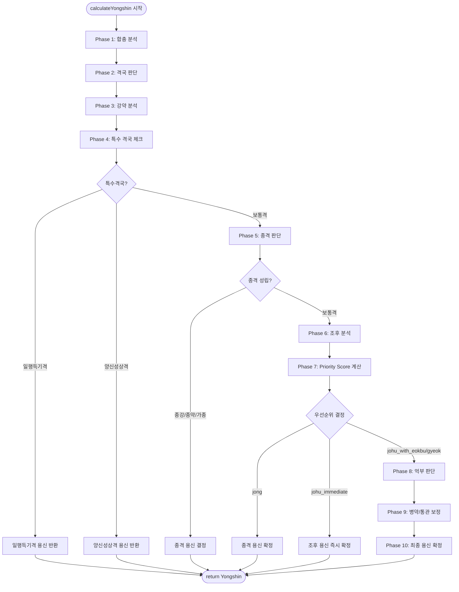

# 용신 분석 알고리즘 기술 문서

## 1. 개요

본 문서는 `calculateYongshin()` 함수를 중심으로 한 용신 결정 알고리즘의 상세 구현을 기술합니다.

### 1.1 핵심 파일 구조

| 파일 | 역할 |
|------|------|
| `Yongshin.ts` | 메인 용신 계산 로직 |
| `CombinationAnalyzer.ts` | 합충 분석 모듈 |
| `SaryeongCalculator.ts` | 사령분일 계산 모듈 |
| `SpecialGyeokguk.ts` | 특수 격국 판별 모듈 |
| `TenGod.ts` | 십성 계산 모듈 |

### 1.2 용어 정의

| 용어 | 정의 |
|------|------|
| 용신(用神) | 사주의 균형을 맞추는 핵심 오행 |
| 희신(喜神) | 용신을 생(生)하거나 보호하는 오행 |
| 기신(忌神) | 용신을 극(克)하거나 손상시키는 오행 |
| 득령(得令) | 일간이 월지의 계절적 기운을 얻음 |
| 통근(通根) | 천간이 지지에 뿌리를 내림 |
| 투출(透出) | 지장간이 천간에 드러남 |

---

## 2. 전체 흐름도



---

## 3. 설정값 상세 (YONGSHIN_CONFIG)

### 3.1 오행 불균형 임계값

| 설정명 | 값 | 설명 | 계산식 적용 |
|--------|-----|------|------------|
| `MISSING_THRESHOLD` | 0.20 | 결핍 판정 기준 | `score < avg × 0.20` → missing |
| `DEFICIENT_THRESHOLD` | 0.70 | 부족 판정 기준 | `score < avg × 0.70` → deficient |
| `EXCESS_THRESHOLD` | 1.80 | 과다 판정 기준 | `score > avg × 1.80` → excess |

### 3.2 종격 관련 설정값

| 설정명 | 값 | 설명 |
|--------|-----|------|
| `JONGGANG_ROOT_MIN` | 6.0 | 종강격 근점수 최소 기준 |
| `JONGYAK_ROOT_MAX` | 2.0 | 종약격 근점수 최대 기준 |
| `DRAIN_LIMIT_JONGGANG` | 1.5 | 종강격 설기(식상+재성) 제한 |
| `SUPPORT_LIMIT_JONGYAK` | 1.5 | 종약격 지원(비겁+인성) 제한 |
| `RESCUE_ROOT_THRESHOLD` | 1.5 | 구응(救應) 통근 기준 |
| `JONGYAK_SIPSEONG_MIN` | 3.0 | 종약 십성 최소 점수 |

### 3.3 조후 관련 설정값

| 설정명 | 값 | 설명 |
|--------|-----|------|
| `JOHU_SUFFICIENT` | 2.0 | 조후 충분 기준 |
| `JOHU_POOR_MIN` | 0.5 | 조후 부족 최소 기준 |
| `JOHU_RELAXED` | 1.5 | 춘추절 완화 모드 기준 |

### 3.4 통관 관련 설정값

| 설정명 | 값 | 설명 |
|--------|-----|------|
| `TONGGWAN_MIN_EXIST` | 0.5 | 통관 오행 원국 존재 최소 |
| `TONGGWAN_MIN_SCORE` | 1.5 | 통관 유효 최소 점수 |
| `TONGGWAN_CONTROL_RATIO` | 1.5 | 통관 피극 비율 |
| `TONGGWAN_SCORE_DIFF` | 1.5 | 통관 필요 점수 차이 |

### 3.5 합충 관련 설정값

| 설정명 | 값 | 설명 |
|--------|-----|------|
| `HAPGEO_DEFAULT_REDUCTION` | 0.5 | 합거 기본 감소율 (50%) |
| `HAPGEO_MONTH_REDUCTION` | 0.6 | 월간 관련 합거 감소율 (60%) |
| `HAPGEO_HOUR_REDUCTION` | 0.4 | 시간 관련 합거 감소율 (40%) |
| `CHUNG_DEFAULT_DIFF` | 2.0 | 충파 기본 점수 차이 |
| `CHUNG_MONTH_DIFF` | 1.5 | 월지 충파 점수 차이 |

### 3.6 Priority Score 가중치

| 설정명 | 값 | 역할 |
|--------|-----|------|
| `PRIORITY_JONG_WEIGHT` | 2.0 (α) | 종격 가중치 |
| `PRIORITY_JOHU_WEIGHT` | 1.5 (β) | 조후 가중치 |
| `PRIORITY_GYEOK_WEIGHT` | 1.0 (γ) | 격국 가중치 |

### 3.7 원국 존재 패널티

| 설정명 | 값 | 설명 |
|--------|-----|------|
| `ABSENT_PENALTY` | 3.0 | 원국 완전 부재 패널티 |
| `WEAK_PENALTY` | 1.0 | 매우 약함 패널티 |
| `WEAK_THRESHOLD` | 0.3 | 약함 판정 기준 (rel < 0.3) |

### 3.8 영향도 점수

| 설정명 | 값 | 의미 |
|--------|-----|------|
| `IMPACT_YONGSHIN` | +3 | 용신 오행 |
| `IMPACT_HEESHIN` | +2 | 희신 오행 |
| `IMPACT_HANSHIN` | 0 | 한신 오행 |
| `IMPACT_SEOLGI_DEFAULT` | -1 | 설기 오행 |
| `IMPACT_GUSHIN` | -2 | 구신 오행 |
| `IMPACT_GISHIN` | -3 | 기신 오행 |

---

## 4. Phase 1: 합충 분석

### 4.1 함수: `analyzeCombinations(sajuData)`

천간합, 지지합(육합/삼합), 충을 분석하여 오행 점수 조정값을 계산합니다.

### 4.2 오행 점수 기본 계산: `computeElementScores(saju)`

#### 가중치 테이블

| 위치 | 천간 가중치 | 지지 가중치 | 지장간 가중치 |
|------|------------|------------|--------------|
| 연주 | 1.0 | 1.5 | [0.9, 0.5, 0.3] |
| 월주 | 1.0 | **3.0** (1.5×2) | [1.8, 1.0, 0.6] (×2) |
| 일주 | 1.0 | 1.5 | [0.9, 0.5, 0.3] |
| 시주 | 1.0 | 1.5 | [0.9, 0.5, 0.3] |

#### 계산 공식

```
오행별 점수 = Σ(천간 오행 × 1.0) 
            + Σ(지지 오행 × 지지가중치) 
            + Σ(지장간 오행 × 지장간가중치[인덱스] × 월주보정)
```

#### 지장간 인덱스별 가중치

```javascript
function weightHiddenStem(idx) {
  if (idx === 0) return 0.9;  // 여기(餘氣)
  if (idx === 1) return 0.5;  // 중기(中氣)
  return 0.3;                  // 정기(正氣) 또는 3번째
}
```

### 4.3 합충 반영 점수: `computeElementScoresWithCombinations()`

```javascript
adjustedScores[elem] = Math.max(0, baseScores[elem] + combinations.totalScoreAdjustment[elem])
```

- 기본 점수에 합충 조정값을 더함
- 최소값 0 보장

### 4.4 오행 분석 결과 도출: `deriveOhaengAnalysisFromScores()`

#### 판정 조건표

| 조건 | 결과 |
|------|------|
| `score < avg × 0.20` | `missing` (결핍) |
| `score < avg × 0.70` | `deficient` (부족) |
| `score > avg × 1.80` | `excess` (과다) |
| 그 외 | 정상 범위 |

```javascript
const avg = totalScore / 5;

if (score < avg * 0.20) → missing
else if (score < avg * 0.70) → deficient
else if (score > avg * 1.80) → excess
```

---

## 5. Phase 2: 격국 판단

### 5.1 함수: `determineGyeokgukV2(saju, dayMaster)`

월지 지장간의 투출 여부를 확인하여 격국을 결정합니다.

### 5.2 지장간 투출 우선순위

```
주기(正氣) > 중기(中氣) > 여기(餘氣)
```

#### 순수 지기 처리 (卯, 酉, 子)

- 이 지지들은 주기만 존재
- 주기만 체크하여 투출 확인

#### 일반 지지 처리

```javascript
// 주기 (마지막 인덱스) - 신뢰도 high
if (jijanggan[주기인덱스]가 천간에 투출) → confidence = 'high'

// 중기 (두 번째 인덱스) - 신뢰도 medium
else if (jijanggan[1]이 천간에 투출) → confidence = 'medium'

// 여기 (첫 번째 인덱스) - 신뢰도 low
else if (jijanggan[0]이 천간에 투출) → confidence = 'low'
```

### 5.3 격국 유형 결정

| 투출 십성 | 격국 유형 |
|----------|----------|
| 정관 | `jeonggwan` (정관격) |
| 편관 | `pyeongwan` (편관격) |
| 정인 | `jeongin` (정인격) |
| 편인 | `pyeonin` (편인격) |
| 식신 | `siksin` (식신격) |
| 상관 | `sanggwan` (상관격) |
| 정재 | `jeongjae` (정재격) |
| 편재 | `pyeonjae` (편재격) |
| 비견/겁재 + 월지=일간오행 | `geonrok` (건록격) |

### 5.4 격국 문제 패턴 체크: `checkGyeokgukIssues()`

#### 문제 패턴 판정 조건

| 문제 유형 | 조건 | 심각도 | 해결책 |
|----------|------|--------|--------|
| **관살혼잡** | 정관 + 편관 함께 투출 | high | 합살유관/거관유살 |
| **재다신약** | 재성 > 3.0 AND 일간 weak | medium | 비겁으로 재 분탈 |
| **상관견관** | 상관격 + 정관 투출 | high | 인성으로 상관 제어 |
| **식신탈인** | 식신격 + 편인 ≥ 1.5 | medium | 재성으로 효신 제어 |
| **재파인** | 인수격 + 재성 ≥ 2.5 | medium | 비겁으로 재 분탈 |

---

## 6. Phase 3: 강약 분석

### 6.1 함수: `analyzeStrength(saju, dayElement)`

일간의 신강/신약을 판단합니다.

### 6.2 근점수 계산 공식

#### 주(柱)별 가중치

| 주(柱) | 가중치 |
|--------|--------|
| 연주 | 1.0 |
| 월주 | **3.0** |
| 일주 | 2.5 |
| 시주 | 1.5 |

#### 통근 점수 계산

```javascript
// 지지 본기가 일간 오행과 동일
if (getOhaeng(pillar.jiHan) === dayElement) {
  root += weight;
}

// 지장간 통근
for (let i = 0; i < hiddenStems.length; i++) {
  if (getOhaeng(hiddenStems[i]) === dayElement) {
    const hsWeight = (i === 0) ? 0.8 : (i === 1 ? 0.5 : 0.3);
    root += hsWeight * (weight / 2);
  }
}
```

#### 천간 지원 계산

```javascript
// 비견/겁재/편인/정인이 천간에 있으면
if (['비견', '겁재', '편인', '정인'].includes(sipsin)) {
  tianganSupport += 1.0;
}
```

#### 최종 근점수

```
rootScore = monthRoot + dayRoot + yearRoot + hourRoot + tianganSupport
```

### 6.3 득령/득지/득세/투간 판정

| 항목 | 조건 | 결과 |
|------|------|------|
| **득령** | 월지 오행 = 일간 오행 | `deukryeong = true` |
| **득지** | 총 통근점수 > 2.0 | `deukji = true` |
| **득세** | 천간 지원 ≥ 1.0 | `deukse = true` |
| **투간** | 득지 AND 득세 | `tugan = true` |

### 6.4 강약 등급 판정

| 조건 | 결과 |
|------|------|
| 득령 AND 근점수 ≥ 6.0 | `extreme-strong` |
| 득령 AND 근점수 ≥ 4.0 | `strong` |
| 근점수 3.0 ~ 5.0 | `neutral` |
| 근점수 1.5 ~ 3.0 | `weak` |
| 근점수 < 1.5 | `extreme-weak` |

---

## 7. Phase 4: 특수 격국 체크

### 7.1 일행득기격 체크: `checkIlhaengDeukgi()`

사주 전체가 하나의 오행으로 편중된 경우를 판별합니다.

#### 성립 조건

1. 일간과 월지가 동일 오행
2. 지지에 방합 또는 삼합 형성
3. 사주의 80% 이상이 동일 오행
4. 관살(克하는 오행)이 원국에 없음

#### 5가지 유형

| 격국명 | 주 오행 | 용신 | 희신 |
|--------|---------|------|------|
| 곡직격 | 木 | 木 | 水(인성), 火(식상) |
| 염상격 | 火 | 火 | 木(인성), 土(식상) |
| 가색격 | 土 | 土 | 火(인성), 金(식상) |
| 종혁격 | 金 | 金 | 土(인성), 水(식상) |
| 윤하격 | 水 | 水 | 金(인성), 木(식상) |

### 7.2 양신성상격 체크: `checkYangshin()`

사주가 두 개의 오행으로만 비슷한 세력을 이룬 경우를 판별합니다.

#### 성립 조건

1. 사주가 정확히 2개의 오행으로만 구성
2. 두 오행의 세력이 대등 (4:4 또는 유사)
3. 다른 오행이 섞여 있지 않음

#### 용신 결정

| 관계 | 용신 |
|------|------|
| 상생 관계 (목화, 화토 등) | 설기되는 오행 (생 받는 쪽) |
| 상극 관계 (금목, 수화 등) | 통관 오행 |

---

## 8. Phase 5: 종격 판단

### 8.1 함수: `checkJonggyeokV2(saju, dayElement, strengthAnalysis)`

### 8.2 십성 분류 계산

```javascript
// 지원 세력 (일간을 돕는 세력)
totalSupport = bigyeopCount + inseongCount

// 설기 세력 (일간의 기운을 빼는 세력)
totalDrain = siksangCount + jaesungCount

// 억제 세력 (일간을 직접 극하는 세력)
totalOppression = gwansalCount
```

#### 십성별 가중치

| 위치 | 가중치 |
|------|--------|
| 천간 | 1.0 |
| 지지 | 0.5 |
| 지장간[0] | 0.3 |
| 지장간[1] | 0.2 |
| 지장간[2] | 0.1 |

### 8.3 종강격 판정 조건

```javascript
if (deukryeong && 
    rootScore >= 6.0 && 
    totalOppression <= 1.0 && 
    totalDrain <= 1.5) {
  // 구응 체크 후 종강격 확정
}
```

| 조건 | 임계값 |
|------|--------|
| 득령 | 필수 (true) |
| 근점수 | ≥ 6.0 |
| 관살(억제) | ≤ 1.0 |
| 설기(식상+재성) | ≤ 1.5 |

#### 신뢰도 결정

| 조건 | 신뢰도 |
|------|--------|
| 근점수 ≥ 7.0 | `high` |
| 근점수 < 7.0 | `medium` |

### 8.4 종약격 판정 조건

```javascript
if (!deukryeong && 
    rootScore <= 2.0 && 
    totalSupport <= 1.5 &&
    (siksangCount >= 3.0 || jaesungCount >= 3.0 || gwansalCount >= 3.0)) {
  // 구응 체크 후 종약격 확정
}
```

| 조건 | 임계값 |
|------|--------|
| 실령 | 필수 (deukryeong = false) |
| 근점수 | ≤ 2.0 |
| 지원(비겁+인성) | ≤ 1.5 |
| 식상/재성/관살 중 하나 | ≥ 3.0 |

#### 신뢰도 결정

| 조건 | 신뢰도 |
|------|--------|
| 근점수 ≤ 1.0 | `high` |
| 근점수 > 1.0 | `medium` |

### 8.5 종약격 세분화: `determineJongyakSubType()`

```javascript
function determineJongyakSubType(siksang, jaesung, gwansal) {
  // 동률 시 근원(생하는 쪽) 우선
  if (siksang >= jaesung && siksang >= gwansal) {
    return '종아격';  // 식상 우선
  }
  if (jaesung > siksang && jaesung >= gwansal) {
    return '종재격';  // 재성 우선
  }
  return '종살격';    // 관살
}
```

#### 세분화 결과표

| 조건 | 결과 | 용신 |
|------|------|------|
| 식상 ≥ 재성 AND 식상 ≥ 관살 | 종아격 | 식상 |
| 재성 > 식상 AND 재성 ≥ 관살 | 종재격 | 재성 |
| 그 외 | 종살격 | 관살 |

### 8.6 가종격 판정 조건

```javascript
if ((deukryeong && rootScore >= 5.0 && totalOppression <= 2.0 && totalDrain <= 2.0) ||
    (!deukryeong && rootScore <= 2.5 && totalSupport <= 2.0)) {
  // 구응 체크 후 가종격 확정 (신뢰도 low)
}
```

### 8.7 구응(救應) 체크: `checkJonggyeokBreak()`

종격을 파격시키는 병신(病神)의 존재 여부를 확인합니다.

#### 종약격 병신

- 인성/비겁이 천간에 투출 + 지지에 강한 통근

#### 종강격 병신

- 관살이 천간에 투출 + 지지에 강한 통근

#### 합에 의한 무력화

```javascript
// 병신이 합 파트너와 인접해 있으면 무력화
const hapPartner = TIANGAN_HE_PARTNER[byungshin.gan];
if (hapPartner && isAdjacent) {
  continue; // 이 병신은 무력화됨
}
```

#### 파격 판정

```javascript
if (rootScore >= RESCUE_ROOT_THRESHOLD) {  // 1.5
  // 합으로 무력화되지 않았으면 파격
  return { broken: true, reason: '구응 존재' };
}
```

---

## 9. Phase 6: 조후 분석

### 9.1 함수: `analyzeJohu(saju, dayElement)`

### 9.2 계절 판정: `getSeason()`

```javascript
const spring = ['寅', '卯', '辰'];  // 춘절
const summer = ['巳', '午', '未'];  // 하절
const autumn = ['申', '酉', '戌'];  // 추절
const winter = ['亥', '子', '丑'];  // 동절
```

### 9.3 한열조습 점수 계산

#### 계절 기본 점수

| 계절 | 한(寒) | 열(熱) | 조(燥) | 습(濕) |
|------|--------|--------|--------|--------|
| 동절 | +3 | - | - | - |
| 하절 | - | +3 | - | - |
| 추절 | - | - | +2 | - |
| 춘절 | - | - | - | +1 |

#### 오행별 기여도

| 오행 | 한(寒) | 열(熱) | 조(燥) | 습(濕) |
|------|--------|--------|--------|--------|
| 水 | +weight | - | - | +weight×0.5 |
| 火 | - | +weight | +weight×0.5 | - |
| 金 | +weight×0.7 | - | +weight | - |
| 木 | - | +weight×0.5 | - | - |

#### 토(土) 특수 처리 - 습토/조토 구분

```javascript
const wetEarth = ['丑', '辰'];   // 습토
const dryEarth = ['未', '戌'];   // 조토
```

| 토 유형 | 조(燥) | 습(濕) | 한(寒)/열(熱) |
|---------|--------|--------|--------------|
| 습토 (丑辰) | - | +weight | 한 +weight×0.3 |
| 조토 (未戌) | +weight | - | 열 +weight×0.3 |

#### 가중치 적용

```javascript
const weight = (pillar === saju.month) ? 2.0 : 1.0;  // 월주 2배
```

### 9.4 조후 상태 판정

```javascript
const isExtreme = (hanScore >= 8 && seupScore >= 6) || 
                  (yeolScore >= 8 && joScore >= 6);
```

#### 상태 판정표

| 조건 | 상태 | 필요 오행 |
|------|------|----------|
| 한≥8 AND 습≥6 | `extreme` (한습극) | 火 |
| 열≥8 AND 조≥6 | `extreme` (조열극) | 水 |
| (한≥6 OR 열≥6) AND (습≥4 OR 조≥4) | `poor` | 상황별 |
| \|한-열\| ≤ 2 AND \|습-조\| ≤ 2 | `satisfied` | 계절별 |
| 그 외 | `good` | 계절별 |

### 9.5 계절별 필요 오행: `neededElementBySeason()`

| 계절 | 필요 오행 | 이유 |
|------|----------|------|
| 夏(하절) | 水 | 조열 해소 |
| 冬(동절) | 火 | 한습 해소 |
| 春(춘절) | 火 | 한기 잔존 해소 |
| 秋(추절) | 水 | 조량 윤택 |

---

## 10. Phase 7: Priority Score 계산

### 10.1 함수: `calculatePriorityScore(jongResult, johuResult, gyeokResult)`

격국/종격/조후가 충돌할 때 동적으로 우선순위를 결정합니다.

### 10.2 점수 계산 공식

```javascript
// 종격 점수
const jongScore = { 'high': 3, 'medium': 2, 'low': 1 }[confidence];
jongPriority = jongScore × 2.0  // α

// 조후 긴급도 점수
const johuScore = { 'extreme': 3, 'poor': 2, 'satisfied': 1 }[status];
johuPriority = johuScore × 1.5  // β

// 격국 문제 심각도
const gyeokScore = Math.max(...issues.map(i => 
  { 'high': 3, 'medium': 2, 'low': 1 }[i.severity]
));
gyeokPriority = gyeokScore × 1.0  // γ
```

### 10.3 우선순위 결정 로직

```javascript
function determineWinner(jong, johu, gyeok) {
  // 종격이 가장 높으면 종격
  if (jong >= johu && jong >= gyeok && jong > 0) {
    return 'jong';
  }
  
  // 조후가 가장 높고, 4.5 이상이면 즉시 확정
  if (johu >= jong && johu >= gyeok) {
    if (johu >= 4.5) {  // critical(3) × 1.5 = 4.5
      return 'johu_immediate';
    }
    return 'johu_with_eokbu';
  }
  
  // 그 외는 격국 기반
  return 'gyeok';
}
```

#### 결과별 처리

| 결과 | 처리 |
|------|------|
| `jong` | 종격 용신 즉시 확정 |
| `johu_immediate` | 조후 용신 즉시 확정 |
| `johu_with_eokbu` | 억부 + 조후 병행 고려 |
| `gyeok` | 격국 기반 병약/억부 진행 |

---

## 11. Phase 8: 억부 판단

### 11.1 억부 후보 생성: `getEokbuCandidates()`

```javascript
function getEokbuCandidates(day, strength) {
  if (strength === 'strong') {
    // 신강: 설기/극/피극 오행
    return [GENERATING_MAP[day], CONTROLLING_MAP[day], invControlling(day)];
  }
  if (strength === 'weak') {
    // 신약: 인성/비겁 오행
    return [invGenerating(day), day];
  }
  // 중화: 모든 후보
  return [GENERATING_MAP[day], CONTROLLING_MAP[day], 
          invControlling(day), invGenerating(day), day];
}
```

### 11.2 억부 후보 점수 계산: `scoreEokbuCandidate()`

#### 점수 구성 요소

```
최종점수 = 불균형점수 
         + 강약적합도 
         + 통근보정 
         + 원국존재패널티 
         + 과다보정 
         + 계절보정
```

#### 세부 점수 계산

| 항목 | 조건 | 점수 |
|------|------|------|
| **불균형 점수** | missing에 포함 | +4 |
| | deficient에 포함 | +2 |
| | excess에 포함 | -3 |
| **강약 적합도** | 신강 + 설기/극 후보 | +2 |
| | 신약 + 인성/비겁 후보 | +2 |
| | 중화 | +1 |
| **통근 보정** | 신약 + 근점수≥3 | -0.5 |
| | 신강 + 근점수≤1 | -0.5 |
| **원국 부재** | elementScore = 0 | **-3.0** |
| **매우 약함** | rel < 0.3 | -1.0 |
| **적당함** | rel < 0.7 | +0.8 |
| **과다** | rel > 1.6 | -0.8 |
| **계절 보정** | 하절/동절 | -0.3 |
| **과다 오행** | excess에 포함 | -1.5 |

#### 상대 비율 계산

```javascript
const avg = Object.values(elementScores).reduce((a, b) => a + b, 0) / 5;
const rel = elementScores[cand] / avg;
```

### 11.3 상위 2개 후보 선택: `pickTopTwo()`

```javascript
const sorted = [...scored].sort((a, b) => b.score - a.score);
return { top: sorted[0], second: sorted[1] };
```

---

## 12. Phase 9: 병약/통관 보정

### 12.1 병약 분석: `analyzeByungyak()`

#### 오행 과다 기반 병 판정

```javascript
// 과다 오행 찾기
for (const [element, score] of Object.entries(elementScores)) {
  const rel = score / avg;
  if (rel > 1.8 && score > maxExcess) {
    excessElement = element;
  }
}
```

#### 약(藥) 결정

```javascript
// 설기(洩氣)와 극(克) 중 원국에 존재하면서 더 약한 것 선택
if (elementScores[generating] > 0 && generatingScore < controllingScore) {
  yak = generating;  // 설기로 해소
} else if (elementScores[controlling] > 0) {
  yak = controlling; // 극으로 억제
}
```

### 12.2 통관 필요성 체크: `checkTonggwanNeed()`

```javascript
// 두 오행의 점수 차이가 1.5 이상이면 통관 불필요
if (Math.abs(score1 - score2) >= 1.5) {
  return { needed: false, reason: '한쪽이 압도' };
}
```

### 12.3 통관 성립 검증: `validateTonggwan()`

#### 검증 조건표

| 단계 | 체크 항목 | 조건 | 실패 결과 |
|------|----------|------|----------|
| ① | 원국 존재 | score ≥ 0.5 | 대운에서 보완 필요 |
| ② | 최소 힘 | score ≥ 1.5 | 통관력 부족 |
| ③ | 피극 체크 | 극오행 ≤ score × 1.5 | 통관 무력화 |

```javascript
function validateTonggwan(tonggwanElement, elementScores) {
  const score = elementScores[tonggwanElement];
  
  // ① 원국 존재 체크
  if (score < 0.5) {
    return { valid: false, reason: '원국 부재' };
  }
  
  // ② 최소 힘 체크
  if (score < 1.5) {
    return { valid: false, reason: '통관력 부족' };
  }
  
  // ③ 피극 체크
  const controllerScore = elementScores[invControlling(tonggwanElement)];
  if (controllerScore > score * 1.5) {
    return { valid: false, reason: '통관 오행이 극 당함' };
  }
  
  return { valid: true };
}
```

---

## 13. Phase 10: 최종 용신 확정

### 13.1 용신 유형 결정

#### 결정 흐름

```javascript
// 1. 통관 용신 우선 검토
if (byungyak.byung?.type === 'conflict' && tonggwanValidation.valid) {
  finalPrimaryType = 'tonggwan';
}

// 2. 병약 용신 검토
else if (byungyak.yak && byungyakScore >= primaryScored.score + 1.5) {
  finalPrimaryType = 'byungyak';
}

// 3. 억부 용신 (기본)
else {
  finalPrimaryType = 'eokbu';
}
```

### 13.2 보조 용신 결정

```javascript
// 조건: 차점 후보가 주용신과 다르고, 주용신을 극하지 않음
if (eokbuTop2.second && 
    eokbuTop2.second.element !== finalPrimaryElement && 
    !isControlling(eokbuTop2.second.element, finalPrimaryElement)) {
  secondaryK = ELEMENT_TO_KOREAN[eokbuTop2.second.element];
}
```

### 13.3 신뢰도 결정: `confidenceFromGap()`

```javascript
function confidenceFromGap(gap) {
  if (gap >= 3.0) return 'high';     // CONFIDENCE_HIGH
  if (gap >= 1.5) return 'medium';   // CONFIDENCE_MEDIUM
  return 'low';
}
```

### 13.4 최종 반환 객체

```typescript
interface Yongshin {
  primary: string;           // 주용신 (한글)
  secondary?: string;        // 보조용신 (한글, 선택)
  type: 'eokbu' | 'johu' | 'tonggwan' | 'byungyak';
  confidence: 'high' | 'medium' | 'low';
  evidence: {
    decisionPath: DecisionStep[];
  };
}
```

---

## 14. Decision Path 구조

### 14.1 DecisionStep 인터페이스

```typescript
interface DecisionStep {
  step: string;        // 단계명
  result: string;      // 결과값
  condition?: string;  // 판단 조건
  continued: boolean;  // 다음 단계 진행 여부
}
```

### 14.2 기록되는 단계들

| step | 설명 | 예시 result |
|------|------|-------------|
| `합충분석` | 합충 영향 기록 | `木 +1.5, 火 -0.8` |
| `격국판단` | 격국 유형과 신뢰도 | `정관격 (high)` |
| `사령분석` | 사령분일 결과 | `득령비율 80%` |
| `일행득기격` | 특수격국 결과 | `곡직격` |
| `양신성상격` | 양신성상 결과 | `木 + 火` |
| `종격체크` | 종격 판정 결과 | `종약격 (종재격)` |
| `조후분석` | 조후 상태 | `poor (夏, 水 1.2)` |
| `강약분석` | 강약 등급 | `weak (근점수 2.1)` |
| `통관적용` | 통관 적용 여부 | `水 (통관)` |
| `억부결정` | 억부 용신 결과 | `木 (eokbu)` |
| `최종용신` | 최종 확정 | `木 (억부)` |

### 14.3 condition 필드 예시

```javascript
// 종격 체크
{
  step: '종격체크',
  result: '종약격 (종재격)',
  condition: '근점수 1.2 ≤ 2.0, 지원 1.0 ≤ 1.5, 재성 4.2 ≥ 3.0',
  continued: false
}

// 조후 분석
{
  step: '조후분석',
  result: 'poor (夏, 水 1.2)',
  condition: '午월(夏) + 水 1.2, 0.5 ≤ 점수 < 2.0',
  continued: true
}
```

---

## 15. 오행 관계 매핑

### 15.1 상생 관계 (GENERATING_MAP)

```javascript
const GENERATING_MAP = {
  wood: 'fire',   // 목생화
  fire: 'earth',  // 화생토
  earth: 'metal', // 토생금
  metal: 'water', // 금생수
  water: 'wood'   // 수생목
};
```

### 15.2 상극 관계 (CONTROLLING_MAP)

```javascript
const CONTROLLING_MAP = {
  wood: 'earth',  // 목극토
  fire: 'metal',  // 화극금
  earth: 'water', // 토극수
  metal: 'wood',  // 금극목
  water: 'fire'   // 수극화
};
```

### 15.3 역상생 (invGenerating)

```javascript
// A를 생하는 오행 찾기
function invGenerating(day) {
  return Object.keys(GENERATING_MAP).find(e => GENERATING_MAP[e] === day);
}
// 예: invGenerating('fire') = 'wood' (목생화)
```

### 15.4 역상극 (invControlling)

```javascript
// A를 극하는 오행 찾기
function invControlling(day) {
  return Object.keys(CONTROLLING_MAP).find(e => CONTROLLING_MAP[e] === day);
}
// 예: invControlling('wood') = 'metal' (금극목)
```

---

## 16. 종격별 용신 결정

### 16.1 종강격 용신

```javascript
if (jonggyeok.type === 'jonggang') {
  primaryElement = dayElement;      // 일간 오행 자체
  secondaryElement = invGenerating(dayElement);  // 인성
}
```

### 16.2 종약격 용신

```javascript
if (jonggyeok.type === 'jongyak') {
  const siksang = GENERATING_MAP[dayElement];     // 식상
  const jaesung = CONTROLLING_MAP[dayElement];    // 재성
  const gwanseong = invControlling(dayElement);   // 관성
  
  switch (jonggyeok.subType) {
    case '종아격': primaryElement = siksang; break;
    case '종재격': primaryElement = jaesung; break;
    case '종살격': primaryElement = gwanseong; break;
  }
}
```

---

## 17. 참조 소스

- `src/shared/lib/saju/calculators/Yongshin.ts`
- `src/shared/lib/saju/calculators/CombinationAnalyzer.ts`
- `src/shared/lib/saju/calculators/SaryeongCalculator.ts`
- `src/shared/lib/saju/calculators/SpecialGyeokguk.ts`
- `src/shared/lib/saju/calculators/TenGod.ts`

---

## 18. 변경 이력

| 버전 | 날짜 | 변경 내용 |
|------|------|----------|
| v1.0 | 2024-12-26 | 초기 문서 작성 |
