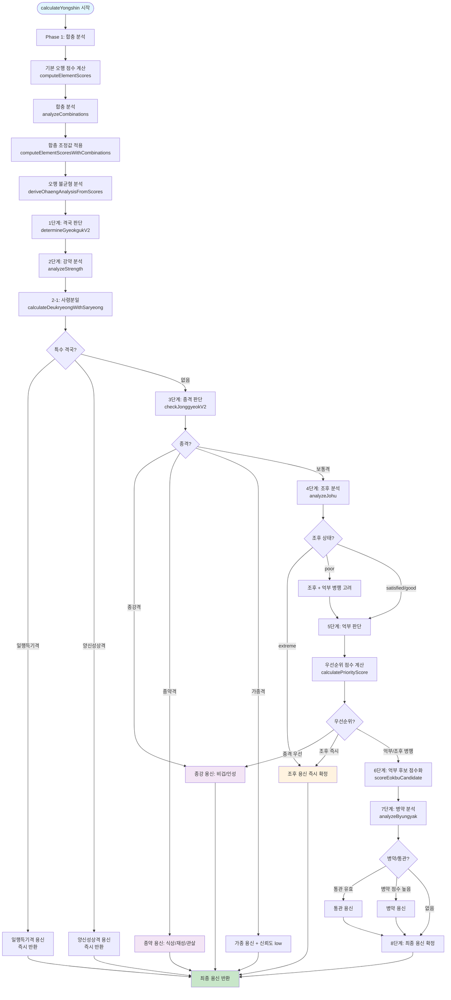

# 용신 계산 알고리즘 상세 문서

## 목차
1. [전체 흐름도](#전체-흐름도)
2. [단계별 상세 설명](#단계별-상세-설명)
3. [계산 공식 정리](#계산-공식-정리)
4. [의사결정 트리](#의사결정-트리)
5. [예시 계산](#예시-계산)

---

## 전체 흐름도



---

## 단계별 상세 설명

### Phase 1: 합충 분석 및 오행 점수 계산

#### 1.1 기본 오행 점수 계산 (`computeElementScores`)

**목적**: 사주 원국의 각 오행(목, 화, 토, 금, 수)의 기본 점수를 계산합니다.

**입력 데이터**:
- `sajuData`: 사주 데이터 (년, 월, 일, 시 주)

**계산 공식**:

```
오행 점수 = Σ(천간 점수 + 지지 점수 + 지장간 점수)
```

**가중치**:
- **천간**: 1.0 (모든 주 동일)
- **지지**: 
  - 월지: 1.5 × 2.0 = 3.0
  - 기타 지지: 1.5
- **지장간** (Hidden Stems):
  - 주기(첫 번째): 0.9 × (월지면 2.0, 아니면 1.0)
  - 중기(두 번째): 0.5 × (월지면 2.0, 아니면 1.0)
  - 여기(세 번째): 0.3 × (월지면 2.0, 아니면 1.0)

**코드 로직**:
```typescript
for (const p of pillars) {
  // 천간 점수
  scores[getOhaeng(p.ganHan)] += 1.0;
  
  // 지지 점수
  const jiW = isMonth ? 1.5 * 2.0 : 1.5;
  scores[getOhaeng(p.jiHan)] += jiW;
  
  // 지장간 점수
  for (let i = 0; i < hiddenStems.length; i++) {
    const w = weightHiddenStem(i) * (isMonth ? 2.0 : 1.0);
    scores[getOhaeng(hiddenStems[i])] += w;
  }
}
```

**출력 결과**: `Record<Element, number>` - 각 오행의 기본 점수

---

#### 1.2 합충 분석 (`analyzeCombinations`)

**목적**: 천간합, 지지합(육합/삼합), 충(沖)의 영향을 계산하여 오행 점수를 조정합니다.

**입력 데이터**:
- `sajuData`: 사주 데이터

**주요 계산**:

**천간합 (天干合)**:
- **합화(合化)**: 두 천간이 합쳐져 화신(化神) 오행으로 변질
  - 조건: 월령 동조 + 화신 오행 존재 + 통근 확인
  - 결과: 원래 두 오행 제거, 화신 오행 추가
  - 공식: `화신 오행 += (원래 오행1 점수 + 원래 오행2 점수) × 인화 보너스(1.5)`
- **합거(合去)**: 두 천간이 합쳐져 약화
  - 감소율: 기본 50% (`HAPGEO_DEFAULT_REDUCTION`), 월간 관련 60%, 시간 관련 40%
  - 공식: `조정 점수 = 원래 점수 × (1 - 감소율)`

**지지합 (地支合)**:
- **육합**: 두 지지가 합쳐져 화신 오행으로 변질
  - 예: 子丑合土 → 수/토 제거, 토 추가
- **삼합**: 세 지지가 합쳐져 화신 오행으로 변질
  - 완전삼합: 100% 변질 (`SAMHAP_COMPLETE = 1.0`)
  - 생왕반합: 60% 변질 (`SAMHAP_SAENG_WANG = 0.6`)
  - 왕묘반합: 50% 변질 (`SAMHAP_WANG_MYO = 0.5`)
  - 생묘반합: 40% 변질 (`SAMHAP_SAENG_MYO = 0.4`)

**충(沖)**:
- **충파(沖破)**: 점수 차이가 큰 경우 약한 쪽 70% 감소
  - 조건: `|점수1 - 점수2| ≥ CHUNG_DEFAULT_DIFF(2.0)`
  - 공식: `약한 쪽 점수 × 0.3`
- **충동(沖動)**: 점수 차이가 작은 경우 양쪽 20% 감소
  - 조건: `|점수1 - 점수2| < CHUNG_DEFAULT_DIFF`
  - 공식: `양쪽 점수 × 0.8`

**출력 결과**: `CombinationAnalysis` - 합충 조정값 포함

---

#### 1.3 합충 조정값 적용 (`computeElementScoresWithCombinations`)

**계산 공식**:
```
조정된 점수[elem] = max(0, 기본 점수[elem] + 합충 조정값[elem])
```

**출력 결과**: 합충이 반영된 최종 오행 점수

---

#### 1.4 오행 불균형 분석 (`deriveOhaengAnalysisFromScores`)

**목적**: 오행 점수를 기준으로 결핍/부족/과다를 판정합니다.

**계산 공식**:
```
평균 점수 = Σ(모든 오행 점수) / 5

if (점수 < 평균 × 0.20) → missing (결핍)
else if (점수 < 평균 × 0.70) → deficient (부족)
else if (점수 > 평균 × 1.80) → excess (과다)
```

**임계값**:
- `MISSING_THRESHOLD`: 0.20 (20%)
- `DEFICIENT_THRESHOLD`: 0.70 (70%)
- `EXCESS_THRESHOLD`: 1.80 (180%)

**출력 결과**: `OhaengAnalysis` - missing, deficient, excess 배열

---

### Phase 2: 특수 격국 판별

#### 2-1: 일행득기격 (`checkIlhaengDeukgi`)

**목적**: 사주 전체가 하나의 오행으로 극도로 편중된 특수 격국을 판별합니다.

**성립 조건**:
1. 일간 오행 비율 ≥ 80%
2. 관살(일간을 극하는 오행) 존재 ≤ 0.5
3. 방합/삼합 형성 (선택적)

**계산 공식**:
```
총점 = Σ(모든 오행 점수)
일간 오행 비율 = 일간 오행 점수 / 총점

IF (일간 오행 비율 ≥ 0.8) AND (관살 점수 ≤ 0.5)
  → 일행득기격 성립
```

**5가지 유형**:
- 곡직격 (木): 용신 = 수(水)
- 염상격 (火): 용신 = 목(木)
- 가색격 (土): 용신 = 화(火)
- 종혁격 (金): 용신 = 토(土)
- 윤하격 (水): 용신 = 금(金)

**출력 결과**: 일행득기격이면 즉시 용신 반환, 아니면 다음 단계 진행

---

#### 2-2: 양신성상격 (`checkYangshin`)

**목적**: 사주가 정확히 두 개의 오행으로만 비슷한 세력을 이룬 특수 격국을 판별합니다.

**성립 조건**:
1. 0이 아닌 오행이 정확히 2개 (0.5 이하는 무시)
2. 각 오행 비율 ≥ 30%
3. 두 오행이 상생 또는 상극 관계

**계산 공식**:
```
총점 = Σ(모든 오행 점수)
nonZeroElements = [오행 | 점수 > 0.5]

IF (nonZeroElements.length === 2) THEN
  ratio1 = elementScores[elem1] / 총점
  ratio2 = elementScores[elem2] / 총점
  
  IF (ratio1 ≥ 0.3 AND ratio2 ≥ 0.3) THEN
    IF (상생 관계 OR 상극 관계)
      → 양신성상격 성립
```

**용신 결정**:
- **상생 관계**: 생 받는 쪽 오행이 용신
- **상극 관계**: 통관 오행이 용신 (중간 오행)

**출력 결과**: 양신성상격이면 즉시 용신 반환, 아니면 다음 단계 진행

---

### 3단계: 격국 판단 (`determineGyeokgukV2`)

**목적**: 월지 지장간의 투출 여부를 확인하여 사주의 격국을 결정합니다.

**입력 데이터**:
- `sajuData`: 사주 데이터
- `dayMaster`: 일간 천간

**투출 확인 순서**:
1. **주기(正氣)** - 신뢰도: `high`
2. **중기(中氣)** - 신뢰도: `medium`
3. **여기(餘氣)** - 신뢰도: `low`

**알고리즘**:
```typescript
// 순수 지기 (卯, 酉, 子)는 주기만 존재
if (isPure) {
  if (주기가 천간에 투출) → confidence = 'high'
} else {
  // 주기 (마지막 인덱스)
  if (주기가 천간에 투출) → confidence = 'high'
  // 중기 (두 번째 인덱스)
  else if (중기가 천간에 투출) → confidence = 'medium'
  // 여기 (첫 번째 인덱스)
  else if (여기가 천간에 투출) → confidence = 'low'
}
```

**격국 유형 결정**:
투출된 천간의 십성을 기준으로 격국 결정:

| 투출 십성 | 격국 유형 |
|----------|----------|
| 정관 | 정관격 |
| 편관 | 편관격 |
| 정인 | 정인격 |
| 편인 | 편인격 |
| 식신 | 식신격 |
| 상관 | 상관격 |
| 정재 | 정재격 |
| 편재 | 편재격 |
| 비견/겁재 + 월지=일간 | 건록격 |

**출력 결과**: `GyeokgukAnalysis` - 격국 유형, 신뢰도, 투출 위치

---

### 3단계: 강약 분석 (`analyzeStrength`)

**목적**: 일간의 강약을 판단하여 억부 용신 선택의 기준을 마련합니다.

**입력 데이터**:
- `sajuData`: 사주 데이터
- `dayElement`: 일간 오행

**근점수 계산 공식**:

```
근점수 = 월지 통근 + 일지 통근 + 년지 통근 + 시지 통근 + 천간 지원
```

**주(柱)별 가중치**:
- 월주: 3.0
- 일주: 2.5
- 시주: 1.5
- 연주: 1.0

**통근 점수 계산**:
```typescript
// 지지 본기 통근
if (지지 오행 === 일간 오행) {
  통근 += 가중치
}

// 지장간 통근
for (지장간 in 지지) {
  if (지장간 오행 === 일간 오행) {
    const hsWeight = (인덱스 === 0) ? 0.8 : (인덱스 === 1) ? 0.5 : 0.3;
    통근 += hsWeight × (가중치 / 2)
  }
}
```

**천간 지원 계산**:
```typescript
// 비견, 겁재, 편인, 정인이 천간에 있으면
if (십성 in ['비견', '겁재', '편인', '정인']) {
  천간 지원 += 1.0
}
```

**득령/득지/득세 판정**:
- **득령**: 월지 오행 = 일간 오행
- **득지**: 총 통근 점수 > 2.0
- **득세**: 천간 지원 ≥ 1.0
- **투간**: 득지 AND 득세

**강약 등급 판정**:

| 조건 | 결과 |
|------|------|
| 득령 AND 근점수 ≥ 6.0 | `extreme-strong` (극강) |
| 득령 AND 근점수 ≥ 4.0 | `strong` (신강) |
| 근점수 3.0 ~ 5.0 | `neutral` (중화) |
| 근점수 1.5 ~ 3.0 | `weak` (신약) |
| 근점수 < 1.5 | `extreme-weak` (극약) |

**출력 결과**: `StrengthAnalysis` - 강약 등급, 근점수, 득령/득지/득세 여부

---

### 3-1단계: 사령분일 (`calculateDeukryeongWithSaryeong`)

**목적**: 월령을 지배하는 기운이 누구인지 날짜별로 계산하여 득령비율을 산출합니다.

**입력 데이터**:
- `dayElement`: 일간 오행
- `monthJi`: 월지

**계산 방법**:
- 월지의 지장간이 순서대로 사령(지배)하며, 각 기간 동안 해당 오행이 지배
- 일간과 동일한 오행이 사령하는 기간의 비율을 계산

**득령비율 공식**:
```
득령비율 = (일간과 동일 오행이 사령하는 일수) / (전체 월 일수)
```

**출력 결과**: 득령비율 (0.0 ~ 1.0)

---

### 4단계: 종격 판단 (`checkJonggyeokV2`)

**목적**: 일간이 극도로 강하거나 약하여 그 흐름을 따라가야 하는 특수 격국인지 판단합니다.

**입력 데이터**:
- `sajuData`: 사주 데이터
- `dayElement`: 일간 오행
- `strengthAnalysis`: 강약 분석 결과

**십성 점수 계산**:
각 주(년, 월, 일, 시)의 천간, 지지, 지장간에서 십성을 계산하여 합산:

```typescript
// 천간: 1.0
// 지지: 0.5
// 지장간: 인덱스별 가중치 (0.3, 0.2, 0.1)

비겁 점수 = Σ(비견/겁재 십성 점수)
인성 점수 = Σ(편인/정인 십성 점수)
식상 점수 = Σ(식신/상관 십성 점수)
재성 점수 = Σ(편재/정재 십성 점수)
관살 점수 = Σ(편관/정관 십성 점수)

지원 = 비겁 + 인성
설기 = 식상 + 재성
억제 = 관살
```

**종강격 판단 조건**:
```
IF (득령 = true) AND
   (근점수 ≥ 6.0) AND
   (관살 ≤ 1.0) AND
   (설기 ≤ 1.5) AND
   (구응 없음)
THEN 종강격 성립
```

**종약격 판단 조건**:
```
IF (실령 = true) AND
   (근점수 ≤ 2.0) AND
   (지원 ≤ 1.5) AND
   (식상 ≥ 3.0 OR 재성 ≥ 3.0 OR 관살 ≥ 3.0) AND
   (구응 없음)
THEN 종약격 성립
```

**종약격 세분화**:
- **종아격**: 식상 점수가 가장 높음
- **종재격**: 재성 점수가 가장 높음
- **종살격**: 관살 점수가 가장 높음

**가종격 판단**:
```
IF ((득령 AND 근점수 ≥ 5.0 AND 관살 ≤ 2.0 AND 설기 ≤ 2.0) OR
    (실령 AND 근점수 ≤ 2.5 AND 지원 ≤ 2.0)) AND
   (구응 없음)
THEN 가종격 성립 (신뢰도: low)
```

**구응(救應) 체크**:
- 종강격: 관살이 투간 + 강한 통근(≥1.5) → 파격
- 종약격: 인성/비겁이 투간 + 강한 통근(≥1.5) → 파격

**출력 결과**: `JonggyeokAnalysisV2` - 종격 여부, 유형, 신뢰도

---

### 5단계: 조후 분석 (`analyzeJohu`)

**목적**: 사주의 한열조습(寒熱燥濕) 균형을 분석하여 필요한 오행을 결정합니다.

**입력 데이터**:
- `sajuData`: 사주 데이터
- `dayElement`: 일간 오행

**한열조습 점수 계산**:

**계절 기본점**:
- 겨울: 한 +3
- 여름: 열 +3
- 가을: 조 +2
- 봄: 습 +1

**오행별 기여도**:
- **수(水)**: 한 +1.0, 습 +0.5
- **화(火)**: 열 +1.0, 조 +0.5
- **금(金)**: 한 +0.7, 조 +1.0
- **목(木)**: 열 +0.5
- **토(土)**:
  - 습토(丑, 辰): 습 +1.0, 한 +0.3
  - 조토(未, 戌): 조 +1.0, 열 +0.3

**가중치**:
- 월지: 2.0배
- 기타: 1.0배
- 지장간: 인덱스별 가중치 (0.9, 0.5, 0.3) × 0.5

**조후 상태 판정**:

| 조건 | 상태 | 설명 |
|------|------|------|
| (한 ≥ 8 AND 습 ≥ 6) OR (열 ≥ 8 AND 조 ≥ 6) | `extreme` | 급선무(急先務) |
| (한 ≥ 6 OR 열 ≥ 6) AND (습 ≥ 4 OR 조 ≥ 4) | `poor` | 부족(不足) |
| 한열조습 균형 (±2 이내) | `satisfied` | 충족(充足) |
| 그 외 | `good` | 양호(良好) |

**필요 오행 결정** (`neededElementBySeason`):
- **여름**: 수(水) - 조열 해소
- **겨울**: 화(火) - 한습 해소
- **봄**: 화(火) - 한기 잔존 해소 (특히 寅월, 辰월)
- **가을**: 수(水) - 조량 윤택

**출력 결과**: `JohuAnalysis` - 조후 상태, 필요 오행, 점수

---

### 6단계: 억부 용신 계산 (`scoreEokbuCandidate`)

**목적**: 억부 원리에 따라 용신 후보의 점수를 계산합니다.

**입력 데이터**:
- `cand`: 후보 오행
- `day`: 일간 오행
- `strength`: 일간 강약 ('strong' | 'weak' | 'neutral')
- `ohaeng`: 오행 불균형 분석
- `season`: 계절
- `roots`: 통근 점수
- `elementScores`: 오행 점수

**억부 후보 선정** (`getEokbuCandidates`):

**신강(strong) 후보**:
- 일간이 생하는 오행 (식상)
- 일간이 극하는 오행 (재성)
- 일간을 극하는 오행 (관살)

**신약(weak) 후보**:
- 일간을 생하는 오행 (인성)
- 일간 오행 (비겁)

**중화(neutral) 후보**:
- 모든 오행

**점수 계산 공식** (`scoreEokbuCandidate`):

```
점수 = 0

// 1. 오행 불균형 점수
점수 += imbalanceScore(ohaeng, cand)
  - missing: +4
  - deficient: +2
  - excess: -3

// 2. 강약 적합도
IF (strength === 'strong' AND cand in strongSet) 점수 += 2
IF (strength === 'weak' AND cand in weakSet) 점수 += 2
IF (strength === 'neutral') 점수 += 1

// 3. 통근 보정
IF (strength === 'weak' AND roots >= 3) 점수 -= 0.5
IF (strength === 'strong' AND roots <= 1) 점수 -= 0.5

// 4. 원국 존재 여부
rel = elementScores[cand] / 평균
IF (elementScores[cand] === 0) 점수 -= 3.0  // ABSENT_PENALTY
ELSE IF (rel < 0.3) 점수 -= 1.0  // WEAK_PENALTY
ELSE IF (rel < 0.7) 점수 += 0.8
IF (rel > 1.6) 점수 -= 0.8

// 5. 계절 보정
IF (season === 'summer' OR season === 'winter') 점수 -= 0.3

// 6. 과다 패널티
IF (cand in excess) 점수 -= 1.5
```

**출력 결과**: 점수가 높은 순으로 정렬하여 상위 2개 선택

---

### 7단계: 병약 분석 (`analyzeByungyak`)

**목적**: 명식의 병(病)을 찾고 이를 치유하는 약(藥)을 결정합니다.

**입력 데이터**:
- `sajuData`: 사주 데이터
- `dayElement`: 일간 오행
- `elementScores`: 오행 점수
- `ohaeng`: 오행 불균형 분석

**과다 오행 탐지**:
```
평균 = Σ(오행 점수) / 5
FOR 각 오행:
  IF (점수 / 평균 > 1.8) AND (점수 > maxExcess)
    excessElement = 해당 오행
```

**약(藥) 선택 우선순위**:
1. **설기(洩氣)**: 병 오행을 설기하는 오행 (원국 존재 + 더 약함)
2. **극(克)**: 병 오행을 극하는 오행 (원국 존재)
3. **설기 (대운)**: 설기 오행이 원국에 없으면 대운에서 보완

**통관 용신 판단** (`validateTonggwan`):

**통관 필요성 체크**:
```
IF (|오행1 점수 - 오행2 점수| < TONGGWAN_SCORE_DIFF(1.5)) THEN
  → 통관 필요
ELSE
  → 한쪽이 압도하여 통관 불필요
```

**통관 오행 찾기**:
```
// A극B 관계에서
통관 오행 = GENERATING_MAP[A]  // A가 생하는 오행
IF (GENERATING_MAP[통관 오행] === B) THEN
  → 통관 오행 확정
```

**통관 성립 조건 검증**:
```
① 원국 존재: 통관 오행 점수 ≥ TONGGWAN_MIN_EXIST(0.5)
② 최소 힘: 통관 오행 점수 ≥ TONGGWAN_MIN_SCORE(1.5)
③ 피극 체크: 통관 오행을 극하는 오행 점수 ≤ 통관 점수 × TONGGWAN_CONTROL_RATIO(1.5)

IF (모든 조건 만족) THEN
  → 통관 용신 성립
ELSE
  → 통관 불가, 이유 반환
```

**인성 과다 체크**:
```
IF (편인/정인 천간 >= 3개) THEN
  병 = 인성
  약 = 재성 (인성을 극)
```

**출력 결과**: `ByungyakAnalysis` - 병/약 오행, 통관 여부

---

### 8단계: 우선순위 결정 (`calculatePriorityScore`)

**목적**: 종격, 조후, 격국 문제의 우선순위를 계산하여 최종 용신 결정 경로를 선택합니다.

**입력 데이터**:
- `jongResult`: 종격 분석 결과
- `johuResult`: 조후 분석 결과
- `gyeokResult`: 격국 분석 결과

**점수 계산**:

**종격 점수**:
```
IF (종격 성립) THEN
  jongScore = (confidence === 'high') ? 3 : (confidence === 'medium') ? 2 : 1
ELSE
  jongScore = 0

jongPriority = jongScore × α (α = 2.0)
```

**조후 점수**:
```
IF (status === 'extreme') johuScore = 3
ELSE IF (status === 'poor') johuScore = 2
ELSE IF (status === 'satisfied') johuScore = 1
ELSE johuScore = 0

johuPriority = johuScore × β (β = 1.5)
```

**격국 점수**:
```
IF (격국 문제 존재) THEN
  gyeokScore = max(문제 심각도 점수)
  - high: 3
  - medium: 2
  - low: 1
ELSE
  gyeokScore = 0

gyeokPriority = gyeokScore × γ (γ = 1.0)
```

**우선순위 결정**:
```
IF (jongPriority >= johuPriority AND jongPriority >= gyeokPriority AND jongPriority > 0)
  → winner = 'jong'
ELSE IF (johuPriority >= jongPriority AND johuPriority >= gyeokPriority)
  IF (johuPriority >= 4.5)  // extreme × 1.5 = 4.5
    → winner = 'johu_immediate'
  ELSE
    → winner = 'johu_with_eokbu'
ELSE
  → winner = 'gyeok'
```

**출력 결과**: `PriorityScore` - 각 점수와 우선순위

---

## 계산 공식 정리

### 오행 점수 계산

```
기본 점수[elem] = Σ(천간[elem] × 1.0 + 지지[elem] × 가중치 + 지장간[elem] × 가중치)

조정 점수[elem] = max(0, 기본 점수[elem] + 합충 조정값[elem])
```

### 근점수 계산

```
근점수 = Σ(주별 통근 점수 × 주 가중치) + 천간 지원

주 가중치:
- 월주: 3.0
- 일주: 2.5
- 시주: 1.5
- 연주: 1.0

통근 점수 = 지지 본기 통근 + 지장간 통근
지장간 가중치: [0.8, 0.5, 0.3] × (주 가중치 / 2)
```

### 억부 후보 점수

```
점수 = 불균형 점수 + 강약 적합도 + 통근 보정 + 원국 존재 보정 + 계절 보정 - 과다 패널티

불균형 점수:
- missing: +4
- deficient: +2
- excess: -3

강약 적합도:
- 신강 + 적합: +2
- 신약 + 적합: +2
- 중화: +1

원국 존재 보정:
- 없음: -3.0
- 매우 약함 (rel < 0.3): -1.0
- 약함 (rel < 0.7): +0.8
- 과다 (rel > 1.6): -0.8
```

### 조후 점수

```
한 점수 = 계절 기본점 + Σ(수/금 오행 기여 × 가중치)
열 점수 = 계절 기본점 + Σ(화/목 오행 기여 × 가중치)
조 점수 = 계절 기본점 + Σ(화/금/조토 오행 기여 × 가중치)
습 점수 = 계절 기본점 + Σ(수/습토 오행 기여 × 가중치)
```

---

## 의사결정 트리

### 종격 판단 의사결정 트리

```
IF (득령 AND 근점수 ≥ 6.0 AND 관살 ≤ 1.0 AND 설기 ≤ 1.5)
  IF (구응 체크 통과)
    → 종강격 성립
  ELSE
    → 파격, 보통격으로 재평가
ELSE IF (실령 AND 근점수 ≤ 2.0 AND 지원 ≤ 1.5 AND (식상≥3.0 OR 재성≥3.0 OR 관살≥3.0))
  IF (구응 체크 통과)
    → 종약격 성립 (세분화: 종아/종재/종살)
  ELSE
    → 파격, 보통격으로 재평가
ELSE IF (가종 조건)
  IF (구응 체크 통과)
    → 가종격 성립 (신뢰도: low)
  ELSE
    → 파격, 보통격으로 재평가
ELSE
  → 보통격
```

### 조후 우선순위 의사결정 트리

```
IF (조후 상태 === 'extreme')
  IF (Priority Score johu ≥ 4.5)
    → 조후 용신 즉시 확정
  ELSE
    → 억부와 병행 고려
ELSE IF (조후 상태 === 'poor')
  → 억부와 병행 고려
ELSE
  → 억부 용신만 고려
```

### 최종 용신 결정 의사결정 트리

```
IF (종격 성립 AND 종격 우선순위 최고)
  → 종격 용신 반환
ELSE IF (조후 extreme AND 조후 즉시 확정)
  → 조후 용신 반환
ELSE
  억부 후보 점수화
  병약 분석
  IF (통관 유효)
    → 통관 용신
  ELSE IF (병약 점수 ≥ 억부 점수 + 1.5)
    → 병약 용신
  ELSE
    → 억부 용신
```

---

## 예시 계산

### 예시 1: 신강 사주의 억부 용신 계산

**사주**: 甲寅 丙寅 甲子 戊辰 (일간: 甲木)

**1단계: 오행 점수 계산**
```
목: 천간(甲×2) + 지지(寅×2, 子) + 지장간 = 2.0 + 4.5 + 3.0 = 9.5
화: 천간(丙) + 지지(寅×2) + 지장간 = 1.0 + 3.0 + 1.8 = 5.8
토: 천간(戊) + 지지(辰) + 지장간 = 1.0 + 1.5 + 0.9 = 3.4
금: 0
수: 지지(子) + 지장간 = 1.5 + 0.5 = 2.0
```

**2단계: 강약 분석**
```
득령: 월지 寅 = 목 → 득령 ○
근점수: 월지(3.0) + 일지(2.5) + 천간 지원(2.0) = 7.5
→ extreme-strong (극강)
```

**3단계: 억부 후보**
```
신강 후보: 화(식상), 토(재성), 금(관살)
```

**4단계: 억부 점수 계산**
```
화(火):
- 불균형: missing(+4) - 목 과다로 화 부족
- 강약 적합: 신강 + 식상 적합(+2)
- 원국 존재: rel = 5.8/4.14 = 1.4 → +0.8
- 계절: 봄(-0.3)
- 총점: 4 + 2 + 0.8 - 0.3 = 6.5

토(土):
- 불균형: 없음(0)
- 강약 적합: 신강 + 재성 적합(+2)
- 원국 존재: rel = 3.4/4.14 = 0.82 → 0
- 계절: 봄(-0.3)
- 총점: 0 + 2 + 0 - 0.3 = 1.7

금(金):
- 불균형: missing(+4)
- 강약 적합: 신강 + 관살 적합(+2)
- 원국 존재: 없음(-3.0)
- 계절: 봄(-0.3)
- 총점: 4 + 2 - 3.0 - 0.3 = 2.7
```

**결과**: 화(火) 용신 (점수: 6.5)

---

### 예시 2: 일행득기격 판단

**사주**: 甲寅 甲寅 甲寅 甲子 (일간: 甲木)

**오행 점수 계산**:
```
목: 천간(甲×4) + 지지(寅×3, 子) + 지장간 = 4.0 + 10.5 + 4.5 = 19.0
화: 지지(寅×3) + 지장간 = 4.5 + 2.7 = 7.2
토: 지지(寅×3) + 지장간 = 0 + 0.9 = 0.9
금: 0
수: 지지(子) + 지장간 = 1.5 + 0.5 = 2.0

총점 = 29.1
목 비율 = 19.0 / 29.1 = 65.3%
```

**일행득기격 판단**:
```
일간 오행 비율: 65.3% < 80%
→ 일행득기격 불성립
```

**만약 목 비율이 80% 이상이었다면**:
```
관살(금) 점수: 0 < 0.5 ✓
방합 형성: 寅×3 → 목 방합 형성 ✓
→ 곡직격 성립, 용신: 수(水)
```

---

### 예시 3: 양신성상격 판단

**사주**: 甲寅 丙午 甲午 丙寅 (일간: 甲木)

**오행 점수 계산**:
```
목: 천간(甲×2) + 지지(寅×2) + 지장간 = 2.0 + 3.0 + 1.8 = 6.8
화: 천간(丙×2) + 지지(午×2) + 지장간 = 2.0 + 3.0 + 1.8 = 6.8
토: 지지(午×2) + 지장간 = 0 + 0.9 = 0.9
금: 0
수: 0

총점 = 14.5
목 비율 = 6.8 / 14.5 = 46.9%
화 비율 = 6.8 / 14.5 = 46.9%
```

**양신성상격 판단**:
```
nonZeroElements: [목, 화] (2개) ✓
목 비율: 46.9% ≥ 30% ✓
화 비율: 46.9% ≥ 30% ✓
관계: 목생화 (상생) ✓
→ 양신성상격 성립
```

**용신 결정**:
```
상생 관계: 목 → 화
생 받는 쪽 = 화(火)
→ 용신: 화(火)
```

---

### 예시 4: 종약격 판단

**사주**: 庚申 甲申 甲子 戊辰 (일간: 甲木)

**강약 분석**:
```
득령: 월지 申 = 금 ≠ 목 → 실령 ✗
근점수: 일지(2.5) + 천간 지원(0) = 2.5
→ weak (신약)
```

**십성 점수**:
```
비겁: 0
인성: 0
식상: 甲(1.0) + 申 지장간(0.3) = 1.3
재성: 戊(1.0) + 辰 지장간(0.2) = 1.2
관살: 庚(1.0) + 申×2(1.0) = 2.0

지원 = 0
설기 = 1.3 + 1.2 = 2.5
억제 = 2.0
```

**종약격 판단**:
```
실령: ✓
근점수 ≤ 2.0: ✗ (2.5 > 2.0)
→ 종약격 불성립, 보통격
```

---

### 예시 3: 조후 분석

**사주**: 丙午 甲午 甲寅 丙寅 (일름: 甲木, 여름)

**조후 점수 계산**:
```
계절 기본점: 여름 → 열 +3

화(火) 기여:
- 천간 丙×2: 열 +2.0, 조 +1.0
- 지지 午×2: 열 +3.0, 조 +1.4
- 지장간: 열 +1.5, 조 +0.75

열 점수 = 3 + 2.0 + 3.0 + 1.5 = 9.5
조 점수 = 1.0 + 1.4 + 0.75 = 3.15
```

**조후 상태 판정**:
```
열 ≥ 8 AND 조 ≥ 6: ✗ (조 3.15 < 6)
열 ≥ 6: ✓ (9.5 ≥ 6)
조 ≥ 4: ✗ (3.15 < 4)
→ poor (부족)
```

**필요 오행**: 수(水) - 조열 해소

---

### 예시 5: 통관 용신 판단

**사주**: 甲寅 庚申 甲子 庚午 (일간: 甲木)

**오행 점수 계산**:
```
목: 천간(甲×2) + 지지(寅, 子) + 지장간 = 2.0 + 3.0 + 1.5 = 6.5
화: 지지(午) + 지장간 = 1.5 + 0.5 = 2.0
토: 지지(寅, 申, 午) + 지장간 = 0 + 1.5 = 1.5
금: 천간(庚×2) + 지지(申) + 지장간 = 2.0 + 1.5 + 0.9 = 4.4
수: 지지(子) + 지장간 = 1.5 + 0.5 = 2.0

총점 = 16.4
```

**상극 충돌 확인**:
```
금극목: 금(4.4) vs 목(6.5)
점수 차이: |4.4 - 6.5| = 2.1 ≥ 1.5
→ 통관 필요성 체크
```

**통관 오행 찾기**:
```
금극목 관계
통관 오행 = GENERATING_MAP[금] = 수(水)
GENERATING_MAP[수] = 목(木) ✓
→ 통관 오행: 수(水)
```

**통관 성립 조건 검증**:
```
① 원국 존재: 수 점수(2.0) ≥ 0.5 ✓
② 최소 힘: 수 점수(2.0) ≥ 1.5 ✓
③ 피극 체크: 토(수 극) 점수(1.5) ≤ 수 점수(2.0) × 1.5 = 3.0 ✓
→ 통관 용신 성립
```

**결과**: 수(水) 통관 용신

---

### 예시 6: 조후 extreme 케이스

**사주**: 丙午 丙午 丙午 甲午 (일간: 丙火, 여름)

**조후 점수 계산**:
```
계절 기본점: 여름 → 열 +3

화(火) 기여:
- 천간 丙×3: 열 +3.0, 조 +1.5
- 지지 午×4: 열 +6.0, 조 +2.8
- 지장간: 열 +3.0, 조 +1.4

열 점수 = 3 + 3.0 + 6.0 + 3.0 = 15.0
조 점수 = 1.5 + 2.8 + 1.4 = 5.7
```

**조후 상태 판정**:
```
열 ≥ 8: ✓ (15.0 ≥ 8)
조 ≥ 6: ✗ (5.7 < 6)
→ poor (부족)
```

**만약 조 점수가 6 이상이었다면**:
```
열 ≥ 8 AND 조 ≥ 6: ✓
→ extreme (급선무)
→ 조후 용신 즉시 확정: 수(水)
```

---

## 참고

### 코드 위치
- **메인 계산 함수**: `src/shared/lib/saju/calculators/Yongshin.ts`
- **합충 분석**: `src/shared/lib/saju/calculators/CombinationAnalyzer.ts`
- **사령분일**: `src/shared/lib/saju/calculators/SaryeongCalculator.ts`
- **특수 격국**: `src/shared/lib/saju/calculators/SpecialGyeokguk.ts`

### 설정값
모든 임계값과 상수는 `YONGSHIN_CONFIG` 객체에 정의되어 있습니다:
- 오행 불균형 임계값: `MISSING_THRESHOLD`, `DEFICIENT_THRESHOLD`, `EXCESS_THRESHOLD`
- 종격 관련: `JONGGANG_ROOT_MIN`, `JONGYAK_ROOT_MAX`, `DRAIN_LIMIT_JONGGANG`, `SUPPORT_LIMIT_JONGYAK`
- 조후 관련: `JOHU_SUFFICIENT`, `JOHU_POOR_MIN`, `JOHU_RELAXED`
- 통관 관련: `TONGGWAN_MIN_EXIST`, `TONGGWAN_MIN_SCORE`, `TONGGWAN_CONTROL_RATIO`
- 우선순위 가중치: `PRIORITY_JONG_WEIGHT`, `PRIORITY_JOHU_WEIGHT`, `PRIORITY_GYEOK_WEIGHT`

### 의사결정 경로
모든 계산 단계는 `decisionPath` 배열에 기록되어 UI에 표시됩니다:
- 각 단계의 이름, 결과, 조건이 저장됨
- 사용자는 용신 계산 과정을 단계별로 확인 가능

### 관련 문서
- `docs/용신_분석_시스템_PRD.md`: 전체 시스템 요구사항
- `docs/YONGSHIN_ALGORITHM.md`: 알고리즘 개요
- `docs/YONGSHIN_ANALYSIS_GUIDE.md`: 분석 가이드

