# 용신 분석 시스템 PRD

## 1. 개요

### 1.1 목적
사주 명식에서 용신·희신·기신을 도출하여 해석 품질을 높인다.

### 1.2 적용 범위
`calculateYongshin`을 중심으로 한 격국·종격·조후·억부·병약·합충 판단 로직.

### 1.3 주요 개념 정의

| 용어 | 정의 |
|------|------|
| 용신(用神) | 격국을 성립시키고 일간을 돕는 핵심 오행 |
| 희신(喜神) | 용신을 생(生)하거나 보호하는 오행 |
| 기신(忌神) | 용신을 극(剋)하거나 손상시키는 오행 |
| 구신(仇神) | 기신을 돕는(생하는) 오행 |
| 한신(閑神) | 용신/희신/기신/구신 어디에도 직접 해당하지 않는 중립 오행 |
| 조후(調候) | 계절의 한난조습을 조절하여 일간이 생존하기 좋은 환경 조성 |
| 억부(抑扶) | 일간의 강약에 따라 억제하거나 부조하는 것 |
| 종격(從格) | 일간이 극도로 강하거나 약하여 그 흐름을 따라가는 격국 |
| 통관(通關) | 상극하는 두 오행 사이를 연결하는 중재 오행 |
| 병약(病藥) | 격국을 손상시키는 병(病)과 이를 치유하는 약(藥) |

### 1.4 설기(洩氣) 용어 구분 ⚠️ 중요

> **동일 용어가 두 가지 맥락에서 사용됨 → 명확한 구분 필수**

| 용어 | 네이밍 | 맥락 | 정의 |
|------|--------|------|------|
| **십성 설기** | `drainSipseong` | 일간 기준 십성 분류 | 일간의 에너지를 소모하는 십성 (식상+재성) |
| **오행 설기** | `outputElement` | 용신 기준 오행 관계 | 용신이 생하는 오행 (용신 기운 유출) |

**사용 위치:**

| 설기 유형 | 사용 섹션 | 설명 |
|----------|----------|------|
| 십성 설기 (`drainSipseong`) | 1.5, 3.3 종격 판단 | 일간 강약/종격 판단 시 사용 |
| 오행 설기 (`outputElement`) | 3.9 희신/기신 계산 | 용신 기준 5행 관계 분류 시 사용 |

```javascript
// 용어 충돌 방지를 위한 네이밍 권장
const SIPSEONG_DRAIN = ['식신', '상관', '편재', '정재']  // 십성 설기
const OUTPUT_ELEMENT = getGeneratedElement(yongshin)     // 오행 설기
```

### 1.5 십성 분류 (일간 기준)

| 분류 | 십성 | 작용 |
|------|------|------|
| 지원(支援) | 비겁, 겁재, 편인, 정인 | 일간을 돕는 기운 |
| **십성 설기** (`drainSipseong`) | 식신, 상관, 편재, 정재 | 일간의 에너지를 소모 |
| 억제(抑制) | 편관, 정관 | 일간을 직접 극함 |

---

## 2. 전체 흐름도 (수정된 우선순위)

> **핵심 변경**: 격국 판단 → 종격 판단 → 조후 extreme만 우선 → poor는 억부와 병행

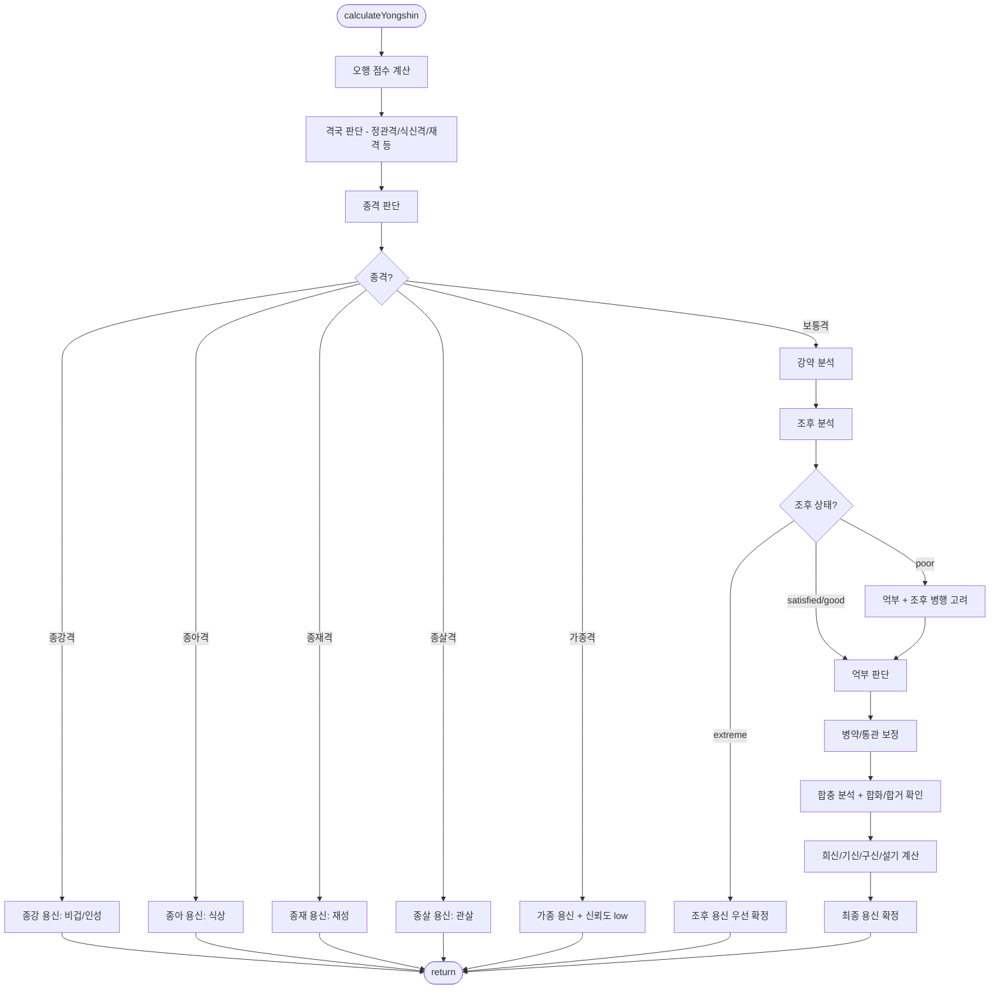

### 2.1 우선순위 변경 이유

| 순서 | 이전 | 변경 | 이유 |
|------|------|------|------|
| 0 | - | **격국 판단** | 병약 분석에서 격국 기반 병 판단 필요 |
| 1 | 조후 extreme/poor | **종격 판단** | 종격은 사주의 구조적 특성 → 먼저 판별 필수 |
| 2 | 종격 | **조후 extreme만** | poor까지 최우선시하면 종격 판단 누락 가능 |
| 3 | 억부 | **억부 + 조후 poor 병행** | poor는 억부와 함께 고려 |

### 2.2 격국/종격/조후 충돌 시 최종 의사결정 규칙 (신규)

> **핵심 문제**: 조후 extreme인데 종격(또는 격국 병약)이 강하게 잡히는 명식 처리

**고정 우선순위의 한계:**

| 케이스 | 문제 |
|--------|------|
| 종살격 매우 강함 + 겨울 火 부족(0.4) | 조후 extreme 우선 → 종살격 무시됨 |
| 정관격 파격(상관견관) + 여름 水 부족(0.3) | 조후 우선 → 격국 병약 무시됨 |

**권장 해결책: 우선권 점수(Priority Score) 기반 의사결정**

```
priorityScore = (jongConfidence × α) + (johuUrgency × β) + (gyeokIssue × γ)
```

| 요소 | 가중치 | 설명 |
|------|--------|------|
| `jongConfidence` | α = 2.0 | 종격 확신도 (high=3, medium=2, low=1) |
| `johuUrgency` | β = 1.5 | 조후 긴급도 (critical=3, high=2, normal=1, none=0) |
| `gyeokIssue` | γ = 1.0 | 격국 문제 심각도 (high=3, medium=2, low=1, none=0) |

**의사결정 로직:**

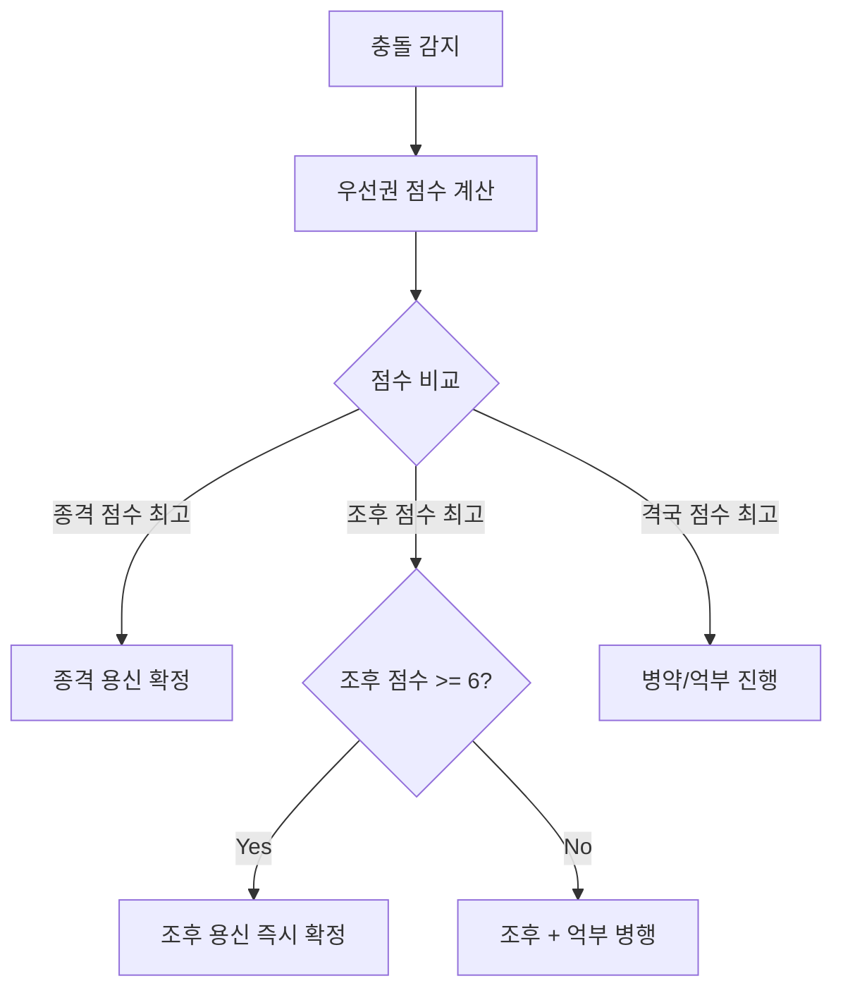

```javascript
// 권장 구현 - 우선권 점수 계산
function calculatePriorityScore(jongResult, johuResult, gyeokResult) {
  const WEIGHTS = { α: 2.0, β: 1.5, γ: 1.0 }
  
  // 종격 점수
  const jongScore = {
    'high': 3, 'medium': 2, 'low': 1, 'none': 0
  }[jongResult.confidence || 'none']
  
  // 조후 긴급도 점수
  const johuScore = {
    'critical': 3, 'high': 2, 'normal': 1, 'none': 0
  }[johuResult.urgency || 'none']
  
  // 격국 문제 심각도
  const gyeokScore = gyeokResult.issues?.reduce((max, issue) => {
    const severity = { 'high': 3, 'medium': 2, 'low': 1 }[issue.severity]
    return Math.max(max, severity)
  }, 0) || 0
  
  return {
    jong: jongScore * WEIGHTS.α,
    johu: johuScore * WEIGHTS.β,
    gyeok: gyeokScore * WEIGHTS.γ,
    winner: determineWinner(jongScore * WEIGHTS.α, johuScore * WEIGHTS.β, gyeokScore * WEIGHTS.γ)
  }
}

function determineWinner(jongPriority, johuPriority, gyeokPriority) {
  // 종격이 가장 높으면 종격
  if (jongPriority >= johuPriority && jongPriority >= gyeokPriority && jongPriority > 0) {
    return 'jong'
  }
  
  // 조후가 가장 높고, 임계값(6점) 이상이면 조후 즉시 확정
  if (johuPriority >= jongPriority && johuPriority >= gyeokPriority) {
    if (johuPriority >= 4.5) { // critical(3) × 1.5 = 4.5
      return 'johu_immediate'
    }
    return 'johu_with_eokbu' // 억부와 병행
  }
  
  // 그 외는 격국 기반 병약/억부 진행
  return 'gyeok'
}
```

**예외 처리 규칙:**

| 조건 | 처리 |
|------|------|
| 조후 점수 < 0.5 **AND** 일간 생존 불가급 | 조후 **즉시 확정** (생존 우선) |
| 종격 confidence = high **AND** 조후 점수 ≥ 1.0 | **종격 우선** (생존 가능) |
| 격국 파격(제화 실패) **AND** 조후 poor | **격국 약 > 조후** 복합 용신 |

```javascript
// 예외 처리 예시
function handleEdgeCases(johuStatus, johuScore, jongConfidence, ilganSurvival) {
  // 일간 생존 불가급이면 무조건 조후 우선
  if (johuScore < 0.5 && ilganSurvival === 'critical') {
    return { decision: 'johu_immediate', reason: '일간 생존 불가급' }
  }
  
  // 종격 high인데 조후가 그나마 있으면 종격 우선
  if (jongConfidence === 'high' && johuScore >= 1.0) {
    return { decision: 'jong', reason: '종격 확실 + 조후 최소 충족' }
  }
  
  return null // 기본 로직으로
}
```

---

## 3. 핵심 알고리즘 상세

### 3.1 오행 점수 계산 (computeElementScores)

- 입력: 4주(연·월·일·시). 월주는 지지/지장간 가중치 2배.
- 가중치: 천간 1.0, 지지 1.5(월주는 3.0), 지장간 0.9/0.5/0.3 (월주는 2배).
- 결과: `{ wood, fire, earth, metal, water }` 점수.

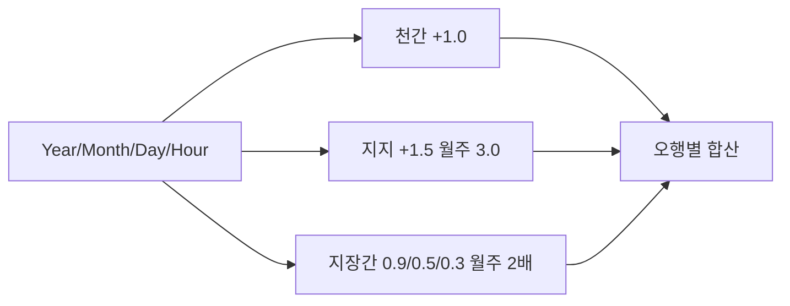

---

### 3.2 격국 판단 (determineGyeokguk) - 확장됨

> **종격 판단 전에 일반 격국을 먼저 판단**해야 병약 분석이 가능

#### 3.2.1 격국 유형

| 격국 | 조건 | 설명 |
|------|------|------|
| 정관격 | 월지 지장간 정관 투출 | 정관이 격국 주도 |
| 편관격 | 월지 지장간 편관 투출 | 편관이 격국 주도 |
| 정인격 | 월지 지장간 정인 투출 | 정인이 격국 주도 |
| 편인격 | 월지 지장간 편인 투출 | 편인이 격국 주도 |
| 식신격 | 월지 지장간 식신 투출 | 식신이 격국 주도 |
| 상관격 | 월지 지장간 상관 투출 | 상관이 격국 주도 |
| 정재격 | 월지 지장간 정재 투출 | 정재가 격국 주도 |
| 편재격 | 월지 지장간 편재 투출 | 편재가 격국 주도 |
| 건록격 | 월지가 일간의 록지 | 비겁이 강함 |

**다중 투출 시 격국 우선순위 (신규):**

> 여러 십성이 동시에 투출될 때 적용

**계열별 내부 우선순위:**

| 계열 | 우선순위 | 이유 |
|------|----------|------|
| 관(官) 계열 | 정관 > 편관 | 정(正)이 편(偏)보다 우선 |
| 재(財) 계열 | 정재 > 편재 | 정(正)이 편(偏)보다 우선 |
| 인(印) 계열 | 정인 > 편인 | 정(正)이 편(偏)보다 우선 |
| 식상(食傷) 계열 | 식신 > 상관 | 식신이 온화, 상관은 예리 |

**계열 간 전체 우선순위:**

```
관(官) > 재(財) > 인(印) > 식상(食傷) > 비겁(建祿/羊刃)
```

| 순위 | 격국 | 이유 |
|------|------|------|
| 1 | 관(정관/편관) | 귀(貴)를 주관 → 가장 중요 |
| 2 | 재(정재/편재) | 부(富)를 주관 |
| 3 | 인(정인/편인) | 학문/인덕 |
| 4 | 식상(식신/상관) | 재능/표현 |
| 5 | 비겁(건록/양인) | 자력/경쟁 |

```javascript
// 권장 구현 - 격국 우선순위
const GYEOKGUK_PRIORITY = {
  '정관격': 1,
  '편관격': 2,
  '정재격': 3,
  '편재격': 4,
  '정인격': 5,
  '편인격': 6,
  '식신격': 7,
  '상관격': 8,
  '건록격': 9,
  '양인격': 10
}

function selectGyeokguk(candidates) {
  // 우선순위가 가장 높은(숫자가 낮은) 격국 선택
  return candidates.sort((a, b) => 
    GYEOKGUK_PRIORITY[a] - GYEOKGUK_PRIORITY[b]
  )[0]
}
```

#### 3.2.2 지장간 우선순위 및 격국 신뢰도 (신규)

> **핵심 추가**: 주기/중기/여기 투출에 따라 격국 신뢰도가 달라짐

**지장간 구조:**

> ⚠️ **주의**: 卯, 酉, 子는 **순수 지기(純粹 地氣)**로 여기/중기가 없음

| 지지 | 여기(餘氣) | 중기(中氣) | 주기/정기(主氣) | 비고 |
|------|-----------|-----------|-----------------|------|
| 寅 | 戊 (이전 土잔기) | 丙 (火) | **甲** (木) ★ | |
| 卯 | - | - | **乙** (木) ★ | 순수 乙木 |
| 辰 | 乙 (木잔기) | 癸 (水) | **戊** (土) ★ | |
| 巳 | 戊 (土잔기) | 庚 (金) | **丙** (火) ★ | |
| 午 | 丙 (火잔기) | 己 (土) | **丁** (火) ★ | |
| 未 | 丁 (火잔기) | 乙 (木) | **己** (土) ★ | |
| 申 | 戊 (土잔기) | 壬 (水) | **庚** (金) ★ | |
| 酉 | - | - | **辛** (金) ★ | 순수 辛金 |
| 戌 | 辛 (金잔기) | 丁 (火) | **戊** (土) ★ | |
| 亥 | 戊 (土잔기) | 甲 (木) | **壬** (水) ★ | |
| 子 | - | - | **癸** (水) ★ | 순수 癸水 |
| 丑 | 癸 (水잔기) | 辛 (金) | **己** (土) ★ | |

**투출 우선순위 및 신뢰도:**

| 투출 위치 | 신뢰도 | 설명 |
|----------|--------|------|
| **주기(主氣)** 투출 | **High** | 월령 본기 → 격국 확실 |
| **중기(中氣)** 투출 | **Medium** | 중간 기운 → 격국 성립하나 다소 불안 |
| **여기(餘氣)** 투출 | **Low** | 잔기 → 격국 성립하나 힘 약함 |
| 투출 없음 | - | 격국 불성립 → 잡격 또는 특수격 |

```javascript
// 권장 구현 - 격국 신뢰도
function determineGyeokguk(saju) {
  const monthJi = saju.month.ji
  const jijanggan = getJijanggan(monthJi) // [여기, 중기, 주기]
  const allTiangan = [saju.year.gan, saju.month.gan, saju.hour.gan] // 일간 제외
  
  let gyeokguk = null
  let confidence = 'none'
  let touchulPosition = null
  
  // 주기 → 중기 → 여기 순서로 체크
  if (allTiangan.some(gan => isSameElement(gan, jijanggan[2]))) {
    gyeokguk = getSipseong(jijanggan[2], saju.day.gan)
    confidence = 'high'
    touchulPosition = 'jugi'
  } else if (jijanggan[1] && allTiangan.some(gan => isSameElement(gan, jijanggan[1]))) {
    gyeokguk = getSipseong(jijanggan[1], saju.day.gan)
    confidence = 'medium'
    touchulPosition = 'junggi'
  } else if (allTiangan.some(gan => isSameElement(gan, jijanggan[0]))) {
    gyeokguk = getSipseong(jijanggan[0], saju.day.gan)
    confidence = 'low'
    touchulPosition = 'yeogi'
  }
  
  // 혼잡/파격 체크
  const issues = checkGyeokgukIssues(gyeokguk, saju)
  
  return { gyeokguk, confidence, touchulPosition, issues }
}
```

#### 3.2.3 격국 문제 패턴 체크 (신규)

> **핵심 추가**: 관살혼잡, 재다신약 등 격국 성립 실패 요인

| 문제 패턴 | 조건 | 심각도 | 영향 |
|----------|------|--------|------|
| **관살혼잡(官殺混雜)** | 정관 + 편관 함께 투출 | **High** | 격국 불안정, 파격 가능 |
| **재다신약(財多身弱)** | 재성 > 3.0 + 일간 weak | **Medium** | 재를 감당 못함 |
| **상관견관(傷官見官)** | 상관격 + 정관 투출 | **High** | 관을 손상 |
| **식신탈인(食神奪印)** | 식신격 + 편인(효신) 투출 | **Medium** | 식신 파괴 |
| **재파인(財破印)** | 인수격 + 재성 강함 (≥2.5) | **Medium** | 인성 손상 |

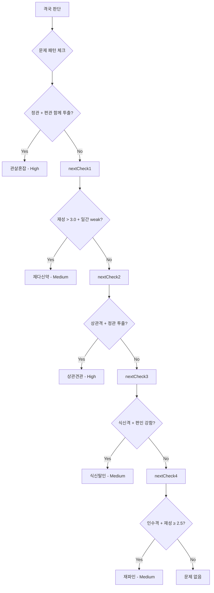

```javascript
// 권장 구현 - 격국 문제 패턴 체크
function checkGyeokgukIssues(gyeokguk, saju) {
  const issues = []
  const tiangan = [saju.year.gan, saju.month.gan, saju.day.gan, saju.hour.gan]
  
  // 1. 관살혼잡: 정관과 편관이 함께 투출
  const hasJeonggwan = tiangan.some(gan => getSipseong(gan, saju.day.gan) === '정관')
  const hasPyeongwan = tiangan.some(gan => getSipseong(gan, saju.day.gan) === '편관')
  if (hasJeonggwan && hasPyeongwan) {
    issues.push({ type: '관살혼잡', severity: 'high', remedy: '합살유관 또는 거관유살' })
  }
  
  // 2. 재다신약: 재성 과다 + 일간 약함
  const jaesungScore = getSipseongScore(['정재', '편재'], saju)
  const ilganStrength = analyzeStrength(saju)
  if (jaesungScore > 3.0 && ilganStrength.level === 'weak') {
    issues.push({ type: '재다신약', severity: 'medium', remedy: '비겁 보강' })
  }
  
  // 3. 상관견관: 상관격에서 정관 투출
  if (gyeokguk === '상관격' && hasJeonggwan) {
    issues.push({ type: '상관견관', severity: 'high', remedy: '인성으로 상관 제어' })
  }
  
  // 4. 식신탈인: 식신격에서 편인(효신) 강함
  const hyosinScore = getSipseongScore(['편인'], saju)
  if (gyeokguk === '식신격' && hyosinScore >= 1.5) {
    issues.push({ type: '식신탈인', severity: 'medium', remedy: '재성으로 효신 제어' })
  }
  
  // 5. 재파인: 인수격에서 재성 강함
  if ((gyeokguk === '정인격' || gyeokguk === '편인격') && jaesungScore >= 2.5) {
    issues.push({ type: '재파인', severity: 'medium', remedy: '비겁으로 재 분탈' })
  }
  
  return issues
}
```

---

### 3.3 종격 판단 (checkJonggyeok) - 확장됨

> **핵심 수정**: 재성을 억제가 아닌 설기로 분리, 종약격 세분화

#### 3.3.1 십성 분류 (수정)

| 분류 | 십성 | 가중치 |
|------|------|--------|
| 지원 (totalSupport) | 비겁 + 인성 | 천간 1.0, 지지 0.5, 지장간 0.3 |
| 설기 (totalDrain) | 식상 + 재성 | 천간 1.0, 지지 0.5, 지장간 0.3 |
| 억제 (totalOppression) | 관살만 | 천간 1.0, 지지 0.5, 지장간 0.3 |

#### 3.3.2 종격 판단 조건 (수정)

| 종격 유형 | 조건 | 신뢰도 |
|----------|------|--------|
| **종강격** | 득령 AND 근점수 ≥ 6.0 AND 관살 ≤ 1.0 AND **설기 ≤ 1.5** | 근점수 ≥ 7.0 → high, else medium |
| **종약격** | 실령 AND 근점수 ≤ 2.0 AND (식상 ≥ 3.0 OR 재성 ≥ 3.0 OR 관살 ≥ 3.0) AND **비겁+인성 ≤ 1.5** | 근점수 ≤ 1.0 → high, else medium |
| **가종격** | (득령 AND 근점수 ≥ 5.0 AND 관살 ≤ 2.0) OR (실령 AND 근점수 ≤ 2.5 AND 지원 ≤ 2.0) | low |
| **보통격** | 위 조건 불충족 | - |

> **변경사항**: 설기 제한 2.0 → 1.5, 지원 제한 2.0 → 1.5 (종격은 압도적이어야 함)

#### 3.3.3 종약격 세분화 (신규)

| 종약 유형 | 조건 | 용신 |
|----------|------|------|
| **종아격(從兒格)** | 식상 ≥ 3.0 AND 식상 > 재성 AND 식상 > 관살 | 식상 |
| **종재격(從財格)** | 재성 ≥ 3.0 AND 재성 > 식상 AND 재성 > 관살 | 재성 |
| **종살격(從殺格)** | 관살 ≥ 3.0 AND 관살 >= 식상 AND 관살 >= 재성 | 관살 |

**동률 처리 규칙 (신규):**

> 식상과 재성이 동점일 때는 **식상(근원)이 우선** - 식상이 재성을 생하기 때문

| 동률 상황 | 결과 | 이유 |
|----------|------|------|
| 식상 = 재성 | **종아격** | 식상이 재성의 근원 (생관계) |
| 식상 = 관살 | **종아격** | 식상이 먼저 발현 |
| 재성 = 관살 | **종재격** | 재성이 관살을 생함 |

```javascript
// 권장 구현 - 동률 처리
function determineJongyakSubType(sikSangScore, jaeSungScore, gwanSalScore) {
  // 동률 처리: 근원(생하는 쪽)이 우선
  if (sikSangScore >= jaeSungScore && sikSangScore >= gwanSalScore) {
    return '종아격' // 식상 우선
  }
  if (jaeSungScore > sikSangScore && jaeSungScore >= gwanSalScore) {
    return '종재격' // 재성 우선 (식상보다 높을 때만)
  }
  return '종살격' // 관살
}
```

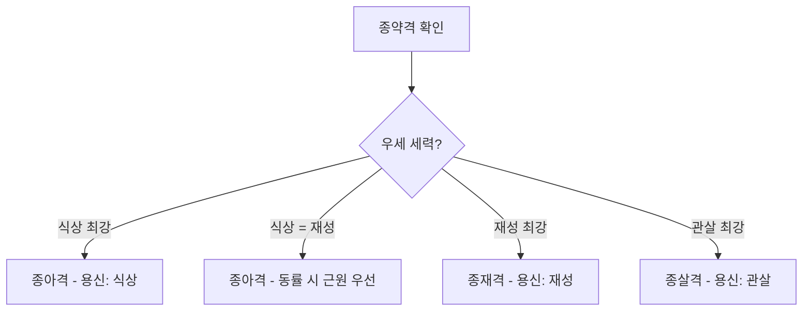

#### 3.3.4 종격 파격(破格) 및 구응(救應) 체크 - 신규

> **핵심 추가**: 종격이라도 구응이 있으면 파격되어 보통격으로 재평가

**구응(救應)이란?**
- 종격을 깨뜨리는 "구원 오행"
- 종약격: 인성/비겁이 천간에 투출 + 지지에 통근하면 → 종격 파격
- 종강격: 관살이 천간에 투출 + 지지에 강한 근이 있으면 → 종격 파격

| 종격 유형 | 구응 조건 | 파격 결과 |
|----------|-----------|-----------|
| **종약격** | 인성/비겁 투간 + 월지/일지 통근 | 보통격으로 재평가 |
| **종강격** | 관살 투간 + 지지에 강근 (≥1.5) | 보통격으로 재평가 |
| **가종격** | 파격 체크 필수 | 조건 불충족 시 보통격 |

```javascript
// 권장 구현 - 구응 체크
function checkJonggyeokBreak(jongType, saju) {
  if (jongType === '종약격') {
    // 인성/비겁이 천간에 투출 + 월지/일지에 통근하면 파격
    const hasRescue = checkTouganWithRoot(['인성', '비겁'], saju)
    if (hasRescue) return { broken: true, reason: '구응 존재 (인성/비겁)' }
  }
  if (jongType === '종강격') {
    // 관살이 천간에 투출 + 지지에 강한 근이 있으면 파격
    const hasControl = checkTouganWithRoot(['관살'], saju)
    if (hasControl) return { broken: true, reason: '제어력 존재 (관살)' }
  }
  return { broken: false }
}

function checkTouganWithRoot(sipseongList, saju) {
  const tiangan = [saju.year.gan, saju.month.gan, saju.day.gan, saju.hour.gan]
  const jiji = [saju.year.ji, saju.month.ji, saju.day.ji, saju.hour.ji]
  
  for (const sipseong of sipseongList) {
    const touchul = tiangan.some(gan => getSipseong(gan) === sipseong)
    if (touchul) {
      const rootScore = calculateRoot(sipseong, jiji)
      if (rootScore >= 1.5) return true // 강한 통근 존재
    }
  }
  return false
}
```

#### 3.3.5 가종격 → 보통격 Fallback (신규)

> **가종격은 불안정** → 파격 체크 후 보통격으로 재평가 가능

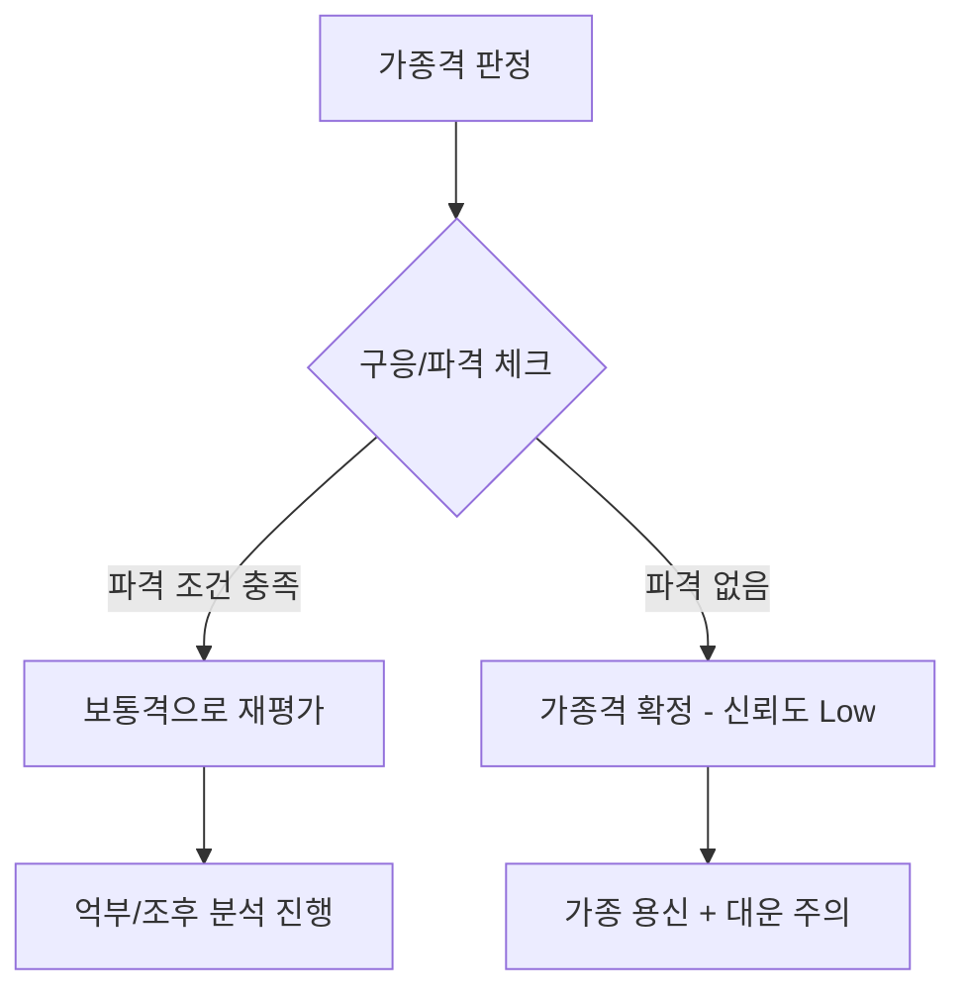

```javascript
// 권장 구현 - 가종격 재평가
function evaluateJonggyeok(saju) {
  const jongType = checkJonggyeok(saju)
  
  if (jongType === '가종격') {
    const breakCheck = checkJonggyeokBreak(jongType, saju)
    if (breakCheck.broken) {
      return { 
        type: '보통격', 
        reason: `가종격 파격: ${breakCheck.reason}`,
        reevaluate: true 
      }
    }
    return { type: '가종격', confidence: 'low' }
  }
  
  if (jongType.includes('종')) {
    const breakCheck = checkJonggyeokBreak(jongType, saju)
    if (breakCheck.broken) {
      return { 
        type: '보통격', 
        reason: `${jongType} 파격: ${breakCheck.reason}`,
        reevaluate: true 
      }
    }
  }
  
  return { type: jongType }
}
```

#### 3.3.6 종격 용신 결정

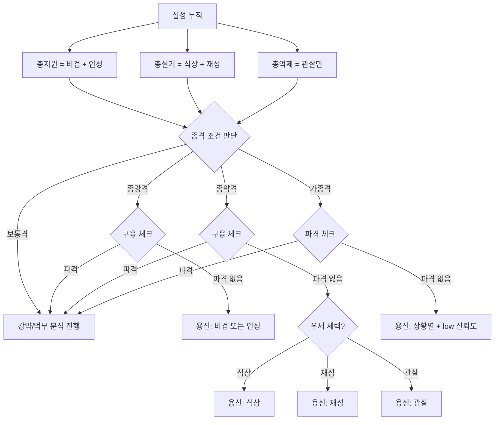

---

### 3.4 강약 분석 (analyzeStrength) - 확장됨

#### 3.4.1 득령 판단 확장 (쇠지 추가)

> **기존 문제**: 오행 일치만으로 생지/왕지/쇠지 구분 불가

| 일간 | 왕지(旺地) 100% | 생지(生地) 70% | 쇠지(衰地) 50% | 실령(失令) 0% | 득령 조건 |
|------|----------------|----------------|----------------|---------------|----------|
| 甲乙木 | 卯 | 寅 | 辰 (잔기) | 申酉戌亥子丑 | 寅卯辰월 |
| 丙丁火 | 午 | 巳 | 未 (잔기) | 亥子丑寅卯辰 | 巳午未월 |
| 庚辛金 | 酉 | 申 | 戌 (잔기) | 寅卯辰巳午未 | 申酉戌월 |
| 壬癸水 | 子 | 亥 | 丑 (잔기) | 巳午未申酉戌 | 亥子丑월 |
| 戊己土 | 辰戌丑未 (100%) | 巳午 (70%) | **寅卯 (30%)** ★ | 申酉亥子 | 사계토왕 |

> **土 일간 특수 처리**: 土는 사계절 끝(辰戌丑未)에 왕성하나, **寅卯월에는 木이 土를 극하므로 쇠지(30%)**로 처리

```javascript
// 권장 구현
function getDeukryeongRatio(dayGan, monthJi) {
  // 왕지: 100%
  // 생지: 70%
  // 쇠지(잔기): 50%
  // 실령: 0%
}
```

#### 3.4.2 근점수 기준 (수정)

| 강약 단계 | 조건 | 비고 |
|----------|------|------|
| extreme-strong | 득령 AND 근점수 ≥ 6.0 | 적절 |
| strong | 득령 AND 근점수 ≥ 4.5 | 4.0 → 4.5 상향 |
| neutral | 득령: 3.5~5.0 / 실령: 3.0~4.5 | **득령 여부 반영** |
| weak | 근점수 1.5~3.0 | 적절 |
| extreme-weak | 근점수 < 1.5 | 적절 |

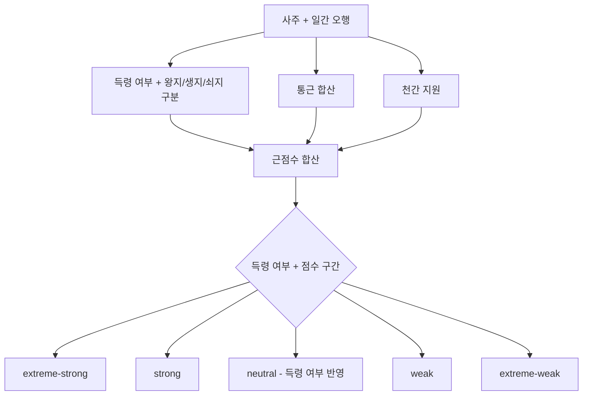

---

### 3.5 조후 분석 (analyzeJohu) - 단순화 및 수치화

> **핵심 변경**: 2축 단순화 + 충분/부족 기준 수치화 + 일간 연관 추가

#### 3.5.1 조후의 정확한 정의

> 계절의 **한난조습(寒暖燥濕)**을 조절하여 일간이 생존하기 좋은 환경을 만드는 것

| 계절 | 지지 | 기후 특성 | 조후 용신 |
|------|------|-----------|-----------|
| 춘(春) | 寅卯辰 | 온난, 다소 습 | 상황별 (목왕기) |
| 하(夏) | 巳午未 | 조열(燥熱) | **水** (해갈), 보조 金 |
| 추(秋) | 申酉戌 | 조량(燥涼) | 상황별 (금왕기) |
| 동(冬) | 亥子丑 | 한습(寒濕) | **火** (난방), 보조 木 |

#### 3.5.2 조후 오행 충분/부족 기준 (신규 수치화)

| 상태 | 조후 오행 점수 | 설명 |
|------|---------------|------|
| **충분** | ≥ 2.0 | 조후 용신 있음, satisfied |
| **부족** | 0.5 ~ 2.0 | 조후 용신 약함, poor |
| **없음** | < 0.5 | 조후 용신 부재, extreme |

#### 3.5.3 일간 오행과 조후 긴급도 (신규)

> 일간 오행과 계절의 조합에 따라 조후 긴급도가 달라짐

| 조합 | 긴급도 | 이유 |
|------|--------|------|
| 丙丁火 + 夏月 | **critical** | 화가 이미 강한데 조열까지 → 水 매우 급함 |
| 壬癸水 + 冬月 | **critical** | 수가 이미 강한데 한습까지 → 火 매우 급함 |
| 壬癸水 + 夏月 | high | 수가 약해지는데 조열 → 水 보충 + 金 생조 필요 |
| 丙丁火 + 冬月 | high | 화가 약해지는데 한습 → 火 보충 + 木 생조 필요 |
| 기타 | normal | 일반 조후 적용 |

```javascript
// 권장 구현
function getJohuUrgency(season, dayElement) {
  if (season === 'summer' && dayElement === 'fire') return 'critical'
  if (season === 'winter' && dayElement === 'water') return 'critical'
  if (season === 'summer' && dayElement === 'water') return 'high'
  if (season === 'winter' && dayElement === 'fire') return 'high'
  return 'normal'
}
```

#### 3.5.4 조후 판단 로직 (수정)

> **월령이 조후의 80% 이상을 결정**

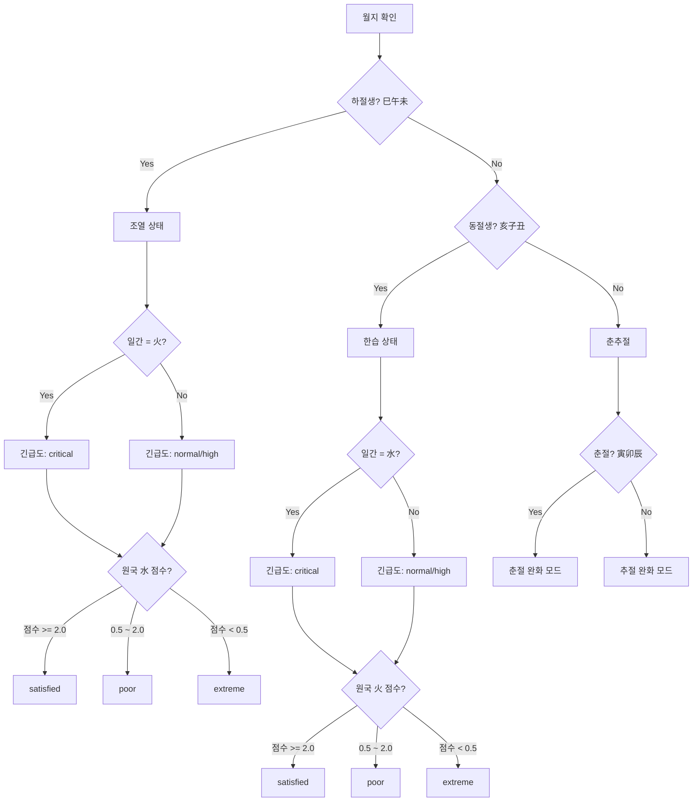

#### 3.5.5 춘추절 조후 완화 모드 (신규)

> **핵심 추가**: 춘추절도 조후 체크 필요하나, 기준 완화

**전통 조후 이론:**

| 계절 | 월지 | 기후 특성 | 조후 필요 오행 | 완화 기준 |
|------|------|-----------|---------------|-----------|
| **초춘** | 寅 | 한기 잔존 | 丙火 (온난) | 1.5 이상 |
| **중춘** | 卯 | 온화 | 부담 적음 | good |
| **늦봄** | 辰 | 습토 | 甲木(소토) + 丙火(조습) | 1.5 이상 |
| **초추** | 申 | 열기 잔존 | 壬水 (윤택) | 1.5 이상 |
| **중추** | 酉 | 조량 | 壬水 (윤택) | 1.5 이상 |
| **늦가을** | 戌 | 조토 | 癸水 (자윤) | 1.5 이상 |

```javascript
// 권장 구현 - 춘추절 완화 모드
function analyzeJohuRelaxed(season, monthJi, elementScores, dayElement) {
  // 하절/동절은 기존 로직
  if (season === 'summer' || season === 'winter') {
    return analyzeJohuStrict(season, elementScores, dayElement)
  }
  
  // 춘절 완화 모드
  if (season === 'spring') {
    if (monthJi === '寅') { // 초춘: 한기 잔존
      return checkJohuRelaxed('fire', elementScores, 1.5, '초춘 한기 잔존')
    }
    if (monthJi === '辰') { // 늦봄: 습기
      return checkJohuRelaxed('fire', elementScores, 1.5, '늦봄 습기')
    }
    return { status: 'good', reason: '중춘 온화' }
  }
  
  // 추절 완화 모드
  if (season === 'autumn') {
    if (monthJi === '申') { // 초추: 열기 잔존
      return checkJohuRelaxed('water', elementScores, 1.5, '초추 열기 잔존')
    }
    if (monthJi === '酉' || monthJi === '戌') { // 중추/늦가을: 조량
      return checkJohuRelaxed('water', elementScores, 1.5, '추절 조량')
    }
  }
  
  return { status: 'good' }
}

function checkJohuRelaxed(element, scores, threshold, reason) {
  const score = scores[element]
  
  if (score < 0.5) {
    return { status: 'poor', needed: element, reason, urgency: 'normal' }
  }
  if (score < threshold) {
    return { status: 'marginal', needed: element, reason, urgency: 'low' }
  }
  return { status: 'satisfied', reason }
}
```

**춘추절 조후 판단 다이어그램:**

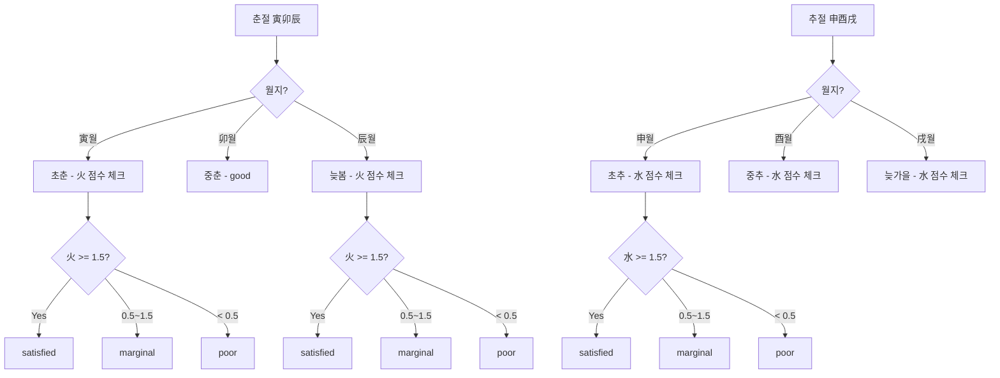

#### 3.5.5 조후 상태별 처리

| 상태 | 조건 | 처리 |
|------|------|------|
| extreme | 하절 水 < 0.5 / 동절 火 < 0.5 | 조후 용신 즉시 확정 |
| poor | 하절 水 0.5~2.0 / 동절 火 0.5~2.0 | 억부와 병행 고려 |
| satisfied | 조후 오행 ≥ 2.0 | 억부 판단으로 진행 |
| good | 춘추절 (조후 부담 적음) | 억부 판단으로 진행 |

---

### 3.6 억부 후보 점수 (scoreEokbuCandidate)

#### 3.6.1 점수 구성

```
최종점수 = 불균형점수 + 강약적합도 + 통근보정 + 원국존재패널티 + 계절보정 + 과다감점
```

#### 3.6.2 세부 점수 기준

| 항목 | 조건 | 점수 |
|------|------|------|
| 원국 부재 | elementScore = 0 | -3.0 |
| 매우 약함 | rel < 0.3 | -1.0 |
| 적당함 | rel < 0.7 | +0.8 |
| 과다 | rel > 1.6 | -0.8 |
| 여름/겨울 | season = summer/winter | -0.3 |
| 과다 오행 | excess에 포함 | -1.5 |
| 용신과 계절 상극 | 예: 金 용신 + 火旺월 | -0.5 |

> `rel = 해당 오행 점수 / 평균 오행 점수`

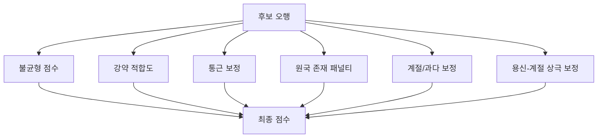

---

### 3.7 병약 분석 (analyzeByungyak) - 확장됨

> **핵심 추가**: 격국 기반 병 판단 + 제화 조건 + 통관 조건 수정

#### 3.7.1 오행 과다 기반 병 (기존)

- 과다 오행 발견 시 설기/극 중 원국에 존재하며 더 약한 쪽 우선
- 없으면 설기로 표시 (대운에서 보완)

#### 3.7.2 통관 조건 (확장) - 성립 조건 검증 추가

> **두 오행이 모두 강할 때만 통관 필요** + **통관 오행 성립 조건 필수**

| 조건 | 통관 필요 여부 |
|------|---------------|
| 木 3.0 vs 金 3.0 (비슷한 힘) | ✅ 통관 필요 (水) |
| 木 4.0 vs 金 1.0 (한쪽 압도) | ❌ 통관 불필요 (木이 이김) |

**통관 성립 조건 (필수 체크):**

| 체크 항목 | 조건 | 실패 시 처리 |
|----------|------|-------------|
| **① 원국 존재** | 통관 오행 점수 ≥ 0.5 | 대운/세운에서 보완 필요 |
| **② 최소 힘** | 통관 오행 점수 ≥ 1.5 | 통관력 부족 |
| **③ 피극 여부** | 극하는 오행 ≤ 통관 × 1.5 | 통관 무력화 |

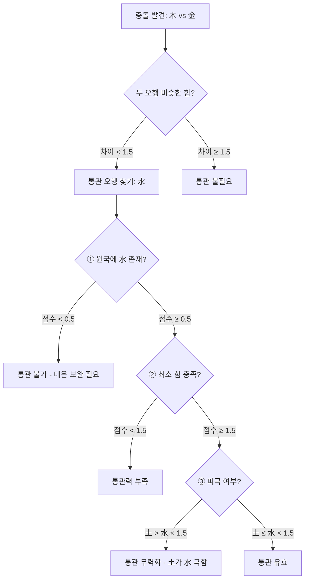

```javascript
// 권장 구현 - 통관 성립 조건 검증
function validateTonggwan(tonggwanElement, elementScores, saju) {
  const score = elementScores[tonggwanElement]
  
  // ① 원국 존재 체크
  if (score < 0.5) {
    return { 
      valid: false, 
      reason: '원국 부재', 
      suggestion: '대운/세운에서 보완 필요',
      needed: tonggwanElement
    }
  }
  
  // ② 최소 힘 체크
  if (score < 1.5) {
    return { 
      valid: false, 
      reason: '통관력 부족', 
      currentScore: score,
      minRequired: 1.5 
    }
  }
  
  // ③ 피극 체크 (통관 오행을 극하는 오행이 강한지)
  const controllingElement = getControllingElement(tonggwanElement)
  const controllingScore = elementScores[controllingElement]
  
  if (controllingScore > score * 1.5) {
    return { 
      valid: false, 
      reason: '통관 오행이 극 당함',
      controller: controllingElement,
      controllerScore: controllingScore,
      tonggwanScore: score
    }
  }
  
  return { 
    valid: true, 
    score,
    element: tonggwanElement
  }
}

// 통관 필요 여부 + 성립 조건 통합 체크
function checkTonggwanNeed(element1, element2, elementScores, saju) {
  const score1 = elementScores[element1]
  const score2 = elementScores[element2]
  
  // 두 오행이 비슷한 힘일 때만 통관 필요
  if (Math.abs(score1 - score2) >= 1.5) {
    return { needed: false, reason: '한쪽이 압도' }
  }
  
  // 통관 오행 찾기
  const tonggwanElement = findTonggwanElement(element1, element2)
  
  // 성립 조건 검증
  return validateTonggwan(tonggwanElement, elementScores, saju)
}
```

**통관 실패 예시:**

```
예: 木 3.0 vs 金 3.0 충돌 → 통관 필요: 水

Case 1: 원국에 水가 없음 (점수 0.3)
→ 통관 불가, 대운에서 水가 올 때 보완

Case 2: 원국에 水 0.8 존재
→ 통관력 부족 (최소 1.5 필요)

Case 3: 원국에 水 2.0 있지만 戊土 3.5가 존재
→ 土가 水를 극함 (3.5 > 2.0 × 1.5) → 통관 무력화
```

#### 3.7.3 격국 기반 병 판단 (추가)

| 격국 | 병(病)이 되는 요소 | 약(藥) |
|------|-------------------|--------|
| 정관격 | 상관(傷官)이 관을 극함 | 인성 (상관 극) |
| 식신격 | 편인(梟神)이 식신을 극함 | 재성 (편인 극) |
| 인수격 | 재성이 인성을 극함 | 비겁 (재 분탈) |
| 재격 | 비겁이 재를 분탈함 | 관살 (비겁 극) |

#### 3.7.4 제화(制化) 조건 (신규)

> **병이 있어도 약이 제압하면 파격이 아님**

| 조건 | 파격 여부 |
|------|----------|
| 약(藥) 점수 ≥ 병(病) 점수 × 0.8 | ❌ 제화 성공 → 격국 유지 |
| 약(藥) 점수 < 병(病) 점수 × 0.8 | ✅ 제화 실패 → 파격 |

```javascript
// 권장 구현
function isGyeokgukDamaged(gyeokguk, byung, yak) {
  const byungScore = getSipseongScore(byung)
  const yakScore = getSipseongScore(yak)
  
  if (yakScore >= byungScore * 0.8) {
    return false // 약이 병을 제화 → 파격 아님
  }
  return true // 파격
}
```

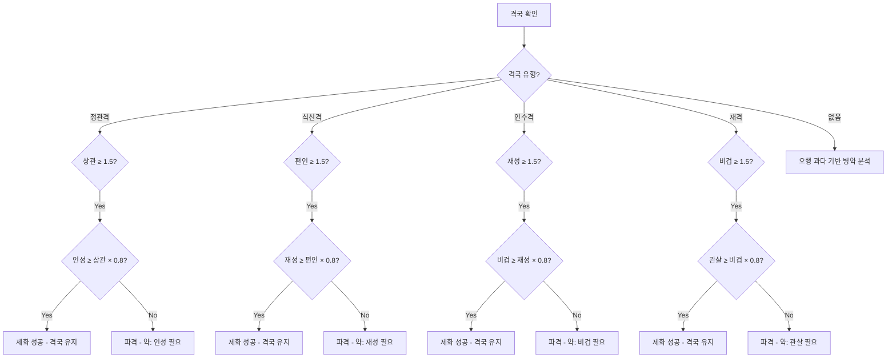

---

### 3.8 합충 분석 (analyzeCombinations) - 확장됨

> **핵심 추가**: 합화/합거 구분, 충 판단 기준

#### 3.8.1 천간합 + 합화/합거 판단

| 천간합 | 화신(化神) | 합화 조건 |
|--------|-----------|-----------|
| 甲己合 | 土化 | 辰戌丑未월 (土旺) + 木 억제 없음 |
| 乙庚合 | 金化 | 申酉戌월 (金旺) + 火 억제 없음 |
| 丙辛合 | 水化 | 亥子丑월 (水旺) + 土 억제 없음 |
| 丁壬合 | 木化 | 寅卯辰월 (木旺) + 金 억제 없음 |
| 戊癸合 | 火化 | 巳午未월 (火旺) + 水 억제 없음 |

**합화 성립 조건:**
1. 화신(化神)이 월령에서 왕성해야 함
2. 화신을 극하는 오행이 원국에 강하게 없어야 함
3. 합하는 두 천간이 모두 드러나야 함

**합거(合去) 처리 (신규):**

| 상황 | 효과 |
|------|------|
| 합화 성립 | 두 천간이 새 오행으로 변화 |
| **합화 불성립** | **합거(合去)** - 두 천간 기능 약화 |

**합거 감소율 (월령 가중 적용):**

| 합 참여 위치 | 감소율 | 이유 |
|-------------|--------|------|
| **월간** 참여 | **60%** | 월령의 힘이 강함 |
| **시간** 참여 | **40%** | 시간은 영향력 약함 |
| 일반 (연간/일간) | **50%** | 기본값 |

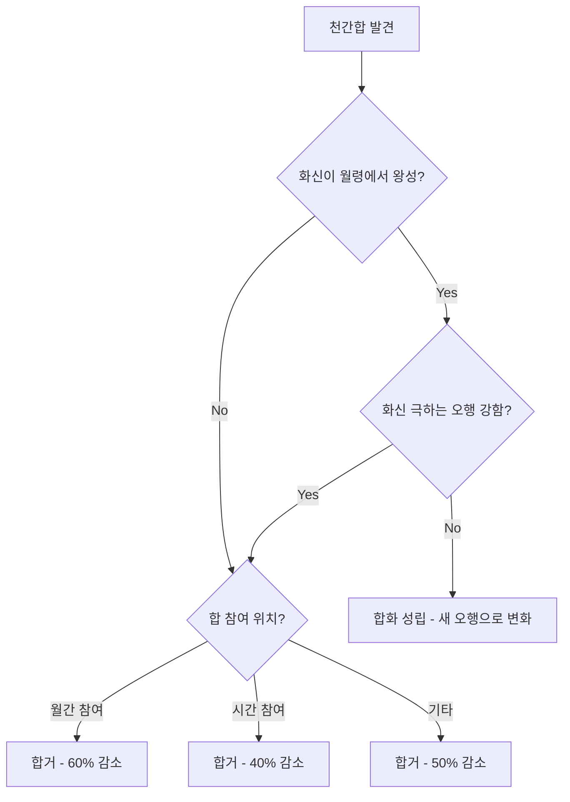

```javascript
// 권장 구현 - 합거 감소율 config
const HAPGEO_CONFIG = {
  DEFAULT_REDUCTION: 0.5,        // 기본 50% 감소
  MONTH_RELATED_REDUCTION: 0.6,  // 월간/월지 관련 시 60% 감소
  HOUR_RELATED_REDUCTION: 0.4    // 시간 관련 시 40% 감소
}

function getHapgeoReduction(position1, position2) {
  if (position1 === 'month' || position2 === 'month') {
    return HAPGEO_CONFIG.MONTH_RELATED_REDUCTION
  }
  if (position1 === 'hour' || position2 === 'hour') {
    return HAPGEO_CONFIG.HOUR_RELATED_REDUCTION
  }
  return HAPGEO_CONFIG.DEFAULT_REDUCTION
}
```

#### 3.8.2 지지합

**육합(六合):**

| 조합 | 화신 |
|------|------|
| 子丑 | 土 |
| 寅亥 | 木 |
| 卯戌 | 火 |
| 辰酉 | 金 |
| 巳申 | 水 |
| 午未 | 土 |

**삼합(三合) - 완전/반합 구분 (신규):**

| 삼합 | 화신 | 구성 지지 |
|------|------|-----------|
| 寅午戌 | **火局** | 생지(寅) + 왕지(午) + 묘지(戌) |
| 亥卯未 | **木局** | 생지(亥) + 왕지(卯) + 묘지(未) |
| 巳酉丑 | **金局** | 생지(巳) + 왕지(酉) + 묘지(丑) |
| 子辰申 | **水局** | 생지(申) + 왕지(子) + 묘지(辰) |

**삼합 성립 조건 및 효과:**

| 삼합 상태 | 조건 | 효과 | 비고 |
|-----------|------|------|------|
| **완전삼합** | 3지지 모두 | 화신으로 완전 변화 (100%) | 강력한 오행 |
| **반합(半合)** | 2지지만 | 부분 강화 (50%) | 변화 미완성 |
| **공합(空合)** | 1지지만 | 효과 없음 | 삼합 불성립 |

**반합(半合) 세부:**

| 반합 유형 | 조합 | 효과 | 비고 |
|----------|------|------|------|
| 생왕반합 | 寅午, 亥卯, 巳酉, 申子 | 강함 (60%) | 생지+왕지 |
| 왕묘반합 | 午戌, 卯未, 酉丑, 子辰 | 중간 (50%) | 왕지+묘지 |
| 생묘반합 | 寅戌, 亥未, 巳丑, 申辰 | 약함 (40%) | 생지+묘지 |

```javascript
// 권장 구현 - 삼합 체크
function checkSamhap(jiji) {
  const samhapGroups = {
    '火局': { members: ['寅', '午', '戌'], saeng: '寅', wang: '午', myo: '戌' },
    '木局': { members: ['亥', '卯', '未'], saeng: '亥', wang: '卯', myo: '未' },
    '金局': { members: ['巳', '酉', '丑'], saeng: '巳', wang: '酉', myo: '丑' },
    '水局': { members: ['申', '子', '辰'], saeng: '申', wang: '子', myo: '辰' }
  }
  
  for (const [element, group] of Object.entries(samhapGroups)) {
    const matches = group.members.filter(ji => jiji.includes(ji))
    
    if (matches.length === 3) {
      return { type: '완전삼합', element, ratio: 1.0 }
    }
    
    if (matches.length === 2) {
      const hasSaeng = matches.includes(group.saeng)
      const hasWang = matches.includes(group.wang)
      const hasMyo = matches.includes(group.myo)
      
      if (hasSaeng && hasWang) {
        return { type: '생왕반합', element, ratio: 0.6 }
      }
      if (hasWang && hasMyo) {
        return { type: '왕묘반합', element, ratio: 0.5 }
      }
      if (hasSaeng && hasMyo) {
        return { type: '생묘반합', element, ratio: 0.4 }
      }
    }
  }
  
  return null
}
```

#### 3.8.3 충 세분화 + 판단 기준 (신규)

| 충 유형 | 효과 | 설명 |
|---------|------|------|
| 충파(沖破) | 완전 파괴 | 약한 쪽이 무력화 |
| 충동(沖動) | 활성화 | 숨은 기운 발현 |
| 충개(沖開) | 합 해소 | 기존 합 파괴 |
| 충거(沖去) | 제거 | 기신 제거 시 길 |

**충 유형 판단 기준 (월령 가중 적용):**

| 조건 | 충 유형 | 비고 |
|------|---------|------|
| 기존 합이 있던 지지 | **충개** (합 해소) | |
| **월지 참여** + 점수 차이 > 1.5 | **충파** | 월지 충은 더 엄격 |
| 일반 + 점수 차이 > 2.0 | **충파** (약한 쪽 파괴) | |
| 점수 차이 ≤ 기준 | **충동** (서로 활성화) | |
| 기신 지지가 충 당함 | **충거** (기신 제거 - 길) | |

```javascript
// 권장 구현 - 충 config (월령 가중)
const CHUNG_CONFIG = {
  DEFAULT_SCORE_DIFF: 2.0,      // 일반 충파 기준
  MONTH_RELATED_DIFF: 1.5       // 월지 충은 더 엄격 (파괴력 큼)
}

function determineChungType(element1Score, element2Score, hasExistingHap, isGishinRemoved, position1, position2) {
  // 충개: 기존 합 해소
  if (hasExistingHap) return 'chungGae'
  
  // 충거: 기신 제거 (길)
  if (isGishinRemoved) return 'chungGeo'
  
  // 충파 기준 결정 (월지 관련 여부)
  const isMonthRelated = position1 === 'month' || position2 === 'month'
  const threshold = isMonthRelated ? CHUNG_CONFIG.MONTH_RELATED_DIFF : CHUNG_CONFIG.DEFAULT_SCORE_DIFF
  
  // 충파: 약한 쪽 파괴
  if (Math.abs(element1Score - element2Score) > threshold) {
    return 'chungPa'
  }
  
  // 충동: 서로 활성화
  return 'chungDong'
}
```

**월지 충의 특수성:**

| 상황 | 영향 | 이유 |
|------|------|------|
| 월지 충 (子午, 卯酉 등) | 파괴력 **1.5배** | 월령은 사주의 중심 |
| 일지 충 | 기본값 | 일간 관련 |
| 시지 충 | 영향 **0.8배** | 시간은 영향력 약함 |

```javascript
// 충 영향력 가중치
function getChungImpactMultiplier(position) {
  switch (position) {
    case 'month': return 1.5   // 월지 충 - 파괴력 강함
    case 'day': return 1.0     // 일지 충 - 기본
    case 'hour': return 0.8    // 시지 충 - 영향 약함
    case 'year': return 0.9    // 연지 충 - 다소 약함
    default: return 1.0
  }
}
```

#### 3.8.4 합충 강도의 점수 반영 위치 (신규)

> **핵심 추가**: 합화/합거/삼합/충의 비율이 어느 점수 항목에 반영되는지 명시

**합화/합거 반영 위치:**

| 합 유형 | 반영 위치 | 반영 방식 | 예시 |
|--------|----------|----------|------|
| **천간 합화** | `adjusted.elementScores` | 원래 오행 제거 + 화신 오행 추가 | 甲己合土 → 木-1, 土+2 |
| **천간 합거** | `adjusted.elementScores` | 두 천간 점수 × 감소율 | 甲己合去 → 甲 50%, 己 50% |
| **지지 삼합 완전** | `adjusted.elementScores` | 화신 오행으로 100% 변화 | 寅午戌 → 火+3 |
| **지지 반합** | `adjusted.elementScores` | 화신 오행 부분 강화 | 寅午 → 火+1.5 (60%) |
| **육합** | `adjusted.elementScores` | 육합 화신으로 변화 | 子丑合土 → 土+1.5 |

**충 반영 위치:**

| 충 유형 | 반영 위치 | 반영 방식 |
|--------|----------|----------|
| **충파** | `adjusted.elementScores` | 약한 쪽 점수 × 0.3 (70% 감소) |
| **충동** | `adjusted.elementScores` | 양쪽 점수 × 0.8 (20% 감소) |
| **충개** | `combinations.hap` | 합 해소 → 원래 오행으로 복귀 |
| **충거** | `adjusted.elementScores` | 기신 제거 → 기신 점수 × 0.2 |

**점수 반영 흐름:**

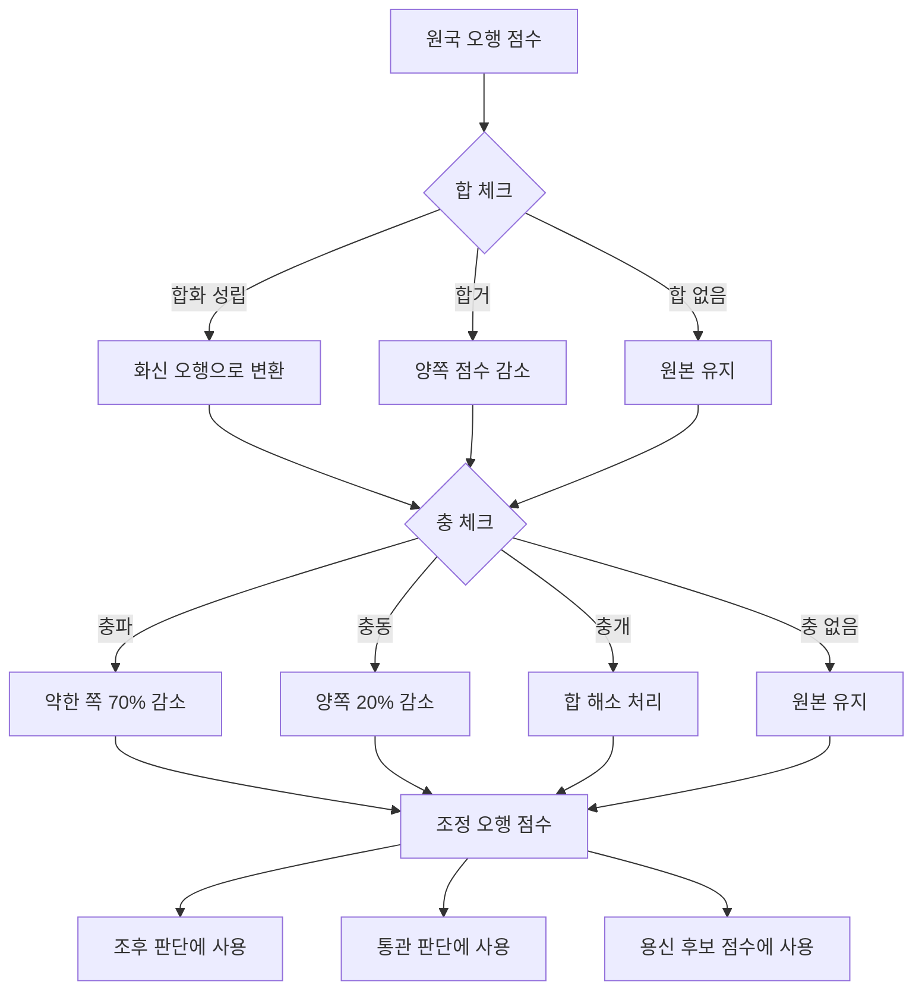

**용신 후보 점수(`scoreEokbuCandidate`) 반영:**

| 항목 | 합충 관련 보정 | 점수 범위 |
|------|--------------|----------|
| `rootAdj` (통근 보정) | 합으로 강화된 오행이면 +0.5 | -0.5 ~ +0.5 |
| `seasonAdj` (계절 보정) | 해당 없음 | -0.3 ~ 0 |
| `combinationAdj` (합충 보정) **신규** | 합화로 용신 오행 강화 시 +1.0 | -1.0 ~ +1.0 |

```javascript
// 권장 구현 - 합충 보정 점수
function getCombinationAdjustment(element, combinations, yongshinElement) {
  let adj = 0
  
  // 합화로 용신 오행이 강화되면 보너스
  for (const hap of combinations.hap) {
    if (hap.result === 'hapHwa' && hap.hwaShin === yongshinElement) {
      adj += 1.0 // 합화가 용신을 강화
    }
    if (hap.result === 'hapGeo' && hap.elements.includes(element)) {
      adj -= 0.5 // 합거로 해당 오행 약화
    }
  }
  
  // 충으로 기신이 약화되면 보너스
  for (const chung of combinations.chung) {
    if (chung.type === 'chungPa' || chung.type === 'chungGeo') {
      // 기신이 충으로 약화되면 용신에게 유리
      adj += 0.5
    }
  }
  
  return Math.max(-1.0, Math.min(1.0, adj)) // -1 ~ +1 범위
}
```

#### 3.8.5 용신 영향 요약

- 천간합 변질 시 → 용신 약화
- 지지합 완성 시 → 용신과 동일 오행이면 강화, 다르면 변질
- 충 시 → 용신 불안정/약화

---

### 3.9 희신/기신/구신/한신/오행설기 계산 - 5분류 체계

> **핵심 수정**: 한신(閑神)을 완전 삭제하지 않고 **중립 오행으로 유지** + 영향도(Impact) 등급 추가

#### 3.9.1 정의 (5분류 체계)

| 용어 | 정의 | 계산 | 영향 |
|------|------|------|------|
| 희신(喜神) | 용신을 생(生)하거나 보호 | 용신을 생하는 오행 | 양(+) |
| 기신(忌神) | 용신을 극(剋)하거나 손상 | 용신을 극하는 오행 | 음(-) |
| 구신(仇神) | 기신을 돕는(생하는) 오행 | 기신을 생하는 오행 | 음(-) |
| **한신(閑神)** | 용신과 직접 관계 없는 **중립** | 희/기/구에 해당하지 않음 | **중립(0)** |
| 오행설기(`outputElement`) | 용신의 기운을 빼앗음 | 용신이 생하는 오행 | 약음(-) |

> **⚠️ 한신 유지 이유**: 5행 순환 구조에서 이론적으로는 모든 오행이 연결되나, **실제 해석에서는 '영향 낮음' 분류가 필요**. 한신을 완전 삭제하면 "모든 게 의미 있음"으로 과해석될 위험.

**5분류 vs 4분류 비교:**

| 분류 체계 | 구성 | 장점 | 단점 |
|----------|------|------|------|
| **5분류** (권장) | 희신/기신/구신/한신/오행설기 | 해석 유연성, 운 해석 대응 | 다소 복잡 |
| 4분류 | 희신/기신/구신/오행설기 | 단순 | 중립 표현 불가 |

#### 3.9.2 영향도(Impact) 등급 (5분류 체계)

> **핵심 추가**: 이론적 정확성 + 실용적 해석을 위한 영향도 등급

| 분류 | 영향도 | 수치 | 설명 |
|------|--------|------|------|
| **용신** | positive-max | **+3** | 용신 그 자체 → 최고 |
| **희신** | positive-high | **+2** | 용신 직접 생조 → 매우 좋음 |
| **한신** | **neutral** | **0** | 중립 → 영향 낮음 |
| **오행설기** | negative-low ~ neutral | **-1 ~ 0** | 용신 기운 소모 → **조건부** |
| **구신** | negative-medium | **-2** | 기신 지원 → 나쁨 |
| **기신** | negative-high | **-3** | 용신 직접 극 → 매우 나쁨 |

**한신(閑神) 처리 (신규):**

> 한신은 용신과 직접 관계가 없는 중립 오행 → **영향 낮음으로 처리**

| 상황 | 처리 |
|------|------|
| 원국에서 한신 | 영향 낮음 (score: 0) |
| 대운에서 한신 | "특별히 좋지도 나쁘지도 않은 운" |
| 한신이 합/충으로 변화 | 변화된 오행으로 재분류 |

```javascript
// 권장 구현 - 한신 판별
function isHanshin(element, yongshin) {
  const heeshin = getGeneratingElement(yongshin)   // 용신 생하는
  const gishin = getControllingElement(yongshin)   // 용신 극하는
  const gushin = getGeneratingElement(gishin)      // 기신 생하는
  const outputElement = getGeneratedElement(yongshin) // 용신이 생하는
  
  // 희신/기신/구신/오행설기에 해당하지 않으면 한신
  if (element !== heeshin && 
      element !== gishin && 
      element !== gushin && 
      element !== outputElement &&
      element !== yongshin) {
    return true
  }
  return false
}
```

**오행설기(`outputElement`) 조건부 판단:**

> 용신이 강할 때는 오행설기의 부정적 영향이 감소함

| 용신 강약 | 오행설기 영향도 | 점수 | 이유 |
|----------|----------------|------|------|
| extreme-strong | **neutral** | **0** | 용신이 매우 강해 감당 |
| strong | **neutral-low** | **-0.5** | 용신이 강해 감당 가능 |
| neutral | negative-low | -1 | 기본값 |
| weak | negative-low | -1 | 설기가 부담됨 |
| extreme-weak | **negative-medium** | **-1.5** | 용신이 약해 더 부담 |

```javascript
// 권장 구현 - 오행설기 조건부 판단
function evaluateOutputElementImpact(yongshinStrength) {
  switch (yongshinStrength) {
    case 'extreme-strong':
      return { impact: 'neutral', score: 0, reason: '용신이 매우 강해 감당' }
    case 'strong':
      return { impact: 'neutral-low', score: -0.5, reason: '용신이 강해 감당 가능' }
    case 'neutral':
    case 'weak':
      return { impact: 'negative-low', score: -1, reason: '용신 기운 소모' }
    case 'extreme-weak':
      return { impact: 'negative-medium', score: -1.5, reason: '용신이 약해 더 부담' }
    default:
      return { impact: 'negative-low', score: -1, reason: '기본값' }
  }
}
```

```javascript
// 권장 구현 - 영향도 등급
function classifyElementsWithImpact(yongshinElement) {
  const generating = getGeneratingElement(yongshinElement)   // 용신 생하는
  const controlling = getControllingElement(yongshinElement) // 용신 극하는
  const generated = getGeneratedElement(yongshinElement)     // 용신이 생하는
  const gushinGen = getGeneratingElement(controlling)        // 기신 생하는
  
  return {
    yongshin: { 
      element: yongshinElement, 
      impact: 'positive-max',
      score: +3
    },
    heeshin: { 
      element: generating, 
      impact: 'positive-high',
      score: +2
    },
    seolgi: { 
      element: generated, 
      impact: 'negative-low',
      score: -1
    },
    gushin: { 
      element: gushinGen, 
      impact: 'negative-medium',
      score: -2
    },
    gishin: { 
      element: controlling, 
      impact: 'negative-high',
      score: -3
    }
  }
}
```

#### 3.9.3 계산 로직 (5분류)

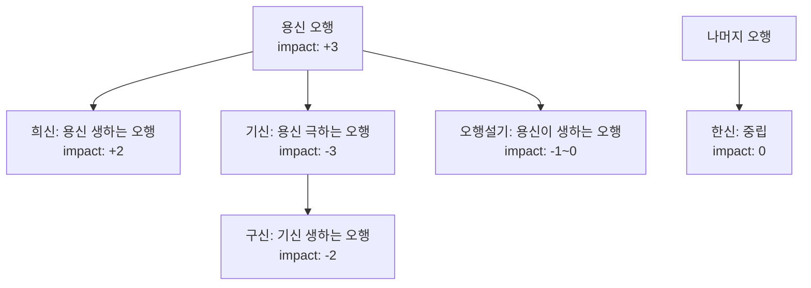

**예시 (용신 = 木):**

| 오행 | 관계 | 분류 | 영향도 | 점수 |
|------|------|------|--------|------|
| **木** | 용신 | **용신** | positive-max | **+3** |
| 水 | 수생목 (용신 생) | **희신** | positive-high | **+2** |
| 火 | 목생화 (용신 소모) | **오행설기** | negative-low | **-1** |
| 土 | - | **한신** ★ | neutral | **0** |
| 金 | 금극목 (용신 극) | **기신** | negative-high | **-3** |

> **참고**: 용신=木일 때 土는 희신/기신/구신/오행설기 어디에도 해당하지 않음 → **한신(중립)**
>
> - 구신은 "기신(金)을 생하는 오행"인데, 土生金이므로 土가 구신이 되어야 할 것 같지만...
> - **중요**: 구신 계산 시 "실제 원국에 金(기신)이 존재하고 土가 金을 생조하는 구조일 때만" 구신으로 분류
> - 단순 상생 관계만으로 구신 판정하면 과해석 → **실제 작용 여부 확인 필요**

**구신 판정 조건:**

```javascript
// 권장 구현 - 구신 판정 (실제 작용 여부 확인)
function isGushin(element, gishin, saju) {
  // 1. 해당 오행이 기신을 생하는 관계인지
  if (getGeneratingElement(gishin) !== element) return false
  
  // 2. 원국에 기신이 존재하는지
  const gishinScore = getElementScore(gishin, saju)
  if (gishinScore < 0.5) return false // 기신이 약하면 구신 효과 미미
  
  // 3. 해당 오행이 실제로 기신을 생조하는 위치에 있는지
  const isActuallySupporting = checkActualSupport(element, gishin, saju)
  
  return isActuallySupporting
}
```

#### 3.9.4 대운/세운 해석 활용

> 영향도 점수로 대운/세운의 길흉 판단에 활용

```javascript
// 대운 길흉 점수 계산 예시
function calculateDaeunScore(daeunElement, yongshinClassification) {
  const classification = yongshinClassification[daeunElement]
  return {
    element: daeunElement,
    type: classification.type,       // 희신/기신/구신/설기
    impact: classification.impact,   // positive-high / negative-low 등
    score: classification.score,     // +2, -1 등
    interpretation: getInterpretation(classification.impact)
  }
}

function getInterpretation(impact) {
  switch (impact) {
    case 'positive-max': return '최고의 운 - 용신 대운'
    case 'positive-high': return '좋은 운 - 희신이 도움'
    case 'negative-low': return '다소 불리 - 기운 소모'
    case 'negative-medium': return '불리한 운 - 기신 지원'
    case 'negative-high': return '매우 불리 - 용신 손상'
    default: return '보통'
  }
}
```

---

## 4. 판단 우선순위 요약 (수정됨)

| 순서 | 판단 | 조건 | 결과 |
|------|------|------|------|
| 0 | **격국 판단** | 월지 지장간 투출 확인 | 정관격/식신격/재격 등 결정 |
| 1 | **종격 판단** | 종강/종아/종재/종살/가종 조건 | 종격 용신 즉시 확정 |
| 2 | **조후 extreme** | 하절 水 < 0.5 / 동절 火 < 0.5 | 조후 용신 우선 확정 |
| 3 | **조후 poor + 억부** | 하절 水 0.5~2.0 / 동절 火 0.5~2.0 | 억부와 병행 고려 |
| 4 | **병약/통관** | 격국 손상 (제화 실패) / 상극 충돌 (비슷한 힘) | 통관 > 병약 > 억부 |
| 5 | **억부** | 일간 강약 기반 | 억부 용신 결정 |
| 6 | **보조용신** | 주용신과 상극 아닌 차점 | 보조 용신 |
| 7 | **증빙** | 합충/격국/강약/병약 | 분석 결과 첨부 |

---

## 5. 설정값 (YONGSHIN_CONFIG) - 확장됨

### 5.0 임계값 측정 단위 정의 (신규) ⚠️ 중요

> **모든 임계값이 어떤 점수 공간(score space)에서 측정되는지 명확히 정의**

| 점수 유형 | 정의 | 범위 | 계산 시점 |
|----------|------|------|----------|
| **원국 오행 점수** | `computeElementScores` 결과 | 약 0 ~ 8+ | 합화/반합 **반영 전** |
| **조정 오행 점수** | 합화/반합/충 반영 후 점수 | 약 0 ~ 8+ | 합화/반합 **반영 후** |
| **근점수** | 일간 통근/지원 합산 | 약 0 ~ 10 | 천간+지지+지장간 합산 |
| **십성 점수** | 특정 십성 누적 점수 | 약 0 ~ 6+ | 천간 1.0 + 지지 0.5 + 지장간 0.3 |
| **상대 비율** | `점수 / 평균` | 0 ~ 3+ | 평균 = 총점 / 5 |

**임계값 적용 점수 타입:**

| 임계값 | 적용 점수 타입 | 비고 |
|--------|---------------|------|
| 조후 충분/부족/없음 (2.0/0.5) | **원국 오행 점수** | 합화 반영 전 |
| 통관 성립 (1.5) | **조정 오행 점수** | 합화 반영 후 |
| 종격 조건 (6.0/2.0) | **근점수** | 일간 기준 |
| 종약 세력 (3.0) | **십성 점수** | 식상/재성/관살 |
| 과다 판정 (1.6) | **상대 비율** | 평균 대비 |

```javascript
// 점수 타입 명시 권장
interface ScoreContext {
  raw: ElementScores         // 원국 오행 점수
  adjusted: ElementScores    // 조정 오행 점수 (합충 반영 후)
  rootScore: number          // 근점수
  sipseong: SipseongScores   // 십성 점수
  relative: RelativeScores   // 상대 비율
}
```

### 5.0.1 튜닝 원칙 (신규)

> **임계값 조정 시 준수해야 할 원칙**

**1. 회귀 테스트 기준:**

| 항목 | 기준 | 설명 |
|------|------|------|
| 표준 테스트셋 통과율 | **≥ 90%** | 대표 명식 N개 기대 결과 일치 |
| 전문가 감정 일치율 | **≥ 85%** | 명리학 전문가 판단과 일치 |
| 극단값 처리 | **100%** | 종격/조후 extreme 케이스 정확 |

**2. 조정 범위 제한:**

| 임계값 | 허용 조정 범위 | 이유 |
|--------|---------------|------|
| 조후 충분 (2.0) | 1.8 ~ 2.2 | 너무 낮으면 조후 과소평가 |
| 조후 없음 (0.5) | 0.3 ~ 0.7 | 너무 높으면 극단 케이스 누락 |
| 종강 근점수 (6.0) | 5.5 ~ 6.5 | 종격 판정 민감도 |
| 통관 최소 (1.5) | 1.2 ~ 1.8 | 통관 유효성 |

**3. 표준 테스트셋 (예시):**

| ID | 명식 | 기대 용신 | 기대 신뢰도 | 허용 오차 |
|----|------|----------|------------|----------|
| T001 | 甲子/丙寅/甲午/甲戌 | 水 (조후) | high | ±0 |
| T002 | 庚申/庚辰/庚申/庚辰 | 木 (종강 억부) | high | ±0 |
| T003 | 乙亥/己丑/丁卯/壬寅 | 木 (억부) | medium | 오행 일치 |
| ... | ... | ... | ... | ... |

```javascript
// 회귀 테스트 예시
const STANDARD_TEST_SET = [
  {
    id: 'T001',
    saju: { year: '甲子', month: '丙寅', day: '甲午', hour: '甲戌' },
    expected: { element: 'water', reason: '조후', confidence: 'high' },
    tolerance: 'exact' // 정확히 일치
  },
  {
    id: 'T002', 
    saju: { year: '庚申', month: '庚辰', day: '庚申', hour: '庚辰' },
    expected: { element: 'wood', reason: '종강억부', confidence: 'high' },
    tolerance: 'exact'
  },
  {
    id: 'T003',
    saju: { year: '乙亥', month: '己丑', day: '丁卯', hour: '壬寅' },
    expected: { element: 'wood', reason: '억부', confidence: 'medium' },
    tolerance: 'element_match' // 오행만 일치하면 OK
  }
]

function runRegressionTest(config) {
  const results = STANDARD_TEST_SET.map(test => {
    const actual = calculateYongshin(test.saju, config)
    return {
      id: test.id,
      pass: checkTolerance(actual, test.expected, test.tolerance)
    }
  })
  
  const passRate = results.filter(r => r.pass).length / results.length
  return { passRate, threshold: 0.9 } // 90% 이상 통과 필요
}
```

### 5.1 기본 설정값

| 설정 | 현재값 | 권장값 | 용도 |
|------|--------|--------|------|
| MISSING_THRESHOLD | 0.35 | **0.20** | 결핍 판정 더 엄격 |
| DEFICIENT_THRESHOLD | 0.70 | 0.70 | 유지 |
| EXCESS_THRESHOLD | 1.60 | **1.80** | 과다 기준 약간 완화 |
| EXTREME_SEASON_DELTA | 1.2 | **1.5** | 극한 계절 판정 엄격 |
| NORMAL_SEASON_DELTA | 2.0 | 2.0 | 유지 |
| CLOSE_SCORE_MARGIN | 0.8 | **1.0** | 용신 후보 간 차이 여유 |
| CONFIDENCE_HIGH | 3.0 | 3.0 | 유지 |
| CONFIDENCE_MEDIUM | 1.5 | 1.5 | 유지 |
| ABSENT_PENALTY | 3.0 | 3.0 | 유지 (원국 부재 패널티) |
| WEAK_PENALTY | 1.0 | 1.0 | 유지 |
| WEAK_THRESHOLD | 0.3 | 0.3 | 유지 |

### 5.2 종격 관련 설정값 (신규)

| 설정 | 권장값 | 용도 |
|------|--------|------|
| **DRAIN_LIMIT_JONGGANG** | **1.5** | 종강격 설기 제한 |
| **SUPPORT_LIMIT_JONGYAK** | **1.5** | 종약격 지원 제한 |
| **RESCUE_ROOT_THRESHOLD** | **1.5** | 구응(救應) 통근 기준 |

### 5.3 조후 관련 설정값 (신규)

| 설정 | 권장값 | 용도 |
|------|--------|------|
| **JOHU_SUFFICIENT** | **2.0** | 조후 충분 기준 |
| **JOHU_POOR_MIN** | **0.5** | 조후 부족 최소 기준 |
| **JOHU_RELAXED** | **1.5** | 춘추절 완화 모드 기준 |

### 5.4 통관 관련 설정값 (신규)

| 설정 | 권장값 | 용도 |
|------|--------|------|
| **TONGGWAN_MIN_EXIST** | **0.5** | 통관 오행 원국 존재 최소 |
| **TONGGWAN_MIN_SCORE** | **1.5** | 통관 유효 최소 점수 |
| **TONGGWAN_CONTROL_RATIO** | **1.5** | 통관 피극 비율 (극 오행 > 통관 × 1.5면 무력화) |

### 5.5 합충 관련 설정값 (신규)

| 설정 | 권장값 | 용도 |
|------|--------|------|
| **HAPGEO_DEFAULT_REDUCTION** | **0.5** | 합거 기본 감소율 |
| **HAPGEO_MONTH_REDUCTION** | **0.6** | 월간 관련 합거 감소율 |
| **HAPGEO_HOUR_REDUCTION** | **0.4** | 시간 관련 합거 감소율 |
| **CHUNG_DEFAULT_DIFF** | **2.0** | 충파 기본 점수 차이 |
| **CHUNG_MONTH_DIFF** | **1.5** | 월지 충파 점수 차이 (더 엄격) |

### 5.6 영향도 점수 (신규)

| 설정 | 값 | 용도 |
|------|------|------|
| **IMPACT_YONGSHIN** | **+3** | 용신 오행 |
| **IMPACT_HEESHIN** | **+2** | 희신 오행 |
| **IMPACT_SEOLGI** | **-1** | 설기 오행 |
| **IMPACT_GUSHIN** | **-2** | 구신 오행 |
| **IMPACT_GISHIN** | **-3** | 기신 오행 |

---

## 6. 구현 시 주의사항

### 6.1 1순위 필수 수정

| 항목 | 현재 문제 | 수정 방향 |
|------|----------|-----------|
| 종약 세분화 | "가장 강한 세력" 불명확 | 종아격/종재격/종살격 명시적 구분 |
| 통관 조건 | 무조건 상극 ≥2건 | 두 오행 모두 강할 때만 적용 (점수 차 < 1.5) |
| 조후 수치화 | 충분/부족 기준 없음 | 점수 기반 명시 (충분 ≥2.0, 부족 0.5~2.0, 없음 <0.5) |

### 6.2 2순위 권장 수정

| 항목 | 현재 문제 | 수정 방향 |
|------|----------|-----------|
| 격국 판단 | 종격 전 격국 판단 없음 | 일반 격국 판단 단계 추가 |
| 합거 처리 | 합화 불성립 시 처리 없음 | 합거(合去) 효과 명시 |
| 충 판단 | 충 유형만 나열 | 점수 차이 기반 유형 결정 |
| 제화 조건 | 병약 분석에 제화 없음 | 약이 병을 제압하는지 확인 |

### 6.3 3순위 개선

| 항목 | 수정 방향 |
|------|-----------|
| 쇠지 반영 | 득령 비율에 50% 추가 |
| 종격 설기 제한 | 2.0 → 1.5 |
| 한신 재정의 | 5행 구조상 한신 없음 → 설기로 대체 |
| 일간-조후 연관 | 일간 오행별 조후 긴급도 반영 |

---

## 7. 대운/세운 영향 분석 - 출력 형태 정의

> 현재 PRD는 **원국(原局) 분석**만 다룸. 대운/세운 분석 시 **최소 출력 형태** 정의.

### 7.1 기본 개념

| 용어 | 설명 |
|------|------|
| 원국 용신 | 태어날 때 사주에서 도출된 용신 |
| 대운 영향 | 10년 주기로 용신이 득령/통근하는지 확인 |
| 세운 영향 | 매년 용신이 강화/약화되는지 확인 |

### 7.2 대운/세운 출력 형태 (신규)

**최소 출력 인터페이스:**

```typescript
interface LuckInfluence {
  // 운의 기본 정보
  period: {
    type: 'daeun' | 'seun'
    gan: string    // 천간
    ji: string     // 지지
    element: Element
    startAge?: number  // 대운 시작 나이
    year?: number      // 세운 연도
  }
  
  // 용신 기준 영향도
  yongshinImpact: {
    classification: 'yongshin' | 'heeshin' | 'gishin' | 'gushin' | 'hanshin' | 'outputElement'
    score: number      // -3 ~ +3
    boost: number      // 강화/약화 정도 (%)
  }
  
  // 희신/기신 영향
  supportImpact: {
    heeshinBoost: number   // 희신 강화 정도
    gishinRisk: number     // 기신 위험도
  }
  
  // 특수 상황 감지
  warnings: Array<{
    type: 'ipmo' | 'chung' | 'geuk' | 'hapHwa' | 'hapGeo'
    target: 'yongshin' | 'heeshin' | 'gishin'
    severity: 'critical' | 'warning' | 'info'
    message: string
  }>
  
  // 종합 평가
  overall: {
    rating: 'excellent' | 'good' | 'neutral' | 'caution' | 'danger'
    score: number  // -10 ~ +10
    summary: string
  }
}
```

### 7.3 특수 상황 경고 템플릿 (신규)

**용신이 입묘/충/극 당할 때:**

| 상황 | severity | 템플릿 메시지 |
|------|----------|--------------|
| 용신 입묘 | **critical** | "용신({element})이 {ji}에서 입묘되어 힘이 크게 약해집니다." |
| 용신 충 | **critical** | "용신({element})이 {opposing}과 충돌하여 불안정합니다." |
| 용신 극 | **warning** | "용신({element})이 {controller}에게 극을 받아 약해집니다." |
| 기신 강화 | **warning** | "기신({element})이 강해져 용신을 압박합니다." |
| 희신 약화 | **caution** | "희신({element})이 약해져 용신 지원이 줄어듭니다." |

```javascript
// 경고 메시지 생성 예시
function generateWarning(situation, context) {
  const templates = {
    yongshin_ipmo: {
      severity: 'critical',
      template: `용신(${context.yongshinElement})이 ${context.ji}에서 입묘되어 힘이 크게 약해집니다. 이 시기에는 새로운 시작보다 현상 유지가 좋습니다.`
    },
    yongshin_chung: {
      severity: 'critical', 
      template: `용신(${context.yongshinElement})이 ${context.opposing}과 충돌하여 불안정합니다. 갈등이나 변동이 예상됩니다.`
    },
    yongshin_geuk: {
      severity: 'warning',
      template: `용신(${context.yongshinElement})이 ${context.controller}에게 극을 받아 약해집니다. 도움을 받기 어려운 시기입니다.`
    },
    gishin_boost: {
      severity: 'warning',
      template: `기신(${context.gishinElement})이 강해져 용신을 압박합니다. 어려움이 예상됩니다.`
    },
    heeshin_weak: {
      severity: 'caution',
      template: `희신(${context.heeshinElement})이 약해져 용신 지원이 줄어듭니다. 스스로 힘써야 합니다.`
    }
  }
  
  return templates[situation]
}
```

### 7.4 대운/세운 종합 점수 계산 (신규)

```javascript
// 종합 점수 계산
function calculateLuckScore(luckInfluence, yongshinResult) {
  let score = 0
  
  // 용신 영향 (가중치 높음)
  score += luckInfluence.yongshinImpact.score * 2.0
  
  // 희신/기신 영향
  score += luckInfluence.supportImpact.heeshinBoost * 1.0
  score -= luckInfluence.supportImpact.gishinRisk * 1.5
  
  // 경고 사항 반영
  for (const warning of luckInfluence.warnings) {
    switch (warning.severity) {
      case 'critical': score -= 3; break
      case 'warning': score -= 1.5; break
      case 'info': score -= 0.5; break
    }
  }
  
  // 등급 결정
  let rating
  if (score >= 5) rating = 'excellent'
  else if (score >= 2) rating = 'good'
  else if (score >= -2) rating = 'neutral'
  else if (score >= -5) rating = 'caution'
  else rating = 'danger'
  
  return {
    rating,
    score: Math.max(-10, Math.min(10, score)),
    summary: getLuckSummary(rating, luckInfluence)
  }
}

function getLuckSummary(rating, influence) {
  const summaries = {
    excellent: '용신이 매우 강해지는 시기입니다. 적극적으로 움직이세요.',
    good: '대체로 순조로운 운입니다. 계획을 실행하기 좋습니다.',
    neutral: '특별히 좋거나 나쁘지 않습니다. 평상심을 유지하세요.',
    caution: '주의가 필요한 시기입니다. 신중하게 행동하세요.',
    danger: '어려움이 예상됩니다. 무리한 도전은 피하세요.'
  }
  return summaries[rating]
}
```

### 7.5 확장 필요 로직

```
1. 원국 용신 도출
2. 대운에서 용신 득령/통근 여부 확인
3. 세운에서 용신 강화/약화 판단
4. 용신이 대운에서 입묘/충/극 당할 때 처리
5. 경고 메시지 생성 및 출력
6. 종합 점수 계산 및 등급 부여
```

---

## 8. 근거 로그(Evidence) 출력 스펙 - 신규

> **핵심 추가**: 왜 이 용신이 나왔는지 디버깅/검증/해석을 위한 근거 출력

### 8.1 필요성

| 목적 | 설명 |
|------|------|
| **디버깅** | 왜 이 용신이 나왔는지 추적 필요 |
| **QA 검증** | 결과 검증을 위한 근거 필요 |
| **사용자 설명** | 해석문 생성 시 근거 활용 |
| **전문가 리뷰** | 로직 정확성 검토 |

### 8.2 리턴 타입 확장 (YongshinResult)

```typescript
interface YongshinResult {
  // ===== 기존 결과 =====
  primary: { 
    element: Element
    sipseong: Sipseong 
  }
  secondary?: { 
    element: Element
    sipseong: Sipseong 
  }
  heeshin: Element
  gishin: Element
  gushin: Element
  seolgi: Element
  
  // ===== 판정 근거 (신규) =====
  evidence: {
    // 격국 근거
    gyeokguk: {
      type: string                           // '정관격', '식신격' 등
      confidence: 'high' | 'medium' | 'low'  // 신뢰도
      touchulPosition: 'jugi' | 'junggi' | 'yeogi' | null  // 투출 위치
      touchulGan: string                     // 투출된 천간
      issues: Array<{                        // 격국 문제 패턴
        type: string                         // '관살혼잡', '재다신약' 등
        severity: 'high' | 'medium' | 'low'
        remedy: string                       // 해결책
      }>
    }
    
    // 종격 판단 근거
    jonggyeok: {
      type: string | null                    // '종강격', '종약격', '가종격', null
      subType?: string                       // '종아격', '종재격', '종살격'
      decision: 'confirmed' | 'broken' | 'none'  // 확정/파격/해당없음
      breakReason?: string                   // 파격 이유
      scores: {
        rootScore: number                    // 근점수
        support: number                      // 비겁 + 인성
        drain: number                        // 식상 + 재성
        oppression: number                   // 관살
      }
      deukryeong: boolean                    // 득령 여부
    }
    
    // 조후 판단 근거
    johu: {
      status: 'extreme' | 'poor' | 'satisfied' | 'good'
      season: 'spring' | 'summer' | 'autumn' | 'winter'
      monthJi: string                        // 월지
      urgency: 'critical' | 'high' | 'normal'
      neededElement?: Element                // 필요한 조후 오행
      currentScore?: number                  // 현재 조후 오행 점수
      threshold: {
        sufficient: number                   // 충분 기준
        poor: number                         // 부족 기준
      }
    }
    
    // 강약 판단 근거
    strength: {
      level: 'extreme-strong' | 'strong' | 'neutral' | 'weak' | 'extreme-weak'
      deukryeong: {
        status: boolean
        type: 'wangji' | 'saengji' | 'swaeji' | 'none'
        ratio: number                        // 100%, 70%, 50%, 0%
      }
      rootScore: number
      breakdown: {
        tonggeun: number                     // 통근
        tiangan: number                      // 천간 지원
        jijanggan: number                    // 지장간
      }
    }
    
    // 병약 판단 근거
    byungyak: {
      hasByung: boolean
      byungType?: string                     // '오행과다', '격국손상'
      byungElement?: Element                 // 병이 되는 오행
      byungSipseong?: string                 // 병이 되는 십성
      yakElement?: Element                   // 약이 되는 오행
      jehwaSuccess?: boolean                 // 제화 성공 여부
      jehwaRatio?: number                    // 제화 비율
      
      // 통관 관련
      tonggwan?: {
        needed: boolean
        element?: Element
        valid: boolean
        validationDetail: {
          existsInWonguk: boolean
          score: number
          minRequired: number
          controllerElement?: Element
          controllerScore?: number
        }
      }
    }
    
    // 용신 후보 점수 (TOP 5)
    candidates: Array<{
      rank: number
      element: Element
      totalScore: number
      breakdown: {
        imbalance: number                    // 불균형 점수
        fit: number                          // 강약 적합도
        rootAdj: number                      // 통근 보정
        existPenalty: number                 // 원국 존재 패널티
        seasonAdj: number                    // 계절 보정
        excessAdj: number                    // 과다 감점
        seasonConflict: number               // 용신-계절 상극
      }
      selected: boolean                      // 선택 여부
      reason?: string                        // 선택/탈락 이유
    }>
    
    // 합충 영향
    combinations: {
      hap: Array<{
        type: 'cheonganHap' | 'yukHap' | 'samHap'
        elements: [string, string]           // 합하는 요소
        result: 'hapHwa' | 'hapGeo'          // 합화/합거
        hwaShin?: Element                    // 화신 (합화 시)
        impact: string                       // 영향 설명
        position?: string                    // 위치 (월령 관련 여부)
      }>
      chung: Array<{
        elements: [string, string]
        type: 'chungPa' | 'chungDong' | 'chungGae' | 'chungGeo'
        scoreDiff: number                    // 점수 차이
        impact: string
        position?: string
      }>
    }
    
    // 최종 결정 경로
    decisionPath: Array<{
      step: string                           // '격국판단', '종격체크' 등
      result: string                         // 결과
      condition?: string                     // 판단 조건 (신규)
      continued: boolean                     // 다음 단계 진행 여부
    }>
  }
}
```

### 8.3 decisionPath 예시 (condition 포함)

```javascript
// 일반적인 억부 용신 도출 케이스
decisionPath: [
  { 
    step: '격국판단', 
    result: '정관격 (High)', 
    condition: '寅월 주기 甲 → 천간 甲 투출',
    continued: true 
  },
  { 
    step: '종격체크', 
    result: '보통격', 
    condition: '근점수 3.2 < 6.0, 종강 불충족',
    continued: true 
  },
  { 
    step: '조후분석', 
    result: 'satisfied (夏, 水 2.3)', 
    condition: '夏月(午) + 水 2.3 ≥ 2.0',
    continued: true 
  },
  { 
    step: '강약분석', 
    result: 'weak (근점수 2.1)', 
    condition: '실령 + 근점수 2.1 < 3.0',
    continued: true 
  },
  { 
    step: '병약체크', 
    result: '상관견관 (제화 실패)', 
    condition: '상관 2.1 > 정관 1.2, 인성 0.8 < 상관×0.8',
    continued: true 
  },
  { 
    step: '억부결정', 
    result: '인성 (Wood)', 
    condition: '일간 weak → 인성으로 부조',
    continued: false 
  },
  { 
    step: '최종용신', 
    result: 'Wood (인성)', 
    condition: '억부 판단 결과',
    continued: false 
  }
]

// 종격 확정 케이스
decisionPath: [
  { 
    step: '격국판단', 
    result: '편관격 (Medium)', 
    condition: '申월 중기 壬 → 천간 壬 투출',
    continued: true 
  },
  { 
    step: '종격체크', 
    result: '종살격 확정 (관살 4.2)', 
    condition: '실령 + 근점수 1.2 ≤ 2.0 + 관살 4.2 ≥ 3.0 + 구응 없음',
    continued: false 
  },
  { 
    step: '최종용신', 
    result: 'Metal (관살)', 
    condition: '종살격 → 관살 추종',
    continued: false 
  }
]

// 조후 extreme 케이스
decisionPath: [
  { 
    step: '격국판단', 
    result: '식신격 (High)', 
    condition: '巳월 주기 丙 → 천간 丙 투출',
    continued: true 
  },
  { 
    step: '종격체크', 
    result: '보통격', 
    condition: '득령 + 근점수 4.0, 관살 2.0 > 1.0',
    continued: true 
  },
  { 
    step: '조후분석', 
    result: 'extreme (冬, 火 0.3)', 
    condition: '子월(冬) + 火 0.3 < 0.5 → extreme',
    continued: false 
  },
  { 
    step: '최종용신', 
    result: 'Fire (조후)', 
    condition: '조후 extreme → 조후 우선',
    continued: false 
  }
]

// 종격 파격 케이스 (신규)
decisionPath: [
  { 
    step: '격국판단', 
    result: '편인격 (Medium)', 
    condition: '亥월 중기 甲 → 천간 甲 투출',
    continued: true 
  },
  { 
    step: '종격체크', 
    result: '종약격 판정', 
    condition: '실령 + 근점수 1.5 ≤ 2.0 + 재성 3.5 ≥ 3.0',
    continued: true 
  },
  { 
    step: '구응체크', 
    result: '파격 → 보통격', 
    condition: '정인 투출 + 월지 亥 통근 1.8 ≥ 1.5',
    continued: true 
  },
  { 
    step: '강약분석', 
    result: 'weak (근점수 1.5)', 
    condition: '실령 + 근점수 1.5 < 3.0',
    continued: true 
  },
  { 
    step: '억부결정', 
    result: '인성 (Water)', 
    condition: '일간 weak → 인성으로 부조',
    continued: false 
  },
  { 
    step: '최종용신', 
    result: 'Water (인성)', 
    condition: '억부 판단 결과',
    continued: false 
  }
]
```

### 8.4 로깅 포맷

```javascript
// 콘솔 로그 예시
function logYongshinEvidence(result: YongshinResult) {
  console.group('🔮 용신 분석 결과')
  
  console.log('━━━ 격국 ━━━')
  console.log(`  유형: ${result.evidence.gyeokguk.type}`)
  console.log(`  신뢰도: ${result.evidence.gyeokguk.confidence}`)
  console.log(`  투출: ${result.evidence.gyeokguk.touchulPosition}`)
  if (result.evidence.gyeokguk.issues.length > 0) {
    console.log(`  문제: ${result.evidence.gyeokguk.issues.map(i => i.type).join(', ')}`)
  }
  
  console.log('━━━ 종격 ━━━')
  console.log(`  판정: ${result.evidence.jonggyeok.decision}`)
  if (result.evidence.jonggyeok.type) {
    console.log(`  유형: ${result.evidence.jonggyeok.type}`)
  }
  
  console.log('━━━ 조후 ━━━')
  console.log(`  상태: ${result.evidence.johu.status}`)
  console.log(`  긴급도: ${result.evidence.johu.urgency}`)
  
  console.log('━━━ 강약 ━━━')
  console.log(`  등급: ${result.evidence.strength.level}`)
  console.log(`  근점수: ${result.evidence.strength.rootScore}`)
  
  console.log('━━━ 용신 후보 TOP 3 ━━━')
  result.evidence.candidates.slice(0, 3).forEach((c, i) => {
    console.log(`  ${i+1}. ${c.element}: ${c.totalScore.toFixed(2)} ${c.selected ? '✅' : ''}`)
  })
  
  console.log('━━━ 결정 경로 ━━━')
  result.evidence.decisionPath.forEach(d => {
    console.log(`  ${d.continued ? '→' : '●'} ${d.step}: ${d.result}`)
  })
  
  console.groupEnd()
}
```

---

## 9. 참조 소스

- `src/shared/lib/saju/calculators/Yongshin.ts`
- `src/shared/lib/saju/calculators/SajuCalculator.ts`

---

## 11. 변경 이력

| 버전 | 날짜 | 주요 변경 |
|------|------|-----------|
| v1 | - | 초기 버전 |
| v2 | - | 우선순위 변경, 재성 설기 분리, 합화 조건 추가 |
| v3 | - | 격국 판단 추가, 종약 세분화, 조후 수치화, 통관 조건 수정, 제화 조건, 합거 처리, 충 판단 기준, 쇠지 반영, 설기/한신 재정의, 대운/세운 섹션 |
| v4 | - | **1순위 필수 반영** |
| | | - 종격 구응(救應) 체크 및 가종→보통격 fallback 로직 |
| | | - 격국 지장간 우선순위(주기/중기/여기) 및 신뢰도 |
| | | - 격국 문제 패턴 체크(관살혼잡, 재다신약, 상관견관 등) |
| | | - 통관 성립 조건 검증(원국 존재 + 최소 점수 + 피극 체크) |
| | | - 근거 로그(Evidence) 출력 스펙 전면 추가 |
| | | **2순위 권장 반영** |
| | | - 춘추절 조후 완화 모드 |
| | | - 합거/충파 월령 가중치 적용 |
| | | **3순위 선택적 반영** |
| | | - 영향도(Impact) 등급 시스템 추가 |
| v4.1 | - | **데이터 오류 수정** |
| | | - 지장간 표: 卯/酉/子 순수 지기 수정 (여기/중기 없음) |
| | | **로직 보완** |
| | | - 종아/종재 동률 처리 규칙 추가 (식상 우선) |
| | | - 삼합 완전/반합 구분 (생왕반합 60%, 왕묘반합 50%, 생묘반합 40%) |
| | | - 土 일간 쇠지 추가 (寅卯월 30%) |
| | | - 격국 우선순위 규칙 명시 (관 > 재 > 인 > 식상 > 비겁) |
| | | - decisionPath에 condition 필드 추가 (판단 조건 명시) |
| | | - 오행설기 조건부 판단 (용신 강약에 따른 영향도 차등) |
| **v4.2** | 현재 | **1순위 보강** |
| | | - 설기(洩氣) 용어 구분: 십성 설기(`drainSipseong`) vs 오행 설기(`outputElement`) |
| | | - 한신(閑神) 중립 유지: 완전 삭제 대신 5분류 체계로 변경 |
| | | - 격국/종격/조후 충돌 시 우선권 점수(Priority Score) 기반 의사결정 |
| | | **2순위 보강** |
| | | - 임계값 측정 단위 정의 (원국 점수/조정 점수/근점수/십성 점수/상대 비율) |
| | | - 튜닝 원칙 및 표준 테스트셋 구조 추가 |
| | | - 합충/합화/합거 강도의 점수 반영 위치 명시 (combinationAdj 신규) |
| | | **3순위 보강** |
| | | - 대운/세운 출력 형태 인터페이스 정의 (LuckInfluence) |
| | | - 특수 상황 경고 템플릿 (입묘/충/극) |
| | | - 대운/세운 종합 점수 계산 로직 |