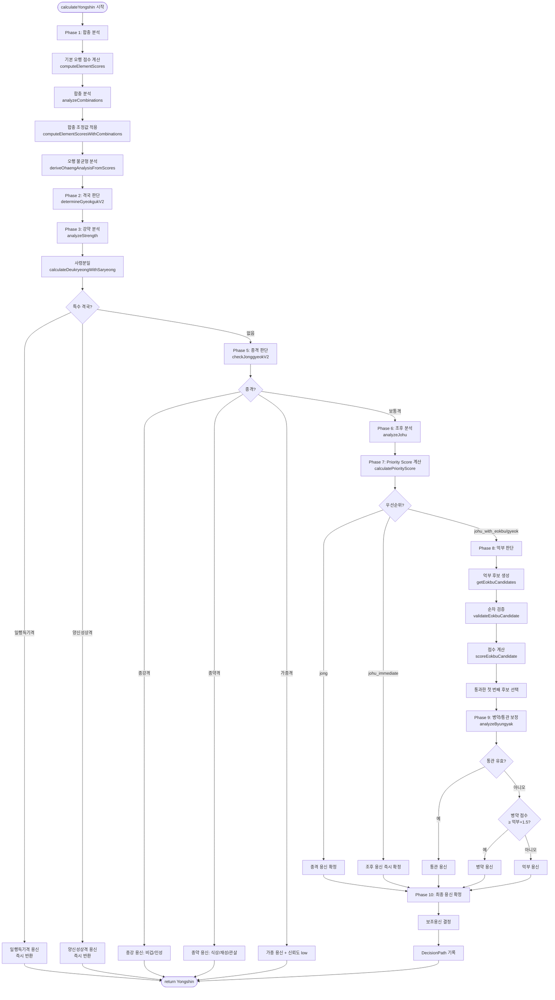

# 용신 계산 알고리즘 상세 문서

본 문서는 `Yongshin.ts` 파일의 용신 계산 알고리즘을 단계별로 상세히 설명합니다.

## 목차

1. [개요 및 설정값](#개요-및-설정값)
2. [Phase 1: 합충 분석 및 점수 조정](#phase-1-합충-분석-및-점수-조정)
3. [Phase 2: 격국 판단](#phase-2-격국-판단)
4. [Phase 3: 강약 분석](#phase-3-강약-분석)
5. [Phase 4: 특수 격국 체크](#phase-4-특수-격국-체크)
6. [Phase 5: 종격 판단](#phase-5-종격-판단)
7. [Phase 6: 조후 분석](#phase-6-조후-분석)
8. [Phase 7: Priority Score 계산](#phase-7-priority-score-계산)
9. [Phase 8: 억부 판단](#phase-8-억부-판단)
10. [Phase 9: 병약/통관 보정](#phase-9-병약통관-보정)
11. [Phase 10: 최종 용신 확정](#phase-10-최종-용신-확정)

---

## 개요 및 설정값

### YONGSHIN_CONFIG 설정값

#### 오행 불균형 임계값

| 설정명 | 값 | 설명 | 계산식 적용 |
|--------|-----|------|------------|
| `MISSING_THRESHOLD` | 0.20 | 결핍 판정 기준 | `score < avg × 0.20` → missing |
| `DEFICIENT_THRESHOLD` | 0.70 | 부족 판정 기준 | `score < avg × 0.70` → deficient |
| `EXCESS_THRESHOLD` | 1.80 | 과다 판정 기준 | `score > avg × 1.80` → excess |

#### 우선순위 델타

| 설정명 | 값 | 설명 |
|--------|-----|------|
| `EXTREME_SEASON_DELTA` | 1.5 | 극한 계절 델타 (더 엄격) |
| `NORMAL_SEASON_DELTA` | 2.0 | 일반 계절 델타 |
| `CLOSE_SCORE_MARGIN` | 1.0 | 점수 차이 여유 |

#### 신뢰도(점수 차)

| 설정명 | 값 | 설명 |
|--------|-----|------|
| `CONFIDENCE_HIGH` | 3.0 | 높은 신뢰도 기준 |
| `CONFIDENCE_MEDIUM` | 1.5 | 중간 신뢰도 기준 |

#### 원국 존재 여부 패널티

| 설정명 | 값 | 설명 |
|--------|-----|------|
| `ABSENT_PENALTY` | 3.0 | 원국에 완전히 없을 때 감점 |
| `WEAK_PENALTY` | 1.0 | 매우 약할 때 감점 |
| `WEAK_THRESHOLD` | 0.3 | 매우 약함 판정 기준 (상대 비율) |

#### 종격 관련 설정값

| 설정명 | 값 | 설명 |
|--------|-----|------|
| `JONGGANG_ROOT_MIN` | 6.0 | 종강격 근점수 최소 기준 |
| `JONGYAK_ROOT_MAX` | 2.0 | 종약격 근점수 최대 기준 |
| `DRAIN_LIMIT_JONGGANG` | 1.5 | 종강격 설기(식상+재성) 제한 |
| `SUPPORT_LIMIT_JONGYAK` | 1.5 | 종약격 지원(비겁+인성) 제한 |
| `RESCUE_ROOT_THRESHOLD` | 1.5 | 구응(救應) 통근 기준 |
| `JONGYAK_SIPSEONG_MIN` | 3.0 | 종약 십성 최소 점수 |

#### 조후 관련 설정값

| 설정명 | 값 | 설명 |
|--------|-----|------|
| `JOHU_SUFFICIENT` | 2.0 | 조후 충분 기준 |
| `JOHU_POOR_MIN` | 0.5 | 조후 부족 최소 기준 |
| `JOHU_RELAXED` | 1.5 | 춘추절 완화 모드 기준 |

#### 통관 관련 설정값

| 설정명 | 값 | 설명 |
|--------|-----|------|
| `TONGGWAN_MIN_EXIST` | 0.5 | 통관 오행 원국 존재 최소 |
| `TONGGWAN_MIN_SCORE` | 1.5 | 통관 유효 최소 점수 |
| `TONGGWAN_CONTROL_RATIO` | 1.5 | 통관 피극 비율 |
| `TONGGWAN_SCORE_DIFF` | 1.5 | 통관 필요 점수 차이 |

#### 합충 관련 설정값

| 설정명 | 값 | 설명 |
|--------|-----|------|
| `HAPGEO_DEFAULT_REDUCTION` | 0.5 | 합거 기본 감소율 |
| `HAPGEO_MONTH_REDUCTION` | 0.6 | 월간 관련 합거 감소율 |
| `HAPGEO_HOUR_REDUCTION` | 0.4 | 시간 관련 합거 감소율 |
| `CHUNG_DEFAULT_DIFF` | 2.0 | 충파 기본 점수 차이 |
| `CHUNG_MONTH_DIFF` | 1.5 | 월지 충파 점수 차이 |

#### 합화(合化) 판별 조건

| 설정명 | 값 | 설명 |
|--------|-----|------|
| `HAPHWA_MONTH_SUPPORT_REQUIRED` | true | 월령 동조 필수 여부 |
| `HAPHWA_INHUA_BONUS` | 1.5 | 인화 오행 존재 시 화신 보너스 배수 |
| `HAPHWA_NO_ROOT_THRESHOLD` | 0.5 | 통근 없음 판정 기준 |

#### 합반(合絆) 점수 감소율

| 설정명 | 값 | 설명 |
|--------|-----|------|
| `HAPBAN_REDUCTION_ADJACENT` | 0.4 | 인접 합반 감소율 (40%) |
| `HAPBAN_REDUCTION_DISTANT` | 0.3 | 원거리 합반 감소율 (30%) |

#### 충(沖) 왕쇠 차등 적용

| 설정명 | 값 | 설명 |
|--------|-----|------|
| `CHUNG_WANG_SWAE_RATIO` | 2.0 | 왕자충쇠 판정 비율 (강자가 2배 이상) |
| `CHUNG_SWAE_REDUCTION` | 0.85 | 쇠자 점수 감소율 (85%) |
| `CHUNG_WANG_REDUCTION` | 0.15 | 왕자 점수 감소율 (15%) |
| `CHUNG_WANG_BONUS_ON_SWAE` | 0.2 | 쇠자충왕 시 왕자 보너스 (20%) |
| `CHUNG_EQUAL_REDUCTION` | 0.5 | 세력비등 양측 감소율 (50%) |

#### 충발(沖發) 관련

| 설정명 | 값 | 설명 |
|--------|-----|------|
| `CHUNGBAL_THRESHOLD` | 3.0 | 충발 발동 왕자 최소 점수 |
| `CHUNGBAL_BONUS` | 0.3 | 충발 보너스율 (30%) |
| `MOGO_CHUNGBAL_BONUS` | 1.5 | 묘고충발 지장간 발현 점수 |

#### 삼합 비율

| 설정명 | 값 | 설명 |
|--------|-----|------|
| `SAMHAP_COMPLETE` | 1.0 | 완전삼합 |
| `SAMHAP_SAENG_WANG` | 0.6 | 생왕반합 |
| `SAMHAP_WANG_MYO` | 0.5 | 왕묘반합 |
| `SAMHAP_SAENG_MYO` | 0.4 | 생묘반합 |

#### 영향도 점수

| 설정명 | 값 | 설명 |
|--------|-----|------|
| `IMPACT_YONGSHIN` | 3 | 용신 영향도 |
| `IMPACT_HEESHIN` | 2 | 희신 영향도 |
| `IMPACT_HANSHIN` | 0 | 한신 영향도 |
| `IMPACT_SEOLGI_DEFAULT` | -1 | 설기 기본 영향도 |
| `IMPACT_GUSHIN` | -2 | 구신 영향도 |
| `IMPACT_GISHIN` | -3 | 기신 영향도 |

#### Priority Score 가중치

| 설정명 | 값 | 설명 |
|--------|-----|------|
| `PRIORITY_JONG_WEIGHT` | 2.0 | 종격 가중치 (α) |
| `PRIORITY_JOHU_WEIGHT` | 1.5 | 조후 가중치 (β) |
| `PRIORITY_GYEOK_WEIGHT` | 1.0 | 격국 가중치 (γ) |

---

## Phase 1: 합충 분석 및 점수 조정

### 1.1 기본 오행 점수 계산 (`computeElementScores`)

**목적**: 사주팔자의 천간, 지지, 지장간을 모두 고려하여 각 오행의 점수를 계산합니다.

**입력**: `SajuData` (사주 데이터)

**출력**: `Record<Element, number>` (오행별 점수)

**계산 공식**:

```
오행 점수 = Σ(천간 점수) + Σ(지지 점수) + Σ(지장간 점수)
```

#### 가중치 상세

**천간 가중치**:
- 모든 주: `1.0`

**지지 가중치**:
- 월지: `1.5 × 2.0 = 3.0`
- 기타 주(년/일/시): `1.5`

**지장간 가중치** (`weightHiddenStem` 함수):
- 정기(첫 번째 인덱스): `0.9`
- 중기(두 번째 인덱스): `0.5`
- 여기(세 번째 인덱스): `0.3`

**월지 지장간 보정**:
- 월지의 지장간은 위 가중치에 `× 2.0` 추가 적용
- 예: 월지 정기 = `0.9 × 2.0 = 1.8`

**코드 예시**:
```typescript
function computeElementScores(saju: SajuData): Record<Element, number> {
  const scores: Record<Element, number> = { wood: 0, fire: 0, earth: 0, metal: 0, water: 0 };
  
  for (const p of pillars) {
    const isMonth = p === saju.month;
    
    // 천간: 1.0
    add(getOhaeng(p.ganHan), 1.0);
    
    // 지지: 월지 3.0, 기타 1.5
    const jiW = isMonth ? 1.5 * 2.0 : 1.5;
    add(getOhaeng(p.jiHan), jiW);
    
    // 지장간: 정기 0.9, 중기 0.5, 여기 0.3 (월지는 2배)
    const hs = HIDDEN_STEMS[p.jiHan] ?? [];
    for (let i = 0; i < hs.length; i++) {
      const w = weightHiddenStem(i) * (isMonth ? 2.0 : 1.0);
      add(getOhaeng(stem), w);
    }
  }
}
```

### 1.2 합충 조정값 적용 (`computeElementScoresWithCombinations`)

**목적**: 합(合)과 충(沖)으로 인한 오행 점수 변화를 반영합니다.

**입력**: 
- `SajuData`: 사주 데이터
- `CombinationAnalysis`: 합충 분석 결과

**출력**: `Record<Element, number>` (조정된 오행 점수)

**계산 공식**:
```
조정된 점수 = 기본 점수 + 합충 조정값
조정된 점수 = max(0, 조정된 점수)  // 음수 방지
```

**코드 예시**:
```typescript
function computeElementScoresWithCombinations(
  saju: SajuData, 
  combinations: CombinationAnalysis
): Record<Element, number> {
  const baseScores = computeElementScores(saju);
  const adjustedScores: Record<Element, number> = { ...baseScores };
  
  for (const elem of Object.keys(combinations.totalScoreAdjustment) as Element[]) {
    adjustedScores[elem] = Math.max(0, baseScores[elem] + combinations.totalScoreAdjustment[elem]);
  }
  
  return adjustedScores;
}
```

**합충 조정값 계산**:
- 합충 분석은 `CombinationAnalyzer.ts`의 `analyzeCombinations` 함수에서 수행
- 각 합/충 관계에 따라 오행 점수에 조정값이 적용됨
- 조정값은 `combinations.totalScoreAdjustment`에 저장됨

### 1.3 오행 불균형 분석 (`deriveOhaengAnalysisFromScores`)

**목적**: 오행 점수를 기준으로 결핍/부족/과다를 판정합니다.

**입력**: `Record<Element, number>` (오행 점수)

**출력**: `OhaengAnalysis` (`{ missing: string[], deficient: string[], excess: string[] }`)

**계산 공식**:
```
평균 = Σ(모든 오행 점수) / 5

각 오행에 대해:
- score < avg × 0.20 → missing (결핍)
- score < avg × 0.70 → deficient (부족)
- score > avg × 1.80 → excess (과다)
```

**코드 예시**:
```typescript
function deriveOhaengAnalysisFromScores(scores: Record<Element, number>): OhaengAnalysis {
  const vals = Object.values(scores);
  const avg = vals.reduce((a, b) => a + b, 0) / (vals.length || 1);
  
  const missing: string[] = [];
  const deficient: string[] = [];
  const excess: string[] = [];
  
  (Object.keys(scores) as Element[]).forEach(e => {
    const s = scores[e];
    const k = ELEMENT_TO_KOREAN[e];
    
    if (s < avg * YONGSHIN_CONFIG.MISSING_THRESHOLD) missing.push(k);
    else if (s < avg * YONGSHIN_CONFIG.DEFICIENT_THRESHOLD) deficient.push(k);
    else if (s > avg * YONGSHIN_CONFIG.EXCESS_THRESHOLD) excess.push(k);
  });
  
  return { missing, deficient, excess };
}
```

---

## Phase 2: 격국 판단

### 2.1 격국 판단 (`determineGyeokgukV2`)

**목적**: 월지의 지장간이 천간에 투출(透出)되는지 확인하여 격국을 판단합니다.

**입력**: 
- `SajuData`: 사주 데이터
- `dayMaster`: 일간 한자

**출력**: `GyeokgukAnalysis` (격국 유형, 신뢰도, 투출 위치, 문제점)

**투출 체크 순서**:
1. **정기(正氣)** 우선 체크 (마지막 인덱스)
   - 신뢰도: `high`
2. **중기(中氣)** 체크 (두 번째 인덱스, 있을 경우)
   - 신뢰도: `medium`
3. **여기(餘氣)** 체크 (첫 번째 인덱스)
   - 신뢰도: `low`

**순수 지기 처리**:
- 순수 지기(卯, 酉, 子)는 정기만 존재하므로 정기만 체크

**격국 유형 매핑**:
- 정관 → `jeonggwan` (정관격)
- 편관 → `pyeongwan` (편관격)
- 정인 → `jeongin` (정인격)
- 편인 → `pyeonin` (편인격)
- 식신 → `siksin` (식신격)
- 상관 → `sanggwan` (상관격)
- 정재 → `jeongjae` (정재격)
- 편재 → `pyeonjae` (편재격)
- 비견/겁재 + 월지=일간 → `geonrok` (건록격)

**코드 예시**:
```typescript
function determineGyeokgukV2(saju: SajuData, dayMaster: string): GyeokgukAnalysis {
  const monthJi = saju.month.jiHan;
  const jijanggan = HIDDEN_STEMS[monthJi] || [];
  const isPure = ['卯', '酉', '子'].includes(monthJi);
  
  // 정기 → 중기 → 여기 순서로 체크
  if (isPure) {
    // 순수 지기는 정기만
    if (jijanggan.length > 0 && tianganList.includes(jijanggan[0])) {
      touchulGan = jijanggan[0];
      touchulPosition = 'jeonggi';
      confidence = 'high';
    }
  } else {
    // 정기 (마지막 인덱스)
    const jeonggiIndex = jijanggan.length - 1;
    if (jeonggiIndex >= 0 && tianganList.some(gan => isSameGan(gan, jijanggan[jeonggiIndex]))) {
      touchulPosition = 'jeonggi';
      confidence = 'high';
    }
    // 중기 (두 번째 인덱스)
    else if (jijanggan.length >= 2 && ...) {
      touchulPosition = 'junggi';
      confidence = 'medium';
    }
    // 여기 (첫 번째 인덱스)
    else if (jijanggan.length >= 1 && ...) {
      touchulPosition = 'yeogi';
      confidence = 'low';
    }
  }
}
```

### 2.2 격국 문제 패턴 체크 (`checkGyeokgukIssues`)

**목적**: 격국에 따른 문제 패턴을 체크합니다.

**문제 패턴**:

1. **관살혼잡**: 정관과 편관이 함께 투출
   - 심각도: `high`
   - 해결책: 합살유관(合殺留官) 또는 거관유살(去官留殺)

2. **재다신약**: 재성 과다(>3.0) + 일간 약함
   - 심각도: `medium`
   - 해결책: 비겁(比劫)으로 재성 분탈

3. **상관견관**: 상관격에서 정관 투출
   - 심각도: `high`
   - 해결책: 인성(印星)으로 상관 제어

4. **식신탈인**: 식신격에서 편인(효신) 강함(≥1.5)
   - 심각도: `medium`
   - 해결책: 재성(財星)으로 효신 제어

5. **재파인**: 인수격에서 재성 강함(≥2.5)
   - 심각도: `medium`
   - 해결책: 비겁(比劫)으로 재 분탈

---

## Phase 3: 강약 분석

### 3.1 강약 분석 (`analyzeStrength`)

**목적**: 일간의 강약을 판단하여 억부 용신 선택의 기준을 마련합니다.

**입력**: 
- `SajuData`: 사주 데이터
- `dayElement`: 일간 오행

**출력**: `StrengthAnalysis` (득령/득지/득세, 근점수, 구조 강약)

**득령(得令) 판정**:
```
득령 = (월지 오행 === 일간 오행)
```

**득지(得地) 판정**:
```
득지 = (총 통근 점수 > 2.0)
```

**득세(得勢) 판정**:
```
득세 = (천간 지원 점수 ≥ 1.0)
```

**투간(透干)**:
```
투간 = 득지 AND 득세
```

### 3.2 통근 점수 계산 (`countRootsWeighted`)

**목적**: 일간이 지지에 뿌리를 내린 정도를 계산합니다.

**주별 가중치**:
- 월주: `3.0`
- 일주: `2.5`
- 시주: `1.5`
- 연주: `1.0`

**지장간 통근 가중치**:
- 정기(첫 번째 인덱스): `0.8`
- 중기(두 번째 인덱스): `0.5`
- 여기(세 번째 인덱스): `0.3`

**계산 공식**:
```
통근 점수 = Σ(지지 본기 통근 × 주 가중치) + Σ(지장간 통근 × 지장간 가중치 × 주 가중치 / 2)

지지 본기 통근:
  IF (지지 오행 === 일간 오행) THEN
    통근 += 주 가중치

지장간 통근:
  FOR 각 지장간:
    IF (지장간 오행 === 일간 오행) THEN
      통근 += 지장간 가중치 × (주 가중치 / 2)
```

**코드 예시**:
```typescript
function countRootsWeighted(saju: SajuData, dayElement: Element): number {
  const pillars = [
    { p: saju.year,  w: 1.0 },
    { p: saju.month, w: 3.0 },
    { p: saju.day,   w: 2.5 },
    { p: saju.hour,  w: 1.5 },
  ];
  
  for (const { p, w } of pillars) {
    // 지지 본기 통근
    if (getOhaeng(p.jiHan) === dayElement) roots += w;
    
    // 지장간 통근
    const hs = HIDDEN_STEMS[p.jiHan] ?? [];
    for (let i = 0; i < hs.length; i++) {
      if (getOhaeng(hs[i]) === dayElement) {
        const hsW = (i === 0) ? 0.8 : (i === 1 ? 0.5 : 0.3);
        roots += hsW * (w / 2);
      }
    }
  }
}
```

### 3.3 천간 지원 점수 계산

**목적**: 천간에 있는 비겁/인성이 일간을 지원하는 정도를 계산합니다.

**계산 공식**:
```
천간 지원 점수 = Σ(비견/겁재/편인/정인 천간 개수 × 1.0)
```

**득세 판정**:
```
득세 = (천간 지원 점수 ≥ 1.0)
```

### 3.4 근점수 계산

**목적**: 일간의 전체적인 힘을 종합적으로 평가합니다.

**계산 공식**:
```
근점수 = 월지 통근 + 일지 통근 + 년지 통근 + 시지 통근 + 천간 지원
```

**주별 통근 점수**:
- 월지 통근: 월주 가중치(3.0) + 월지 지장간 통근
- 일지 통근: 일주 가중치(2.5) + 일지 지장간 통근
- 년지 통근: 연주 가중치(1.0) + 년지 지장간 통근
- 시지 통근: 시주 가중치(1.5) + 시지 지장간 통근

### 3.5 구조 강약 판정 (`structuralStrength`)

**판정 기준**:

| 조건 | 결과 |
|------|------|
| 득령 AND 근점수 ≥ 6.0 | `extreme-strong` (극강) |
| 득령 AND 근점수 ≥ 4.0 | `strong` (신강) |
| 근점수 3.0 ~ 5.0 | `neutral` (중화) |
| 근점수 1.5 ~ 3.0 | `weak` (신약) |
| 근점수 < 1.5 | `extreme-weak` (극약) |

**코드 예시**:
```typescript
let structuralStrength: 'extreme-strong' | 'strong' | 'neutral' | 'weak' | 'extreme-weak';
if (deukryeong && rootScore >= 6.0) {
  structuralStrength = 'extreme-strong';
} else if (deukryeong && rootScore >= 4.0) {
  structuralStrength = 'strong';
} else if (rootScore >= 3.0 && rootScore <= 5.0) {
  structuralStrength = 'neutral';
} else if (rootScore >= 1.5 && rootScore < 3.0) {
  structuralStrength = 'weak';
} else {
  structuralStrength = 'extreme-weak';
}
```

---

## Phase 4: 특수 격국 체크

### 4.1 일행득기격 (`checkIlhaengDeukgi`)

**목적**: 사주의 80% 이상이 한 오행으로 편중된 특수 격국을 판별합니다.

**입력**: 
- `SajuData`: 사주 데이터
- `dayElement`: 일간 오행
- `elementScores`: 오행 점수

**출력**: `IlhaengDeukgiResult` (일행득기격 여부, 유형, 용신)

**성립 조건**:
1. 일간 오행 비율 ≥ 80%
2. 관살(일간을 극하는 오행) 점수 ≤ 0.5
3. 방합/삼합 형성 여부 확인 (선택사항, 성립 강화)

**계산 공식**:
```
총점 = Σ(모든 오행 점수)
일간 비율 = elementScores[dayElement] / 총점

IF (일간 비율 < 0.8) THEN
  return { isIlhaeng: false, reason: '일간 비율 부족' }

관살 오행 = CONTROLLING_MAP[dayElement]
IF (elementScores[관살 오행] > 0.5) THEN
  return { isIlhaeng: false, reason: '관살 존재' }

→ 일행득기격 성립
```

**5가지 유형**:

| 일간 오행 | 격국명 | 용신 | 설명 |
|----------|--------|------|------|
| 목(木) | 곡직격(曲直格) | 수(水) | 목을 생하는 수 |
| 화(火) | 염상격(炎上格) | 목(木) | 화를 생하는 목 |
| 토(土) | 가색격(稼穡格) | 화(火) | 토를 생하는 화 |
| 금(金) | 종혁격(從革格) | 토(土) | 금을 생하는 토 |
| 수(水) | 윤하격(潤下格) | 금(金) | 수를 생하는 금 |

**방합/삼합 확인**:
```
방합 그룹:
- 목: 寅, 卯, 辰
- 화: 巳, 午, 未
- 금: 申, 酉, 戌
- 수: 亥, 子, 丑

IF (지지에 해당 그룹 2개 이상 AND 그룹 오행 === 일간 오행) THEN
  hasFanghe = true
```

**용신 결정**:
```
용신 = invGenerating(dayElement)  // 일간을 생하는 오행
```

**코드 예시**:
```typescript
export function checkIlhaengDeukgi(
  saju: SajuData,
  dayElement: Element,
  elementScores: Record<Element, number>
): IlhaengDeukgiResult {
  const total = Object.values(elementScores).reduce((a, b) => a + b, 0);
  const ratios: Record<Element, number> = { wood: 0, fire: 0, earth: 0, metal: 0, water: 0 };
  
  for (const elem of Object.keys(elementScores) as Element[]) {
    ratios[elem] = elementScores[elem] / total;
  }
  
  // 일간 비율 체크
  if (ratios[dayElement] < 0.8) {
    return { isIlhaeng: false, ratio: ratios[dayElement], reason: '일간 비율 < 80%' };
  }
  
  // 관살 체크
  const controllElement = CONTROLLING_MAP[dayElement];
  if (elementScores[controllElement] > 0.5) {
    return { isIlhaeng: false, ratio: ratios[dayElement], reason: '관살 존재' };
  }
  
  // 용신: 일간을 생하는 오행
  const yongshin = invGenerating(dayElement);
  
  return {
    isIlhaeng: true,
    type: typeMap[dayElement],
    yongshin,
    ratio: ratios[dayElement],
    reason: `${typeMap[dayElement]} 성립`,
  };
}
```

### 4.2 양신성상격 (`checkYangshin`)

**목적**: 사주가 정확히 두 오행으로만 비슷한 세력을 이룬 특수 격국을 판별합니다.

**입력**: `Record<Element, number>` (오행 점수)

**출력**: `YangshinResult` (양신성상격 여부, 두 오행, 관계, 용신)

**성립 조건**:
1. 0이 아닌 오행이 정확히 2개 (0.5 이하는 무시)
2. 각 오행 비율 ≥ 30%
3. 두 오행이 상생 또는 상극 관계

**계산 공식**:
```
총점 = Σ(모든 오행 점수)
nonZeroElements = [오행 | elementScores[오행] > 0.5]

IF (nonZeroElements.length !== 2) THEN
  return { isYangshin: false, reason: '2개 오행 아님' }

[elem1, elem2] = nonZeroElements
ratio1 = elementScores[elem1] / 총점
ratio2 = elementScores[elem2] / 총점

IF (ratio1 < 0.3 OR ratio2 < 0.3) THEN
  return { isYangshin: false, reason: '비율 부족' }

// 관계 판정
IF (GENERATING_MAP[elem1] === elem2) THEN
  relationship = 'generating'  // 상생: elem1 → elem2
  yongshin = elem1  // 생하는 쪽
ELSE IF (GENERATING_MAP[elem2] === elem1) THEN
  relationship = 'generating'  // 상생: elem2 → elem1
  yongshin = elem2  // 생하는 쪽
ELSE IF (CONTROLLING_MAP[elem1] === elem2 OR CONTROLLING_MAP[elem2] === elem1) THEN
  relationship = 'controlling'  // 상극
  yongshin = getMiddleElement(elem1, elem2)  // 통관 오행
ELSE
  return { isYangshin: false, reason: '상생/상극 관계 아님' }
```

**용신 결정**:
- **상생 관계**: 생하는 쪽 오행이 용신 (예: 목→화 상생 → 목 용신)
- **상극 관계**: 통관 오행이 용신 (예: 금↔목 상극 → 수 통관 용신)

**통관 오행 찾기** (`getMiddleElement`):
```
FOR 각 중간 오행 middle:
  IF (GENERATING_MAP[elem1] === middle AND GENERATING_MAP[middle] === elem2) THEN
    return middle  // elem1 → middle → elem2
  IF (GENERATING_MAP[elem2] === middle AND GENERATING_MAP[middle] === elem1) THEN
    return middle  // elem2 → middle → elem1

return null  // 통관 오행 없음
```

**코드 예시**:
```typescript
export function checkYangshin(
  elementScores: Record<Element, number>
): YangshinResult {
  const total = Object.values(elementScores).reduce((a, b) => a + b, 0);
  
  // 0이 아닌 오행 찾기 (0.5 이하 무시)
  const nonZeroElements = (Object.keys(elementScores) as Element[])
    .filter(e => elementScores[e] > 0.5);
  
  if (nonZeroElements.length !== 2) {
    return { isYangshin: false, reason: `${nonZeroElements.length}개 오행 존재` };
  }
  
  const [elem1, elem2] = nonZeroElements;
  const ratio1 = elementScores[elem1] / total;
  const ratio2 = elementScores[elem2] / total;
  
  if (ratio1 < 0.3 || ratio2 < 0.3) {
    return { isYangshin: false, reason: '비율 부족' };
  }
  
  // 관계 판정
  if (GENERATING_MAP[elem1] === elem2) {
    return { isYangshin: true, relationship: 'generating', yongshin: elem1, ... };
  } else if (CONTROLLING_MAP[elem1] === elem2) {
    const middleElement = getMiddleElement(elem1, elem2);
    return { isYangshin: true, relationship: 'controlling', yongshin: middleElement, ... };
  }
}
```

---

## Phase 5: 종격 판단

### 5.1 종강격 판단

**조건**:
- 득령: `true`
- 근점수 ≥ `6.0` (JONGGANG_ROOT_MIN)
- 관살(억제) ≤ `1.0`
- 설기(식상+재성) ≤ `1.5` (DRAIN_LIMIT_JONGGANG)

**십성 점수 계산**:
```
천간 십성: 1.0
지지 십성: 0.5
지장간[0] 십성: 0.3
지장간[1] 십성: 0.2
지장간[2] 십성: 0.1

비겁 = 비견 + 겁재
인성 = 편인 + 정인
식상 = 식신 + 상관
재성 = 편재 + 정재
관살 = 편관 + 정관

지원(totalSupport) = 비겁 + 인성
설기(totalDrain) = 식상 + 재성
억제(totalOppression) = 관살
```

**구응(救應) 체크** (`checkJonggyeokBreak`):
- **병신(病神)**: 종강격에서는 관살이 병신
- **파격 조건**: 관살이 투간 + 통근 ≥ `1.5` (RESCUE_ROOT_THRESHOLD)
- **무력화 조건**: 관살이 다른 천간과 합(合)으로 묶이면 무력화되어 파격 아님
  - 인접 합: 무조건 무력화
  - 비인접 합: 통근 < `1.5 × 1.5 = 2.25`이면 무력화

**통근 점수 계산** (`calculateRootForElement`):
```
통근 점수 = Σ(지지 본기 통근 × 1.0) + Σ(지장간 통근 × 가중치)

지지 본기 통근:
  IF (지지 오행 === 해당 오행) THEN 통근 += 1.0

지장간 통근:
  정기(첫 번째): +0.5
  중기(두 번째): +0.3
  여기(세 번째): +0.2
```

**신뢰도 결정**:
- 근점수 ≥ 7.0: `high`
- 그 외: `medium`

**용신**: 비겁(일간 오행) 또는 인성

**코드 예시**:
```typescript
function checkJonggyeokBreak(
  jongType: 'jonggang' | 'jongyak',
  saju: SajuData,
  dayMaster: string
): { broken: boolean; reason?: string; neutralizedByHap?: boolean } {
  // 병신 찾기
  if (jongType === 'jonggang') {
    // 종강격: 관살이 병신
    for (const { gan, pos } of tianganWithPos) {
      const sipsin = calculateSipsin(dayMaster, gan);
      if (['편관', '정관'].includes(sipsin)) {
        byungshinList.push({ gan, pos, sipsin });
      }
    }
  }
  
  // 각 병신에 대해 파격 여부 판단
  for (const byungshin of byungshinList) {
    const rootScore = calculateRootForElement(ganElement, jiji);
    
    if (rootScore >= YONGSHIN_CONFIG.RESCUE_ROOT_THRESHOLD) {
      // 합에 의한 무력화 체크
      const hapPartner = TIANGAN_HE_PARTNER[byungshin.gan];
      if (hapPartner && tiangan.includes(hapPartner)) {
        const isAdjacent = Math.abs(byungshin.pos - partnerPos) === 1;
        if (isAdjacent || rootScore < RESCUE_ROOT_THRESHOLD * 1.5) {
          continue; // 무력화됨
        }
      }
      
      return { broken: true, reason: `구응 존재: ${byungshin.sipsin} 투간 + 통근 ${rootScore}` };
    }
  }
  
  return { broken: false };
}
```

### 5.2 종약격 판단

**조건**:
- 실령: `false` (득령 아님)
- 근점수 ≤ `2.0` (JONGYAK_ROOT_MAX)
- 지원(비겁+인성) ≤ `1.5` (SUPPORT_LIMIT_JONGYAK)
- 식상/재성/관살 중 하나 ≥ `3.0` (JONGYAK_SIPSEONG_MIN)

**구응(救應) 체크**:
- **병신(病神)**: 종약격에서는 인성/비겁이 병신
- **파격 조건**: 인성/비겁이 투간 + 통근 ≥ `1.5`이면 파격
- **무력화 조건**: 인성/비겁이 다른 천간과 합(合)으로 묶이면 무력화되어 파격 아님
  - 인접 합: 무조건 무력화
  - 비인접 합: 통근 < `2.25`이면 무력화

**세분화** (`determineJongyakSubType`):
- **종아격**: 식상 ≥ 재성 AND 식상 ≥ 관살
  - 용신: 식상 (일간을 설기하는 오행)
- **종재격**: 재성 > 식상 AND 재성 ≥ 관살
  - 용신: 재성 (일간이 극하는 오행)
- **종살격**: 그 외 (관살이 가장 강함)
  - 용신: 관살 (일간을 극하는 오행)

**신뢰도 결정**:
- 근점수 ≤ 1.0: `high`
- 그 외: `medium`

**코드 예시**:
```typescript
function determineJongyakSubType(
  siksangScore: number, 
  jaesungScore: number, 
  gwansalScore: number
): '종아격' | '종재격' | '종살격' {
  // 동률 시 근원(생하는 쪽) 우선
  if (siksangScore >= jaesungScore && siksangScore >= gwansalScore) {
    return '종아격'; // 식상 우선
  }
  if (jaesungScore > siksangScore && jaesungScore >= gwansalScore) {
    return '종재격'; // 재성 우선
  }
  return '종살격'; // 관살
}
```

### 5.3 가종격 판단

**조건**:
- 종강격에 근접: 득령 + 근점수 ≥ 5.0 + 관살 ≤ 2.0 + 설기 ≤ 2.0
- 또는 종약격에 근접: 실령 + 근점수 ≤ 2.5 + 지원 ≤ 2.0

**신뢰도**: `low` (대운 주의)

---

## Phase 6: 조후 분석

### 6.1 조후 점수 계산 (`analyzeJohu`)

**목적**: 명식 전체의 한열조습(寒熱燥濕) 상태를 분석합니다.

**계절 기본점**:
- 겨울: 한(寒) +3
- 여름: 열(熱) +3
- 가을: 조(燥) +2
- 봄: 습(濕) +1

**천간 기여도** (가중치: 월지 2.0, 기타 1.0):

| 오행 | 한 | 열 | 조 | 습 |
|------|-----|-----|-----|-----|
| 수(水) | +weight | - | - | +weight×0.5 |
| 화(火) | - | +weight | +weight×0.5 | - |
| 금(金) | +weight×0.7 | - | +weight | - |
| 목(木) | - | +weight×0.5 | - | - |

**지지 기여도** (가중치: 월지 2.0, 기타 1.0):

| 오행 | 한 | 열 | 조 | 습 |
|------|-----|-----|-----|-----|
| 수(水) | +weight×1.5 | - | - | +weight |
| 화(火) | - | +weight×1.5 | +weight×0.7 | - |
| 금(金) | +weight | - | +weight×1.2 | - |
| 목(木) | - | +weight×0.7 | - | - |
| 토(土) | 습토: +weight×0.3, +weight | 조토: +weight×0.3, +weight | - | - |

**지장간 기여도**:
- 가중치: `weightHiddenStem(i) × weight × 0.5`
- 정기: `0.9 × weight × 0.5`
- 중기: `0.5 × weight × 0.5`
- 여기: `0.3 × weight × 0.5`

**계산 공식**:
```
한 점수 = 계절 기본점(겨울 +3) + Σ(수/금 오행 기여 × 가중치)
열 점수 = 계절 기본점(여름 +3) + Σ(화/목 오행 기여 × 가중치)
조 점수 = 계절 기본점(가을 +2) + Σ(화/금/조토 오행 기여 × 가중치)
습 점수 = 계절 기본점(봄 +1) + Σ(수/습토 오행 기여 × 가중치)
```

### 6.2 조후 상태 판정

**극한(extreme)**:
- 한습극: 한 ≥ 8 AND 습 ≥ 6
- 조열극: 열 ≥ 8 AND 조 ≥ 6

**불량(poor)**:
- (한 ≥ 6 OR 열 ≥ 6) AND (습 ≥ 4 OR 조 ≥ 4)

**충족(satisfied)**:
- |한 - 열| ≤ 2 AND |습 - 조| ≤ 2

**양호(good)**:
- 그 외

### 6.3 계절별 필요 오행 (`neededElementBySeason`)

| 계절 | 필요 오행 | 이유 |
|------|----------|------|
| 여름(夏) | 수(水) | 조열 해소 |
| 겨울(冬) | 화(火) | 한습 해소 |
| 봄(春) | 화(火) | 한기 잔존 해소 |
| 가을(秋) | 수(水) | 조량 윤택 |

---

## Phase 7: Priority Score 계산

### 7.1 우선순위 점수 계산 (`calculatePriorityScore`)

**목적**: 종격/조후/격국의 우선순위를 동적으로 결정합니다.

**입력**:
- `jongResult`: 종격 분석 결과 (`JonggyeokAnalysisV2 | null`)
- `johuResult`: 조후 분석 결과 (`JohuAnalysis`)
- `gyeokResult`: 격국 분석 결과 (`GyeokgukAnalysis`)

**출력**: `PriorityScore` (종격/조후/격국 점수, 우승자)

**가중치**:
- 종격 가중치(α): `2.0` (PRIORITY_JONG_WEIGHT)
- 조후 가중치(β): `1.5` (PRIORITY_JOHU_WEIGHT)
- 격국 가중치(γ): `1.0` (PRIORITY_GYEOK_WEIGHT)

**종격 점수 계산**:
```
IF (jongResult?.isJonggyeok) THEN
  confidence = jongResult.details.confidence
  jongScore = (confidence === 'high' ? 3 : confidence === 'medium' ? 2 : 1)
ELSE
  jongScore = 0

종격 우선순위 = jongScore × α
```

**조후 점수 계산**:
```
johuScore = 0
IF (johuResult.status === 'extreme') THEN
  johuScore = 3  // critical
ELSE IF (johuResult.status === 'poor') THEN
  johuScore = 2  // high
ELSE IF (johuResult.status === 'satisfied') THEN
  johuScore = 1  // normal
// 'good'는 0

조후 우선순위 = johuScore × β
```

**격국 점수 계산**:
```
gyeokScore = 0
IF (gyeokResult.issues.length > 0) THEN
  maxSeverity = MAX(issue.severity 점수)
  severity 점수:
    - 'high': 3
    - 'medium': 2
    - 'low': 1
  gyeokScore = maxSeverity

격국 우선순위 = gyeokScore × γ
```

**우선 결정 로직**:
```
IF (종격 우선순위 ≥ 조후 우선순위 AND 종격 우선순위 ≥ 격국 우선순위 AND 종격 우선순위 > 0) THEN
  winner = 'jong'  // 종격 우선
ELSE IF (조후 우선순위 ≥ 종격 우선순위 AND 조후 우선순위 ≥ 격국 우선순위) THEN
  IF (조후 우선순위 ≥ 4.5) THEN
    winner = 'johu_immediate'  // 조후 즉시 확정 (critical × 1.5 = 4.5)
  ELSE
    winner = 'johu_with_eokbu'  // 조후와 억부 병행
ELSE
  winner = 'gyeok'  // 격국 기반
```

**코드 예시**:
```typescript
function calculatePriorityScore(
  jongResult: JonggyeokAnalysisV2 | null,
  johuResult: JohuAnalysis,
  gyeokResult: GyeokgukAnalysis
): PriorityScore {
  const WEIGHTS = {
    α: YONGSHIN_CONFIG.PRIORITY_JONG_WEIGHT,  // 2.0
    β: YONGSHIN_CONFIG.PRIORITY_JOHU_WEIGHT,  // 1.5
    γ: YONGSHIN_CONFIG.PRIORITY_GYEOK_WEIGHT,  // 1.0
  };
  
  // 종격 점수
  let jongScore = 0;
  if (jongResult?.isJonggyeok) {
    const conf = jongResult.details.confidence;
    jongScore = conf === 'high' ? 3 : conf === 'medium' ? 2 : 1;
  }
  
  // 조후 점수
  let johuScore = 0;
  if (johuResult.status === 'extreme') johuScore = 3;
  else if (johuResult.status === 'poor') johuScore = 2;
  else if (johuResult.status === 'satisfied') johuScore = 1;
  
  // 격국 점수
  let gyeokScore = 0;
  if (gyeokResult.issues.length > 0) {
    const maxSeverity = gyeokResult.issues.reduce((max, issue) => {
      const severityScore = issue.severity === 'high' ? 3 : issue.severity === 'medium' ? 2 : 1;
      return Math.max(max, severityScore);
    }, 0);
    gyeokScore = maxSeverity;
  }
  
  const jongPriority = jongScore * WEIGHTS.α;
  const johuPriority = johuScore * WEIGHTS.β;
  const gyeokPriority = gyeokScore * WEIGHTS.γ;
  
  // 우선 결정
  let winner: 'jong' | 'johu_immediate' | 'johu_with_eokbu' | 'gyeok' = 'gyeok';
  
  if (jongPriority >= johuPriority && jongPriority >= gyeokPriority && jongPriority > 0) {
    winner = 'jong';
  } else if (johuPriority >= jongPriority && johuPriority >= gyeokPriority) {
    if (johuPriority >= 4.5) {
      winner = 'johu_immediate';
    } else {
      winner = 'johu_with_eokbu';
    }
  }
  
  return {
    jong: Number(jongPriority.toFixed(2)),
    johu: Number(johuPriority.toFixed(2)),
    gyeok: Number(gyeokPriority.toFixed(2)),
    winner,
  };
}
```

---

## Phase 8: 억부 판단

### 8.1 억부 후보 생성 (`getEokbuCandidates`)

**목적**: 신강/신약에 따른 억부 용신 후보를 생성합니다.

**신강(strong/extreme-strong) 후보**:
```
[식상, 재성, 관살]

식상 = GENERATING_MAP[일간]  // 일간이 생하는 오행
재성 = CONTROLLING_MAP[일간]  // 일간이 극하는 오행
관살 = invControlling(일간)   // 일간을 극하는 오행
```

**신약(weak/extreme-weak) 후보**:
```
[인성, 비겁]

인성 = invGenerating(일간)  // 일간을 생하는 오행
비겁 = 일간                 // 일간 오행
```

**중화(neutral) 후보**:
```
[식상, 재성, 관살, 인성, 비겁]  // 모든 후보
```

**코드 예시**:
```typescript
function getEokbuCandidates(day: Element, strength: IlganStrength['strength'] | 'extreme-strong' | 'extreme-weak'): Element[] {
  if (strength === 'strong' || strength === 'extreme-strong') {
    return dedupe([GENERATING_MAP[day], CONTROLLING_MAP[day], invControlling(day)]);
  }
  if (strength === 'weak' || strength === 'extreme-weak') {
    return dedupe([invGenerating(day), day]);
  }
  return dedupe([GENERATING_MAP[day], CONTROLLING_MAP[day], invControlling(day), invGenerating(day), day]);
}
```

### 8.2 억부 후보 검증 (`validateEokbuCandidate`)

**목적**: 억부 용신 후보가 원국에 있고 과다하지 않은지 검증합니다.

**검증 조건**:
1. 원국에 없으면 통과 실패: `elementScores[cand] === 0`
2. excess에 포함되면 통과 실패: `hasKorean(ohaeng.excess, candKorean)`

**코드 예시**:
```typescript
function validateEokbuCandidate(
  cand: Element,
  elementScores: Record<Element, number>,
  ohaeng: OhaengAnalysis
): boolean {
  // 원국에 없으면 통과 실패
  if (elementScores[cand] === 0) {
    return false;
  }
  
  // excess에 포함되면 통과 실패
  const candKorean = ELEMENT_TO_KOREAN[cand];
  if (hasKorean(ohaeng.excess, candKorean)) {
    return false;
  }
  
  return true;
}
```

### 8.3 순차 검증 로직

**목적**: 후보 배열 순서대로 검증하여 통과한 첫 번째 후보를 선택합니다.

**검증 순서**:
- **신강**: 식상 → 재성 → 관살
- **신약**: 인성 → 비겁
- **중화**: 식상 → 재성 → 관살 → 인성 → 비겁

**검증 실패 시 처리**:
- 모든 후보가 검증 실패 시 점수 기반으로 폴백

**코드 예시**:
```typescript
// 순차 검증: 후보 배열 순서대로 검증하여 통과한 첫 번째 후보 선택
let validatedPrimary: Element | null = null;
const validationResults: Array<{ element: Element; passed: boolean; reason?: string }> = [];

for (const cand of eokbuCandidates) {
  const isValid = validateEokbuCandidate(cand, elementScores, imbalance);
  const candKorean = ELEMENT_TO_KOREAN[cand];
  let reason: string | undefined;
  
  if (!isValid) {
    if (elementScores[cand] === 0) {
      reason = '원국에 없음';
    } else if (hasKorean(imbalance.excess, candKorean)) {
      reason = '과다 오행';
    }
  }
  
  validationResults.push({ element: cand, passed: isValid, reason });
  
  if (isValid && validatedPrimary === null) {
    validatedPrimary = cand;
  }
}
```

### 8.4 억부 후보 점수 계산 (`scoreEokbuCandidate`)

**목적**: 억부 용신 후보의 적합도를 점수로 평가합니다.

**입력**:
- `cand`: 후보 오행
- `day`: 일간 오행
- `strength`: 일간 강약
- `ohaeng`: 오행 불균형 분석
- `season`: 계절
- `roots`: 통근 점수
- `elementScores`: 오행 점수

**출력**: 점수 (숫자)

**점수 구성 요소**:

#### 1. 불균형 점수 (`imbalanceScore`)
```
불균형 점수 = 0
IF (cand in missing) THEN 불균형 점수 += 4
IF (cand in deficient) THEN 불균형 점수 += 2
IF (cand in excess) THEN 불균형 점수 -= 3
```

#### 2. 강약 적합도
```
IF (strength === 'strong' AND cand in [식상, 재성, 관살]) THEN 점수 += 2
IF (strength === 'weak' AND cand in [인성, 비겁]) THEN 점수 += 2
IF (strength === 'neutral') THEN 점수 += 1
```

#### 3. 통근 보정
```
IF (strength === 'weak' AND roots >= 3) THEN 점수 -= 0.5
IF (strength === 'strong' AND roots <= 1) THEN 점수 -= 0.5
```

#### 4. 원국 존재 여부 패널티
```
평균 = Σ(모든 오행 점수) / 5
상대 비율(rel) = elementScores[cand] / 평균

IF (elementScores[cand] === 0) THEN 점수 -= 3.0  // ABSENT_PENALTY
ELSE IF (rel < 0.3) THEN 점수 -= 1.0  // WEAK_PENALTY
ELSE IF (rel < 0.7) THEN 점수 += 0.8
IF (rel > 1.6) THEN 점수 -= 0.8
```

#### 5. 계절 보정
```
IF (season === 'summer' OR season === 'winter') THEN 점수 -= 0.3
```

#### 6. 과다 패널티
```
IF (cand in excess) THEN 점수 -= 1.5
```

**최종 점수**:
```
최종 점수 = 불균형 점수 + 강약 적합도 + 통근 보정 + 원국 존재 패널티 + 계절 보정 + 과다 패널티
```

**코드 예시**:
```typescript
function scoreEokbuCandidate(
  cand: Element,
  day: Element,
  strength: IlganStrength['strength'],
  ohaeng: OhaengAnalysis,
  season: Season,
  roots: number,
  elementScores: Record<Element, number>
): number {
  let score = 0;
  
  // 1. 불균형 점수
  score += imbalanceScore(ohaeng, cand);
  
  // 2. 강약 적합도
  const strongSet = new Set(getEokbuCandidates(day, 'strong'));
  const weakSet = new Set(getEokbuCandidates(day, 'weak'));
  if (strength === 'strong' && strongSet.has(cand)) score += 2;
  if (strength === 'weak' && weakSet.has(cand)) score += 2;
  if (strength === 'neutral') score += 1;
  
  // 3. 통근 보정
  if (strength === 'weak' && roots >= 3) score -= 0.5;
  if (strength === 'strong' && roots <= 1) score -= 0.5;
  
  // 4. 원국 존재 여부 패널티
  const vals = Object.values(elementScores);
  const avg = vals.reduce((a, b) => a + b, 0) / (vals.length || 1);
  const rel = elementScores[cand] / (avg || 1);
  
  if (elementScores[cand] === 0) {
    score -= YONGSHIN_CONFIG.ABSENT_PENALTY;  // -3.0
  } else if (rel < YONGSHIN_CONFIG.WEAK_THRESHOLD) {  // < 0.3
    score -= YONGSHIN_CONFIG.WEAK_PENALTY;  // -1.0
  } else if (rel < 0.7) {
    score += 0.8;
  }
  
  if (rel > 1.6) score -= 0.8;
  
  // 5. 계절 보정
  if (season === 'summer' || season === 'winter') score -= 0.3;
  
  // 6. 과다 패널티
  if (hasKorean(ohaeng.excess, ELEMENT_TO_KOREAN[cand])) score -= 1.5;
  
  return score;
}
```

---

## Phase 9: 병약/통관 보정

### 9.1 병약 분석 (`analyzeByungyak`)

**목적**: 명식의 병(病)을 찾고 이를 치유하는 약(藥)을 결정합니다.

**과다 오행 찾기**:
```
평균 = Σ(모든 오행 점수) / 5

FOR 각 오행:
  상대 비율(rel) = score / 평균
  IF (rel > 1.8 AND score > maxExcess) THEN
    excessElement = 해당 오행
    maxExcess = score
```

**약(藥) 결정**:
```
설기 = GENERATING_MAP[과다 오행]  // 과다 오행이 생하는 오행
극 = invControlling(과다 오행)    // 과다 오행을 극하는 오행

설기 상대 비율 = elementScores[설기] / 평균
극 상대 비율 = elementScores[극] / 평균

IF (설기 원국 존재 AND 설기 상대 비율 < 극 상대 비율) THEN
  약 = 설기
ELSE IF (극 원국 존재) THEN
  약 = 극
ELSE
  약 = 설기  // 대운에서 보완 필요
```

**통관 필요성 확인**:
- 천간과 지지가 상극 관계인 경우 2개 이상이면 통관 필요
- 통관 오행: A극B 관계에서 A가 생하고 B를 생하는 오행
  - 예: 금극목 → 수가 통관 (금생수, 수생목)

**인성과다 확인**:
- 인성(편인/정인) 천간이 3개 이상이면 막힘
- 약: 재성으로 인성을 극하여 막힘 해소

**코드 예시**:
```typescript
function analyzeByungyak(
  saju: SajuData,
  dayElement: Element,
  elementScores: Record<Element, number>,
  ohaeng: OhaengAnalysis
): ByungyakAnalysis {
  // 과다 오행 찾기
  for (const [element, score] of Object.entries(elementScores) as [Element, number][]) {
    const rel = score / (avg || 1);
    if (rel > 1.8 && score > maxExcess) {
      excessElement = element;
    }
  }
  
  if (excessElement) {
    const generating = GENERATING_MAP[excessElement];
    const controlling = invControlling(excessElement);
    
    const generatingScore = elementScores[generating] / (avg || 1);
    const controllingScore = elementScores[controlling] / (avg || 1);
    
    // 설기와 극 중 원국에 존재하면서 더 약한 것 선택
    if (elementScores[generating] > 0 && generatingScore < controllingScore) {
      yak = generating;
    } else if (elementScores[controlling] > 0) {
      yak = controlling;
    } else {
      yak = generating;  // 대운에서 보완 필요
    }
  }
}
```

### 9.2 통관 성립 조건 검증 (`validateTonggwan`)

**목적**: 통관 용신이 유효한지 검증합니다.

**검증 조건**:

1. **원국 존재 체크**:
```
IF (통관 오행 점수 < 0.5) THEN
  valid = false
  reason = '원국 부재 → 대운/세운에서 보완 필요'
```

2. **최소 힘 체크**:
```
IF (통관 오행 점수 < 1.5) THEN
  valid = false
  reason = '통관력 부족'
```

3. **피극 체크**:
```
피극 오행 = invControlling(통관 오행)
피극 점수 = elementScores[피극 오행]

IF (피극 점수 > 통관 점수 × 1.5) THEN
  valid = false
  reason = '통관 오행이 극 당함 → 무력화'
```

**코드 예시**:
```typescript
function validateTonggwan(
  tonggwanElement: Element,
  elementScores: Record<Element, number>
): TonggwanValidation {
  const score = elementScores[tonggwanElement];
  
  // ① 원국 존재 체크
  if (score < YONGSHIN_CONFIG.TONGGWAN_MIN_EXIST) {  // < 0.5
    return { valid: false, reason: '원국 부재' };
  }
  
  // ② 최소 힘 체크
  if (score < YONGSHIN_CONFIG.TONGGWAN_MIN_SCORE) {  // < 1.5
    return { valid: false, reason: '통관력 부족' };
  }
  
  // ③ 피극 체크
  const controllerElement = invControlling(tonggwanElement);
  const controllerScore = elementScores[controllerElement];
  
  if (controllerScore > score * YONGSHIN_CONFIG.TONGGWAN_CONTROL_RATIO) {  // > score × 1.5
    return { valid: false, reason: '통관 오행이 극 당함' };
  }
  
  return { valid: true, reason: '통관 유효' };
}
```

---

## Phase 10: 최종 용신 확정

### 10.1 주용신 결정

**의사결정 순서**:

1. **통관 용신 우선 검토**:
   - 병약 분석에서 통관 필요성이 확인되고 통관 유효하면 통관 용신 선택

2. **병약 용신 검토**:
   - 병약 점수 ≥ 억부 점수 + 1.5이면 병약 용신 선택

3. **억부 용신 선택**:
   - 순차 검증 통과한 첫 번째 후보 선택
   - 모든 후보가 검증 실패 시 점수 기반으로 폴백

**코드 예시**:
```typescript
// 통관 용신 우선 검토
if (byungyak.byung?.type === 'conflict' && byungyak.yak) {
  const tonggwanValidation = validateTonggwan(byungyak.yak, elementScores);
  if (tonggwanValidation.valid) {
    finalPrimaryElement = byungyak.yak;
    finalPrimaryType = 'tonggwan';
  }
}
// 병약 용신 검토
else if (byungyak.yak && byungyak.byung) {
  const byungyakScore = scoreEokbuCandidate(...);
  if (byungyakScore >= primaryScored.score + 1.5) {
    finalPrimaryElement = byungyak.yak;
    finalPrimaryType = 'byungyak';
  }
}
```

### 10.2 보조용신 결정

**목적**: 주용신을 보완하는 보조용신을 결정합니다.

**선택 로직**:
1. 검증 통과한 후보 중에서 주용신과 상극이 아닌 것 선택
2. 검증 통과한 후보가 없으면 점수 기반으로 폴백

**코드 예시**:
```typescript
// 보조용신 결정: 검증 통과한 후보 중에서 선택
const validatedCandidates = validationResults
  .filter(v => v.passed && v.element !== finalPrimaryElement)
  .map(v => v.element);

// 검증 통과한 후보 중에서 주용신과 상극이 아닌 것 선택
for (const cand of validatedCandidates) {
  if (!isControlling(cand, finalPrimaryElement)) {
    secondaryK = ELEMENT_TO_KOREAN[cand];
    break;
  }
}

// 검증 통과한 후보가 없으면 점수 기반으로 폴백
if (!secondaryK) {
  const eokbuTop2 = pickTopTwo(eokbuScored);
  if (eokbuTop2?.second && 
      eokbuTop2.second.element !== finalPrimaryElement && 
      !isControlling(eokbuTop2.second.element, finalPrimaryElement)) {
    secondaryK = ELEMENT_TO_KOREAN[eokbuTop2.second.element];
  }
}
```

### 10.3 DecisionPath 기록

**목적**: 모든 결정 과정을 기록하여 사용자가 확인할 수 있도록 합니다.

**기록되는 단계**:
1. 합충분석
2. 격국판단
3. 사령분석 (있을 경우)
4. 일행득기격 / 양신성상격
5. 종격체크
6. 조후분석
7. 강약분석
8. 억부결정 (검증 과정 포함)
9. 통관적용 (있을 경우)
10. 최종용신

**억부결정 기록 예시**:
```
step: '억부결정'
result: '목(木)'
condition: '억부 용신: 목(木) (5.2) | 검증: 화(통과), 토(실패: 원국에 없음), 금(실패: 과다 오행) | 선택 방식: 순차 검증 통과 | 오행별 점수: 화(6.5), 목(5.2), 수(3.1)'
```

---

## 전체 알고리즘 흐름도



---

## 주요 함수 요약

### 오행 관련 함수

| 함수명 | 입력 | 출력 | 설명 |
|--------|------|------|------|
| `computeElementScores` | SajuData | Record<Element, number> | 기본 오행 점수 계산 |
| `computeElementScoresWithCombinations` | SajuData, CombinationAnalysis | Record<Element, number> | 합충 조정값 적용 |
| `deriveOhaengAnalysisFromScores` | Record<Element, number> | OhaengAnalysis | 오행 불균형 분석 |

### 강약 관련 함수

| 함수명 | 입력 | 출력 | 설명 |
|--------|------|------|------|
| `analyzeStrength` | SajuData, Element | StrengthAnalysis | 강약 분석 |
| `countRootsWeighted` | SajuData, Element | number | 통근 점수 계산 |

### 억부 관련 함수

| 함수명 | 입력 | 출력 | 설명 |
|--------|------|------|------|
| `getEokbuCandidates` | Element, strength | Element[] | 억부 후보 생성 |
| `validateEokbuCandidate` | Element, Record, OhaengAnalysis | boolean | 억부 후보 검증 |
| `scoreEokbuCandidate` | Element, Element, strength, ... | number | 억부 후보 점수 계산 |

### 조후 관련 함수

| 함수명 | 입력 | 출력 | 설명 |
|--------|------|------|------|
| `analyzeJohu` | SajuData, Element | JohuAnalysis | 조후 분석 |
| `neededElementBySeason` | Season, Element, ... | Element | 계절별 필요 오행 |

### 병약/통관 관련 함수

| 함수명 | 입력 | 출력 | 설명 |
|--------|------|------|------|
| `analyzeByungyak` | SajuData, Element, Record, OhaengAnalysis | ByungyakAnalysis | 병약 분석 |
| `validateTonggwan` | Element, Record | TonggwanValidation | 통관 성립 조건 검증 |

---

## 예시 계산

### 예시 1: 신강 사주의 억부 용신 계산

**사주**: 甲寅 丙寅 甲子 戊辰 (일간: 甲木)

**1단계: 오행 점수 계산**
```
목: 천간(甲×2) + 지지(寅×2, 子) + 지장간 = 2.0 + 4.5 + 3.0 = 9.5
화: 천간(丙) + 지지(寅×2) + 지장간 = 1.0 + 3.0 + 1.8 = 5.8
토: 천간(戊) + 지지(辰) + 지장간 = 1.0 + 1.5 + 0.9 = 3.4
금: 0
수: 지지(子) + 지장간 = 1.5 + 0.5 = 2.0
```

**2단계: 강약 분석**
```
득령: 월지 寅 = 목 → 득령 ○
근점수: 월지(3.0) + 일지(2.5) + 천간 지원(2.0) = 7.5
→ extreme-strong (극강)
```

**3단계: 억부 후보**
```
신강 후보: 화(식상), 토(재성), 금(관살)
```

**4단계: 순차 검증**
```
화(火): 원국 존재(5.8) AND 과다 아님 → 통과 ✓
토(土): 원국 존재(3.4) AND 과다 아님 → 통과
금(金): 원국에 없음(0) → 실패
```

**5단계: 억부 점수 계산**
```
화(火):
- 불균형: missing(+4) - 목 과다로 화 부족
- 강약 적합: 신강 + 식상 적합(+2)
- 원국 존재: rel = 5.8/4.14 = 1.4 → +0.8
- 계절: 봄(-0.3)
- 총점: 4 + 2 + 0.8 - 0.3 = 6.5
```

**결과**: 화(火) 용신 (순차 검증 통과, 점수: 6.5)

---

## 참고사항

- 모든 계산은 부동소수점 연산을 사용하며, 최종 결과는 소수점 둘째 자리까지 반올림됩니다.
- DecisionPath는 모든 결정 과정을 기록하여 사용자가 결과의 근거를 확인할 수 있도록 합니다.
- 검증 실패 시 폴백 로직이 작동하여 항상 용신이 결정됩니다.

